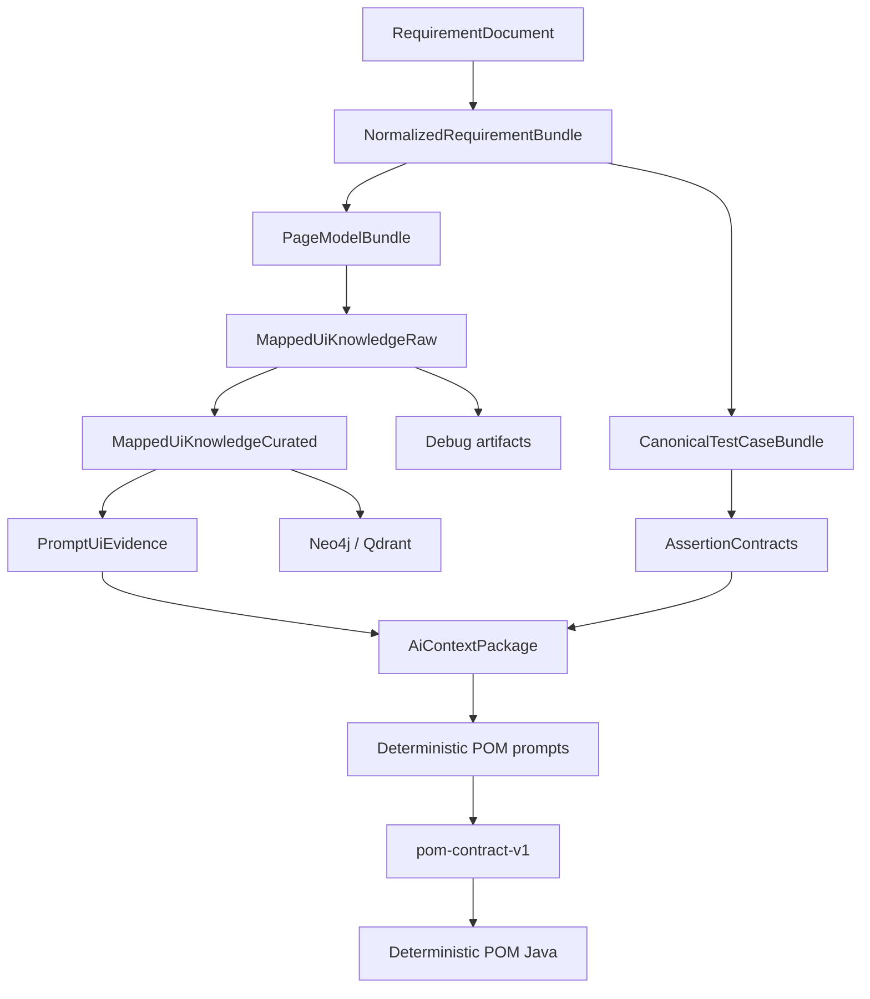

# Architecture Guide

## Purpose

This document is the technical map for the current repository architecture. It describes the active dependency-based pipeline, the major contracts, and the boundaries used for UI prompt generation, API generation, knowledge persistence, and generated-code validation.

For the most detailed AI/UI workflow, see [docs/CURRENT_AI_UI_ARCHITECTURE.md](docs/CURRENT_AI_UI_ARCHITECTURE.md).

## System Overview

The platform is a requirement-driven automation generation system. It reads requirement documents, discovers UI/API evidence, builds typed internal contracts, optionally enriches mapper output through AI, and emits deterministic artifacts guarded by executable quality gates.

The runtime is no longer numeric-order based. Agents declare typed artifacts through `requires()` and `produces()`. `AgentOrchestrator` builds a dependency graph and executes `PipelineAgent<I, O>` stages when their typed input is available.



## Orchestration

Main classes:

- `ua.demo.agentlab.orchestration.WorkflowAgent` - minimal graph contract: `name`, `requires`, `produces`.
- `ua.demo.agentlab.orchestration.AgentOrchestrator` - builds and executes the dependency graph.
- `ua.demo.agentlab.orchestration.pipeline.PipelineAgent<I, O>` - typed execution contract.
- `ua.demo.agentlab.orchestration.pipeline.PipelineArtifactStore` - primary in-run typed artifact registry.
- `ua.demo.agentlab.orchestration.WorkflowState` - run envelope/read model for audit, failures, generated artifact references, and reporting projection.

`WorkflowState` should not be treated as the business-data source of truth. New stages should exchange typed inputs and outputs through `PipelineArtifactStore`.

## Workflow Wiring

`DemoRunner` is now a thin entry point. Workflow composition is split across module/factory classes in `ua.demo.agentlab.app.workflow`, including:

- `AppBootstrap`
- `WorkflowRequestFactory`
- `WorkflowModeResolver`
- `DeterministicWorkflowFactory`
- `AiPromptWorkflowFactory`
- `DiscoveryModuleFactory`
- `KnowledgeStoreModuleFactory`
- `ApiModuleFactory`
- `ValidationModuleFactory`

This keeps CLI parsing, config loading, discovery wiring, AI wiring, persistence wiring, and validation wiring out of a single god class.

## UI Knowledge Layers

The mapper output is intentionally split into three levels:

1. `MappedUiKnowledgeRaw` - full debug-level discovery/mapping output.
2. `MappedUiKnowledgeCurated` - promoted safe facts for persistence.
3. `PromptUiEvidence` - minimal prompt-ready evidence for a target page/route/requirement scope.

This prevents raw mapper noise from leaking directly into LLM prompts.

## Page Selection

The platform uses confirmed page evidence, not product-specific fallback page names.

Current page confirmation path:

```text
ProjectProfile explicit routes
    + requirement routes/capabilities
    + discovery-confirmed links/pages
    + stable cache records
    -> ConfirmedPageRegistry
```

Page names are a consequence of route, capability, and evidence. Generic names such as `ListingPage`, `DetailsPage`, or `CartPage` are not injected unless confirmed by the current project.

## AI Boundary

AI is used as enrichment and prompt-assist, not as the source of truth.

Current AI contract mode:

- enriches expected-result and PageModel metadata;
- builds deterministic POM prompts;
- accepts only typed `pom-contract-v1` JSON from the LLM;
- writes Page Object Java through `DeterministicPomJavaWriter`;
- writes prompt/context/quality artifacts;

Direct LLM-backed Java generation remains disabled. LLMs may plan typed contracts, but Java source is owned by deterministic writers and quality gates.

## API Layer

The API branch has an MVP:

```text
requirements + endpoint evidence
  -> canonical API test cases
  -> typed assertion contracts
  -> ApiClientSpec / ApiDtoSpec / ApiTestSpec
  -> ApiQualityGate
  -> RestAssured/TestNG writer
```

Endpoint evidence can come from:

- OpenAPI;
- network scan;
- `project.api.endpoint-seed`.

Runnable demo tests are intentionally conservative: default generation creates tests only for confirmed GET collection endpoints. Path-parameter and mutation tests require explicit scenario data, auth policy, and data-factory support.

For full CRUD resources, API demo mode can generate a controlled flow test:

```text
create -> read created id -> update -> patch -> delete
```

Run it with:

```powershell
mvn --batch-mode "-Duser.home=." "-Dmaven.repo.local=.m2repo" exec:java "-Dexec.args=--api requirements/valid-author.md"
```

## Runtime Support Packages

Preferred platform namespace:

```text
ua.demo.agentlab...
```

Current generated API code imports:

- `ua.demo.agentlab.core.api.ApiManager`
- `ua.demo.agentlab.core.config.ConfigReader`

Root-package facades remain only for backward compatibility:

- `core.ApiManager`
- `config.ConfigReader`

Do not add new platform implementation code to root packages.

## Test Layout

Current unit tests live in:

```text
src/test/java/unit/tests
```

`src/test/java` is reserved for future integration tests and generated-test compile fixtures.

## Public Repository Guardrails

Before publishing:

```powershell
git status --short
rg -n 'BEGIN .*PRIVATE KEY' src docker-compose*.yml
rg -n 'sk-' src/main/resources src/test/resources docker-compose*.yml
rg -n 'password\s*=\s*[^${].+|token\s*=\s*[^${].+' src/main/resources src/test/resources docker-compose*.yml
mvn --batch-mode "-Duser.home=." "-Dmaven.repo.local=.m2repo" test
```
