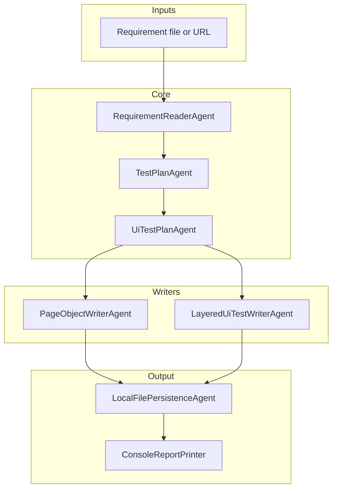
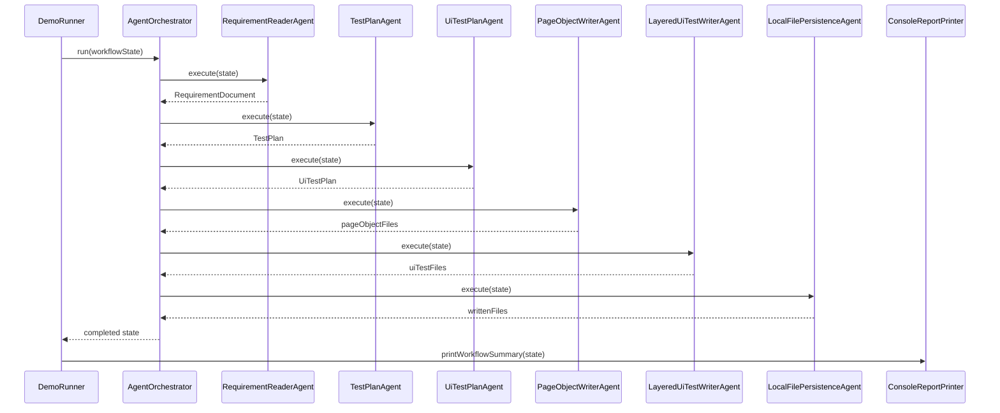

# Architecture Guide

## Purpose of this document

This document explains the internal architecture of the project from an engineering point of view.

If `README.md` is the onboarding document, then this file is the **technical map** of:

- layers;
- contracts;
- data flow;
- responsibilities;
- extension points;
- rules for adding new agents and generators.

The goal is to make future changes predictable and safe.

---

## System overview

The project is built as a **sequential workflow pipeline**.

Each step of the pipeline is represented by a Java class that implements `WorkflowAgent`.

The orchestrator does not know business details. It only:

1. sorts agents by `order()`;
2. checks `supports(state)`;
3. executes `execute(state)`;
4. stops the workflow on failure.

This creates a clean separation between:

- pipeline control;
- domain transformation;
- code generation;
- file persistence;
- reporting.

---

## High-level architecture



---

## Package architecture

### `ua.demo.agentlab.app`

Application entry points.

Responsibilities:

- start the application;
- wire workflow agents;
- select AI or rule-based mode;
- trigger reporting.

Classes:

- `AgentOrchestratorLabApplication`
- `DemoRunner`

Design note:

`DemoRunner` is currently the main demonstration entry point for the workflow. It is intentionally explicit and wiring-oriented.

---

### `ua.demo.agentlab.orchestration`

Core workflow layer.

Responsibilities:

- define the agent contract;
- store shared workflow state;
- execute the pipeline in a deterministic order.

Classes:

- `WorkflowAgent`
- `WorkflowState`
- `AgentOrchestrator`

This package must remain framework-light and stable. Other layers depend on it.

---

### `ua.demo.agentlab.requirements`

Input acquisition layer.

Responsibilities:

- describe requirement input;
- load requirements from supported sources;
- convert raw input into `RequirementDocument`.

Subpackages:

- `model`
- `source`
- `agent`

Main flow:

`RequirementInput` -> `RequirementSource` -> `RequirementDocument`

---

### `ua.demo.agentlab.planning`

Functional planning layer.

Responsibilities:

- convert requirements into structured test planning objects;
- isolate planning logic from orchestration;
- support both rule-based and AI-based generators.

Subpackages:

- `model`
- `generator`
- `agent`

Main flow:

`RequirementDocument` -> `TestPlanGenerator` -> `TestPlan`

---

### `ua.demo.agentlab.ai.openai`

Optional AI integration layer.

Responsibilities:

- initialize OpenAI client;
- provide AI-based implementation of `TestPlanGenerator`.

Important boundary:

This package should not directly orchestrate the pipeline. It should only provide generator implementations or helper classes.

---

### `ua.demo.agentlab.ui`

UI abstraction layer.

Responsibilities:

- describe UI automation scenarios independently from specific test code;
- capture page name, route, actions, assertions and locator hints.

Key idea:

This is the bridge between a business-level `TestPlan` and generated browser automation code.

Main flow:

`TestPlan` -> `UiTestPlan`

---

### `ua.demo.agentlab.ui.generator`

UI planning transformation layer.

Responsibilities:

- detect UI-relevant scenarios;
- map generic test scenarios into UI-specific scenarios;
- attach locator hints and page metadata.

Main flow:

`TestPlan` -> `UiTestPlanGenerator` -> `UiTestPlan`

---

### `ua.demo.agentlab.ui.agent`

UI workflow execution layer.

Responsibilities:

- trigger UI plan generation;
- trigger page object generation;
- trigger UI test generation.

This package is orchestration-facing, not code-generation-facing.

---

### `ua.demo.agentlab.ui.writer`

Code generation layer.

Responsibilities:

- convert UI model objects into Java source files;
- return file metadata via `GeneratedSourceFile`;
- stay independent from file system persistence.

Main outputs:

- page object source;
- Playwright Java UI test source;
- layered writer variants.

---

### `ua.demo.agentlab.persistence`

File output layer.

Responsibilities:

- write generated source files to disk;
- keep persistence logic separate from source generation;
- allow future replacement with other storage targets.

Main flow:

`GeneratedSourceFile` -> `GeneratedFileWriter` -> file system

---

### `ua.demo.agentlab.reporting`

Reporting layer.

Responsibilities:

- print execution summary;
- expose generated artifacts and written files;
- stay read-only with regard to workflow state.

---

## Core contracts

### `WorkflowAgent`

This is the main extension contract for pipeline steps.

Expected behavior:

- `name()`
  - returns a stable identifier for logs and audit
- `order()`
  - defines execution order
- `supports(WorkflowState state)`
  - decides whether the agent should run for the current state
- `execute(WorkflowState state)`
  - performs the transformation or action

Rules:

- one agent should have one responsibility;
- `execute(...)` should only mutate the state it owns;
- agents should not call each other directly;
- communication must happen through `WorkflowState`.

---

### `WorkflowState`

This is the central shared object of the whole system.

Current responsibilities:

- hold workflow objective;
- hold requirement input;
- hold `RequirementDocument`;
- hold `TestPlan`;
- hold `UiTestPlan`;
- hold generated page object files;
- hold generated UI test files;
- hold written file paths;
- hold findings, artifacts and audit messages;
- hold failure status.

Architectural role:

`WorkflowState` is the project's in-memory message bus.

Rules:

- if a result is needed by a later agent, it should be stored in `WorkflowState`;
- typed fields are preferred over raw strings for meaningful domain outputs;
- `artifacts` should be used for small summaries, counters, or auxiliary values;
- `findings` should explain what happened, not store full domain data.

---

### `GeneratedSourceFile`

This object separates **generation** from **persistence**.

It contains:

- `packageName`
- `className`
- `relativePath`
- `content`

This allows:

- preview before write;
- testing writers without touching the file system;
- future support for alternative persistence strategies.

---

## Current workflow in detail

### Step 1. Read requirements

Agent:

- `RequirementReaderAgent`

Consumes:

- `RequirementInput`

Produces:

- `RequirementDocument`
- raw requirement artifact

Source selection is delegated to:

- `FileRequirementSource`
- `UrlRequirementSource`

Boundary:

This step should not interpret requirements. It only loads them.

---

### Step 2. Build functional test plan

Agent:

- `TestPlanAgent`

Consumes:

- `RequirementDocument`

Produces:

- `TestPlan`

Execution strategies:

- `RuleBasedTestPlanGenerator`
- `OpenAiTestPlanGenerator`

Boundary:

This step is responsible for planning, not code generation.

---

### Step 3. Build UI test plan

Agent:

- `UiTestPlanAgent`

Consumes:

- `TestPlan`

Produces:

- `UiTestPlan`

Generator:

- `RuleBasedUiTestPlanGenerator`

Boundary:

This step decides which functional scenarios are meaningful for browser automation and translates them into a UI-oriented model.

---

### Step 4. Generate page object source

Agent:

- `PageObjectWriterAgent`

Consumes:

- `UiTestPlan`

Produces:

- `List<GeneratedSourceFile>` stored in `pageObjectFiles`

Writer:

- `PlaywrightJavaPageObjectWriter`

Boundary:

This step creates Java source definitions only. It does not write files to disk.

---

### Step 5. Generate UI test source

Agent:

- `LayeredUiTestWriterAgent`

Consumes:

- `UiTestPlan`

Produces:

- `List<GeneratedSourceFile>` stored in `uiTestFiles`

Writer:

- `PlaywrightJavaUiTestWriter`

Boundary:

This step generates test classes only. It does not persist them.

---

### Step 6. Persist generated files

Agent:

- `LocalFilePersistenceAgent`

Consumes:

- `pageObjectFiles`
- `uiTestFiles`

Produces:

- written files on disk;
- `writtenFiles` entries in workflow state

Persistence implementation:

- `LocalGeneratedFileWriter`

Boundary:

This step writes to the file system, but should not generate business content.

---

## Execution sequence



---

## Current agent ordering

The current recommended order is:

1. `RequirementReaderAgent`
2. `TestPlanAgent`
3. `UiTestPlanAgent`
4. `PageObjectWriterAgent`
5. `LayeredUiTestWriterAgent`
6. `LocalFilePersistenceAgent`

Why this order works:

- requirements must exist before planning;
- planning must exist before UI transformation;
- UI model must exist before source generation;
- source generation must finish before persistence.

---

## Dependency direction

The preferred dependency direction is:

```text
app
  -> orchestration
  -> requirements
  -> planning
  -> ui
  -> persistence
  -> reporting

requirements/planning/ui/persistence/reporting
  -> orchestration

ai.openai
  -> planning
  -> requirements
  -> orchestration
```

Key rule:

Lower-level domain packages should not depend on `app`.

Writers should not depend on persistence.

Generators should not depend on console reporting.

---

## Design principles used in the project

### 1. Sequential composition over hidden magic

Every step is explicit.

The workflow can be read from top to bottom.

This is important for debugging and onboarding.

### 2. Strategy pattern for generators

Examples:

- `TestPlanGenerator`
- `UiTestPlanGenerator`
- `GeneratedFileWriter`

This allows swapping implementations without changing orchestration.

### 3. Data handoff through shared state

Agents do not call one another directly.

They collaborate through `WorkflowState`.

### 4. Code generation and file writing are separate concerns

This keeps the system testable and flexible.

### 5. Rule-based first, AI second

The system should still be understandable and runnable without AI.

AI should enrich or replace specific generators, not own the whole architecture.

---

## How to add a new domain output

If you want to add a new stage like:

- BDD features
- API test design
- bug analysis
- documentation summary

use this sequence:

1. create a typed model object
2. add the field to `WorkflowState`
3. create a generator interface if the transformation is non-trivial
4. create an agent that owns this transformation
5. insert the agent into `DemoRunner`
6. optionally expose summary in `ConsoleReportPrinter`

Example:

```text
TestPlan -> ApiTestDesignAgent -> ApiTestPlan -> RestAssuredWriterAgent -> GeneratedSourceFile
```

---

## How to add a new agent safely

### Step 1. Define input and output clearly

Before writing the class, answer:

- what field in `WorkflowState` does the agent read?
- what field in `WorkflowState` does it produce?
- should it produce typed output or just an artifact?

### Step 2. Keep `supports(...)` strict

Good `supports(...)` logic prevents duplicate execution.

Example pattern:

```java
return state.getTestPlan() != null && state.getUiTestPlan() == null;
```

This is better than checking only for the presence of input.

### Step 3. Add audit and findings

Every meaningful step should leave:

- audit trace;
- finding summary;
- optional artifact counters.

### Step 4. Avoid cross-agent direct calls

Do not do this:

```java
anotherAgent.execute(state);
```

Instead:

- add both agents to the orchestrator;
- let `order()` define the sequence.

---

## How to add a new writer safely

If you want to add:

- Selenium writer
- TestNG writer
- Gherkin writer
- REST Assured writer

follow this pattern:

1. keep the planning model unchanged if possible;
2. create a new writer contract implementation;
3. return `GeneratedSourceFile` objects;
4. optionally create a dedicated writer agent.

This keeps domain modeling reusable while letting code generation vary by framework.

Example future direction:

```text
UiTestPlan
  -> SeleniumJavaPageObjectWriter
  -> SeleniumTestNgUiTestWriter
  -> LocalFilePersistenceAgent
```

---

## Error handling model

Current error handling is simple and intentionally visible.

Behavior:

- if an agent throws an exception, `AgentOrchestrator` marks the workflow as failed;
- `WorkflowState.fail(...)` stores the reason;
- further agents are not executed;
- `ConsoleReportPrinter` prints failure summary.

Implication:

This is fail-fast behavior.

Future extensions may add:

- retry policies;
- partial recovery;
- warning vs failure distinction;
- validation agents before persistence.

---

## Reporting model

`ConsoleReportPrinter` currently prints:

- audit trail;
- findings;
- test plan summary;
- UI test plan summary;
- generated files summary.

This design is intentionally read-only.

The reporter should not mutate state or trigger generation.

Future reporting options:

- markdown reports;
- HTML reports;
- JSON export;
- execution metrics.

---

## AI integration boundary

The AI layer should remain behind interfaces.

Current example:

- `OpenAiTestPlanGenerator` implements `TestPlanGenerator`

This is the correct direction because:

- orchestration does not care whether the generator is AI or rule-based;
- UI and persistence layers remain independent;
- tests can run without remote dependencies.

Recommended future rule:

AI classes should stay in `ai.*` packages and implement existing contracts rather than introducing new orchestration rules.

---

## Suggested future architecture additions

### BDD layer

Possible flow:

```text
TestPlan
  -> BddScenarioAgent
  -> BddFeature
  -> GherkinWriterAgent
  -> .feature generated files
```

### API automation layer

Possible flow:

```text
TestPlan
  -> ApiTestDesignAgent
  -> ApiTestPlan
  -> RestAssuredWriterAgent
  -> generated API tests
```

### Documentation layer

Possible flow:

```text
WorkflowState
  -> DocumentationAgent
  -> DocumentationSummary
  -> MarkdownDocumentationWriterAgent
```

### Bug analysis layer

Possible flow:

```text
BugReport
  -> BugTriageAgent
  -> BugAnalysisReport
  -> Review or fix suggestion writers
```

### Validation layer

Possible flow:

```text
GeneratedSourceFile
  -> GeneratedCodeCompileAgent
  -> validation result
```

---

## Current limitations

These are known and acceptable at the current stage:

- rule-based planning is intentionally heuristic;
- UI selection is still keyword-based;
- generated UI code is a scaffold, not a full production framework;
- Playwright is the current output target;
- Spring Boot is present, but runtime orchestration is still demo-runner based;
- there is no compile-validation step for generated test code yet.

These limitations are normal for the current maturity level.

---

## Recommended extension order

From an architecture perspective, the safest order of evolution is:

1. stabilize UI plan and generated code quality;
2. add compile-validation for generated files;
3. add Selenium/TestNG writer if needed;
4. add BDD planning and writers;
5. add API planning and writers;
6. add documentation generation;
7. add bug triage and analysis;
8. add persistence alternatives and richer reporting.

---

## Final architecture rule

When in doubt, prefer this shape:

```text
input model
  -> generator
  -> typed domain result
  -> writer
  -> generated source file
  -> persistence
```

This shape keeps the system:

- understandable;
- testable;
- replaceable by layer;
- safe to extend.

That is the core architectural idea of this project.
