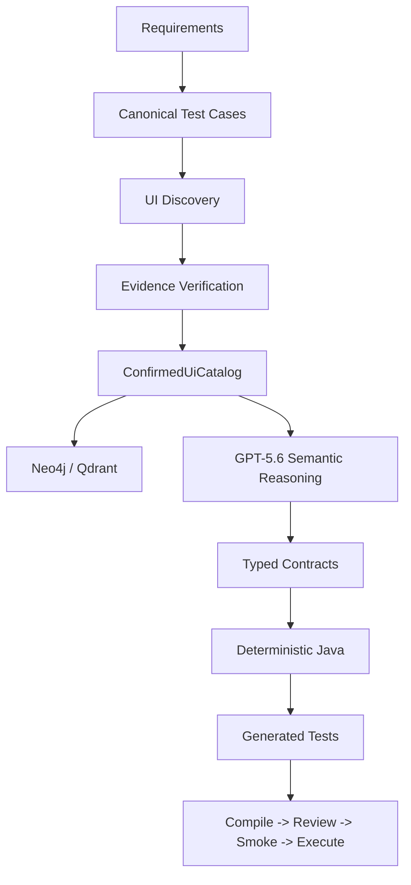

# AQAI - Autonomous Quality Assurance Intelligence

**From software requirements to verified executable tests.**

AQAI is an AI-assisted Java platform that turns capability-first requirements into browser-verified UI evidence, structured Page Object contracts, deterministic Java, and executed TestNG tests.

[Build Week Demo](docs/BUILD_WEEK_DEMO.md) | [Captured Demo Evidence](docs/build-week/README.md) | [Architecture](docs/CURRENT_AI_UI_ARCHITECTURE.md) | [Developer Onboarding](docs/DEVELOPER_ONBOARDING.md)

**Demo video:** https://youtu.be/rYHalJSPRjc

## Problem

Traditional LLM test generation can invent locators, produce unstable browser code, blur page ownership, and repeatedly spend tokens on knowledge the system already discovered.

That makes a generated test look plausible without proving that it is executable.

## Solution

AQAI separates semantic reasoning from execution. The browser discovers facts; the platform scores and verifies those facts; only promoted evidence can reach a POM contract. GPT-5.6 plans structured JSON contracts, while deterministic writers generate Java and TestNG code. Compile, review, smoke, execution, and runtime feedback close the loop.

When the knowledge layer already contains validated evidence, AQAI reuses it instead of making unnecessary LLM calls.

## Build Week Result

Measured OrangeHRM authentication, user-menu, and logout demo. The DB-backed result is a warm run after the same workflow has seeded and validated knowledge.

| Metric | Without DB: cold discovery | With knowledge layer: reuse |
|---|---:|---:|
| GPT-5.6 runtime calls | 4 | 0 |
| Stable POM contracts reused | 0 | 2 |
| Page-enrichment cache hits | 0 | 2 |
| Generated TestNG tests | 4/4 passed | 4/4 passed |
| Compile, review, and live smoke | passed | passed |

The warm run demonstrates the product claim directly: AQAI learns only from validated evidence and then deterministically reuses that knowledge. See the immutable, repository-held [cold/warm comparison](docs/build-week/comparison.md).

## How It Works

```text
Requirements
  -> Canonical scenarios
  -> Browser discovery and typed UI evidence
  -> Scoring, relevance filtering, and live verification
  -> ConfirmedUiCatalog
  -> GPT-5.6 JSON planning or stable knowledge reuse
  -> Deterministic Page Object and TestNG Java
  -> Compile, review, smoke, execution, runtime feedback
```

Candidate, fallback, stale, or unverified locator evidence cannot enter a POM prompt or generated Java. Missing evidence becomes an explicit coverage gap rather than an invented assertion.

## Role Of GPT-5.6

GPT-5.6 is used by the running platform for two constrained semantic tasks:

- page-model enrichment from scoped, curated evidence;
- `pom-contract-v1` JSON planning for a Page Object contract.

It does not write Selenium or Java method bodies. Schema validation, ownership checks, locator promotion, Java generation, compilation, review, smoke, and test execution are deterministic.

## Role Of Codex

Codex was used directly during repository development as the engineering collaborator: architecture enforcement, typed-pipeline refactoring, implementation, documentation, regression-oriented review, and workflow stabilization. Codex is not a runtime decision-maker in the generated test flow; GPT-5.6 is the runtime model boundary.

## Architecture

The runtime uses dependency-based orchestration: agents declare typed input/output artifacts, `AgentOrchestrator` builds a DAG, and `PipelineArtifactStore` is the primary in-run artifact registry. `WorkflowState` is a run envelope/read model for audit, failures, and artifact references.



The canonical evidence lifecycle is:

```text
Raw UI evidence
  -> Locator / element / action candidates
  -> Static scoring and requirement relevance
  -> Top-K selection and live verification
  -> State/postcondition verification
  -> Promotion or rejection
  -> ConfirmedUiCatalog
  -> POM contract
  -> Deterministic Java
  -> Compile / review / smoke / execution feedback
```

## Quick Start

### Recommended: Docker

Docker is the reviewer path: the published image contains Java 17, Chromium, ChromeDriver, Maven dependencies, and precompiled AQAI classes. Docker still needs valid OpenAI and OrangeHRM environment variables because they are intentionally never embedded in an image.

**Supported reviewer platforms:** Docker Engine or Docker Desktop running Linux containers on Windows, macOS, or Linux. The published image targets `linux/amd64`; Docker Desktop may emulate this architecture where needed.

```powershell
docker pull ghcr.io/pkrasytskyi/aqai-build-week:2026

docker run --rm --shm-size=2g `
  -e OPENAI_API_KEY="..." `
  -e TEST_VALID_USERNAME="..." `
  -e TEST_VALID_PASSWORD="..." `
  -e KNOWLEDGE_DB_STATUS=false `
  ghcr.io/pkrasytskyi/aqai-build-week:2026
```

The container invokes the versioned `--demo orangehrm` workflow and prints the Build Week result. It does not compile AQAI from source at runtime.

### Full Knowledge-Layer Demo: Docker Compose

Copy `.env.example` to `.env`, set the required variables, then run:

```powershell
docker compose -f docker-compose.build-week.yml down -v
docker compose -f docker-compose.build-week.yml up --pull always
```

Compose starts clean Neo4j and Qdrant services, runs a knowledge seed, then runs the same fixture again to measure reuse. Captured seed and reuse summaries are written to `build-week-artifacts/`.

### Alternative: Build The Image Locally

```powershell
docker build -t aqai-build-week:local .
docker run --rm --shm-size=2g -e OPENAI_API_KEY="..." -e TEST_VALID_USERNAME="..." -e TEST_VALID_PASSWORD="..." -e KNOWLEDGE_DB_STATUS=false aqai-build-week:local
```

### Development: Source And Maven

Requirements: Java 17, Maven 3.9+, Chrome/ChromeDriver, and valid OrangeHRM credentials. Set secrets only through environment variables:

```powershell
$env:OPENAI_API_KEY="..."
$env:OPENAI_MODEL="gpt-5.6-luna"
$env:TEST_VALID_USERNAME="..."
$env:TEST_VALID_PASSWORD="..."
$env:KNOWLEDGE_DB_STATUS="false"

mvn --batch-mode "-Duser.home=." "-Dmaven.repo.local=.m2repo" exec:java "-Dexec.args=--demo orangehrm"
```

The versioned input bundle is [demo/orangehrm-login-logout](demo/orangehrm-login-logout). It contains the profile reference, requirement fixture, expected scenario identities, expected POM names, and no secret values.

## Demo

Use `KNOWLEDGE_DB_STATUS=false` for the cold baseline. For a DB-backed comparison, start Neo4j and Qdrant, set `KNOWLEDGE_GRAPH_NEO4J_PASSWORD`, then set `KNOWLEDGE_DB_STATUS=true`. A first run seeds validated knowledge; the next equivalent run is the measured reuse run.

The final artifacts are:

```text
target/ai-run/quality/build-week-demo-summary.md
target/ai-run/quality/confirmed-ui-catalog.json
target/ai-run/validation/generated-tests-execution-result.json
```

Docker and Compose packaging details are in [GitHub Actions and container delivery](docs/GITHUB_ACTIONS_CI_CD.md).

## Full Documentation

- [Build Week Demo](docs/BUILD_WEEK_DEMO.md)
- [Captured Build Week Evidence](docs/build-week/README.md)
- [Current AI/UI Architecture](docs/CURRENT_AI_UI_ARCHITECTURE.md)
- [Developer Onboarding](docs/DEVELOPER_ONBOARDING.md)
- [API Layer](docs/API_LAYER.md)

## Main Modules

- `ua.demo.agentlab.app` - runner entry points and workflow wiring.
- `ua.demo.agentlab.requirements` - requirement loading and normalization.
- `ua.demo.agentlab.testcase` - canonical test case generation.
- `ua.demo.agentlab.ui.discovery` - UI discovery, PageModel building, locator scoring, and mapping.
- `ua.demo.agentlab.ui.catalog` - confirmed page candidates, capabilities, and page registry.
- `ua.demo.agentlab.ai.context` - target-aware prompt context assembly and retrieval filtering.
- `ua.demo.agentlab.ai.pageenrichment` - page-scoped enrichment over mapper output.
- `ua.demo.agentlab.ai.expectationenrichment` - deterministic/AI expected-result resolution.
- `ua.demo.agentlab.ai.ui` - structured POM contract planning and deterministic Page Object generation.
- `ua.demo.agentlab.ui.testcontract` - typed atomic UI test contracts, schema/semantic validation, deterministic TestNG generation, and source maps.
- `ua.demo.agentlab.ai.quality` - run quality summary and artifact diff.
- `ua.demo.agentlab.core.ui` - Selenium base page/test helpers used by generated code.
- `ua.demo.agentlab.core.api` - RestAssured API runtime helper used by generated API clients.
- `ua.demo.agentlab.core.config` - repository-safe runtime configuration reader with environment/JVM placeholder resolution.

### Compatibility Facades

The preferred package namespace for platform-owned code is `ua.demo.agentlab...`.
Two root-package facades remain only for backward compatibility with older generated examples:

- `core.ApiManager` delegates to `ua.demo.agentlab.core.api.ApiManager`.
- `config.ConfigReader` delegates to `ua.demo.agentlab.core.config.ConfigReader`.

New generated API code imports the `ua.demo.agentlab.core.*` classes directly.

## Runtime Skills

LLM-facing task contracts live in:

```text
runtime-skills/
```

This package separates prompt/schema rules from Java orchestration code. The current skill set is:

- `pom-json-generation` - structured `pom-contract-v1` output for deterministic POM Java writing.
- `page-enrichment` - semantic enrichment over mapper-approved page evidence.
- `test-json-generation` - structured UI test spec JSON, not Java code.
- `self-healing-locator` - replacement locator review after runtime failures.
- `error-analysis` - root-cause classification for failed runs/tests.
- `bug-report-generation` - bug report drafts from validated evidence.

Each skill owns `skill.yaml`, `prompt.md`, `input-schema.json`, `output-schema.json`, `rules.md`, and examples. `RuntimeSkillPromptLoader` loads these contracts for POM JSON generation and page enrichment prompt assembly, while page-specific evidence remains dynamically assembled by the Java pipeline.

## Requirements

- Java 17
- Maven 3.9+
- Chrome/ChromeDriver compatible with Selenium when browser discovery is enabled
- Optional: Docker for Neo4j and Qdrant
- Optional: `OPENAI_API_KEY` for AI enrichment

## Configuration

Default project configuration is in:

```text
src/main/resources/framework.properties
src/main/resources/test-data.properties
src/main/resources/profiles/orangehrm.project-profile.yaml
```

`framework.properties` is intentionally safe to keep in the repository: secret values are expressed as `${ENV_VAR}` placeholders and resolved at runtime from JVM properties, environment variables, or the loaded properties file. Do not commit local secrets. Use environment variables or ignored local override files for private values:

```powershell
$env:OPENAI_API_KEY="..."
$env:OPENAI_MODEL="gpt-5.6-luna"
$env:RAG_OPENAI_API_KEY="..."
$env:KNOWLEDGE_GRAPH_NEO4J_PASSWORD="..."
$env:API_AUTH_TOKEN="..."
$env:TEST_VALID_USERNAME="..."
$env:TEST_VALID_PASSWORD="..."
```

Project-specific runtime values should live in a project profile:

```properties
project.profile.file=profiles/orangehrm.project-profile.yaml
```

The active profile can define project id/name/base URL, routes, UI runtime defaults, auth selectors/env names, AI switches, knowledge-store switches, and the default requirements file. Resolution order is:

```text
JVM system property > environment variable > project profile YAML > framework.properties > code fallback
```

If the CLI does not pass a requirement file, the runner uses `requirements.file` from the active project profile.

Generated UI sources are isolated per project. Unless a profile explicitly declares output packages, the platform derives them from `profileId + baseUrlHash`:

```text
ua.demo.agentlab.ui.generated.<generationNamespace>.pages
ua.demo.agentlab.ui.generated.<generationNamespace>.tests
```

The checked-in OpenAI generation default is `gpt-5.6-luna`. `OPENAI_MODEL` remains the runtime override
for accounts or environments that expose a different model identifier; RAG generation inherits the same
value unless `RAG_OPENAI_GENERATION_MODEL` is set explicitly.

Persistence writes `target/ai-run/validation/generated-source-manifest.json`. Compile, review, and generated-source smoke accept only files whose package, path, class name, and content hash belong to that current-run manifest. Maven compile is scoped to the manifest namespace, so equal names such as `LoginPage` or `REQ001...Test` from another project cannot collide with the active run.

Important runtime switches:

```properties
openai.enabled=true
ai.page-enrichment.llm.enabled=true
ai.page-object.llm.enabled=true
ai.ui-test.llm.enabled=false
rag.enabled=true
knowledge.graph.enabled=true
knowledge.vector.enabled=true
artifact.reuse.enabled=true
artifact.reuse.force-refresh=false
```

- `KNOWLEDGE_DB_STATUS=false` disables RAG, Neo4j, Qdrant, and artifact reuse for a no-DB comparison run.
- `KNOWLEDGE_DB_STATUS=true` enables RAG, Neo4j, Qdrant, and artifact reuse for a DB-backed run.
- Demo manifests use `runtime.databaseMode: environment-controlled`, so the same immutable demo input supports both runs. Fixed `without-db-baseline` and `with-db-required` modes remain available for dedicated manifests.
- `ai.page-enrichment.llm.enabled` controls whether page enrichment can call OpenAI.
- `rag.enabled` controls retrieval/indexing behavior and must not be treated as the page-enrichment switch.
- `knowledge.graph.enabled` and `knowledge.vector.enabled` control Neo4j/Qdrant persistence and retrieval availability.
- `artifact.reuse.enabled` allows DB-backed POM contract reuse by fingerprint before the POM LLM call; only contracts promoted to `STABLE` after writer, compile, review, and smoke validation are reusable.
- `artifact.reuse.flow-contract.enabled` persists evidence-gated, capability-based Flow Contracts to Neo4j. `ReusePlanner` may reuse only a Qdrant-ranked and Neo4j-confirmed stable flow as a precondition decision; it never injects raw flow text into a POM prompt.
- `semantic.reuse.enabled` is opt-in. It indexes only `CONFIRMED` Flow Contract summaries in Qdrant; Neo4j exact lookup and namespace checks remain the decision boundary.
- `artifact.reuse.pom-contract.enabled`, `artifact.reuse.flow-contract.enabled`, and `artifact.reuse.test-data.enabled` independently control reuse domains. `artifact.reuse.policy=strict` and `artifact.reuse.force-refresh=true` prevent accidental rollout or stale reuse.
- `artifact.reuse.force-refresh=true` bypasses reusable artifacts and forces a new POM contract generation.
- Run summaries expose `dbUsageMode`, `neo4jHit`, `qdrantHit`, `stableCacheUsed`, and page-enrichment counters so DB/no-DB behavior is visible in artifacts.

Ignored local override examples:

```text
framework-local.properties
test-data-local.properties
application-local.properties
.env
```

## Knowledge Stores

The platform can use:

- Neo4j for graph page knowledge.
- Qdrant for vector retrieval.

DB-backed runs are reported as:

- `with-db` when Neo4j hit, Qdrant hit, and stable cache reuse are all true.
- `without-db` when all three are false.
- `partial-db` for mixed states, for example Neo4j available but Qdrant disabled or embedding key missing.

Page enrichment cache reuse is tracked separately through:

- `pageEnrichmentGenerated`
- `pageEnrichmentCacheHits`
- `pageEnrichmentOpenAiCalls`

Start both with:

```powershell
$env:KNOWLEDGE_GRAPH_NEO4J_PASSWORD="local-neo4j-password"
docker compose -f docker-compose.knowledge.yml up -d
```

Neo4j schema:

```powershell
docker exec -it agentlab-neo4j cypher-shell -u neo4j -p $env:KNOWLEDGE_GRAPH_NEO4J_PASSWORD -f /var/lib/neo4j/import/page-knowledge-schema.cypher
```

## Build And Test

Run tests:

```powershell
mvn --batch-mode "-Duser.home=." "-Dmaven.repo.local=.m2repo" test
```

Unit tests for the platform live in:

```text
src/test/java/unit/tests
```

`src/test/java` is the standard Maven test source root. Generated UI/API compile fixtures also live under this root so their package names match their file paths.

Compile only:

```powershell
mvn --batch-mode "-Duser.home=." "-Dmaven.repo.local=.m2repo" compile
```

## Run The Workflow

Build Week OrangeHRM requirements-to-execution demo:

```powershell
$env:OPENAI_API_KEY="..."
$env:OPENAI_MODEL="gpt-5.6-luna"
$env:TEST_VALID_USERNAME="..."
$env:TEST_VALID_PASSWORD="..."
$env:KNOWLEDGE_DB_STATUS="false"

mvn --batch-mode "-Duser.home=." "-Dmaven.repo.local=.m2repo" exec:java "-Dexec.args=--demo orangehrm"
```

The command resolves the versioned demo manifest, generates namespaced Page Objects and TestNG tests, compiles and reviews them, runs source/live smoke, executes only current-run manifest-owned generated tests, and writes `target/ai-run/quality/build-week-demo-summary.{json,md}`. See [Build Week Demo](docs/BUILD_WEEK_DEMO.md).

In GitHub Actions, the `with-db` option intentionally runs twice on the same clean runner: a knowledge seed run persists validated evidence, then a measured reuse run proves Neo4j/Qdrant, enrichment-cache, and stable-POM reuse. The workflow uploads separate without-DB, seed, and reuse summaries.

Deterministic run:

```powershell
mvn --batch-mode "-Duser.home=." "-Dmaven.repo.local=.m2repo" exec:java
```

Run with a requirement file:

```powershell
mvn --batch-mode "-Duser.home=." "-Dmaven.repo.local=.m2repo" exec:java "-Dexec.args=requirements/valid-login-requirement.md"
```

AI enrichment / prompt-review run:

```powershell
$env:OPENAI_API_KEY="..."
$env:TEST_VALID_USERNAME="..."
$env:TEST_VALID_PASSWORD="..."
$env:KNOWLEDGE_GRAPH_NEO4J_PASSWORD="local-neo4j-password"

mvn --batch-mode "-Duser.home=." "-Dmaven.repo.local=.m2repo" exec:java "-Dexec.args=--ai requirements/valid-login-requirement.md"
```

The checked-in `framework.properties` is demo-oriented and enables AI/RAG/knowledge-store switches, while secrets still come from environment variables. For a clean no-DB/no-RAG comparison run, disable them explicitly with JVM properties:

```powershell
mvn --batch-mode "-Duser.home=." "-Dmaven.repo.local=.m2repo" exec:java "-Dexec.args=--ai requirements/valid-login-requirement.md" "-Drag.enabled=false" "-Dknowledge.graph.enabled=false" "-Dknowledge.vector.enabled=false"
```

Equivalent one-switch form:

```powershell
$env:KNOWLEDGE_DB_STATUS="false"
mvn --batch-mode "-Duser.home=." "-Dmaven.repo.local=.m2repo" exec:java "-Dexec.args=--ai"
```

Current AI mode records deterministic POM contract prompts and enrichment artifacts. When `ai.page-object.llm.enabled=true`, the LLM returns only `pom-contract-v1` JSON. It does not write Java bodies. Java Page Objects are produced by `DeterministicPomJavaWriter` from the validated contract.

The current golden UI slice is `requirements/valid-login-requirement.md`: LoginPage discovery, confirmed username/password/login-button locators, DashboardPage discovery, confirmed dashboard route, user-menu trigger and logout link evidence, Neo4j/Qdrant knowledge use when enabled, `pom-contract-v1`, deterministic POM generation, source persistence, compile/review, and generated-source smoke validation.

Current golden-slice limitations:

- Target-page assertions are promoted only when the target-state binding identifies an exact, browser-verified locator. Missing evidence remains a coverage gap; the platform never manufactures a locator to close it.
- The generated-source smoke gate validates generated POM files, compile/review readiness, and structural interaction contracts. The profile/capability-driven live browser smoke additionally proves `open login -> authenticate -> dashboard route -> open user menu -> logout visible -> login route` when the relevant evidence and credentials are available.
- Run quality score is intentionally conservative: it should exceed 90 only when confirmed locators, compile, review, and smoke evidence are all strong.

### Reading The Quality Score

`qualityScore` is an evidence-maturity signal, not a percentage of working product functionality or passed tests. It penalizes unpromoted candidate evidence, weak locator-score distribution, missing prompt-ready locator coverage, runtime feedback risk, and terminal gate failures. Compile, review, live smoke, and generated TestNG execution are reported separately as binary validation results.

A demo can therefore be fully passing while reporting a conservative score such as `79/100`: `0` blocking issues, `0` review findings, compile and smoke passed, and all generated tests passed. Any assertion that lacks an exact confirmed locator remains an explicit coverage gap instead of an AI-invented assertion. This is intentional: AQAI prefers an actionable evidence gap over false confidence.

POM prompts are compact by default: they contain the page capability contract, page-owned required actions/assertions, allowed locators, baseline API signatures, and the `pom-contract-v1` output schema. Full diagnostic prompt evidence can be enabled with `-Dai.page-object.prompt.mode=debug` or `-Dai.prompt.debug=true`.

API generation is currently demo-safe by default: endpoint discovery may produce client and DTO specs for the discovered surface, but runnable RestAssured/TestNG tests are generated only for confirmed GET collection endpoints until explicit scenario data and auth/data-factory policy are available for path-parameter and mutation flows.

API CRUD demo run:

```powershell
$env:API_AUTH_TOKEN="..."
mvn --batch-mode "-Duser.home=." "-Dmaven.repo.local=.m2repo" exec:java "-Dexec.args=--api requirements/valid-author.md"
```

More details:

- [API Layer Documentation](docs/API_LAYER.md)
- [Release / Demo Notes](docs/RELEASE_DEMO_NOTES.md)

## Important Runtime Artifacts

Runtime artifacts are generated under `target/` and are ignored by Git:

```text
target/ai-run/debug/
target/ai-run/enrichment/
target/ai-run/expectations/
target/ai-run/need-review/
target/ai-run/page-objects/
target/ai-run/quality/
target/ai-run/run-summary.json
target/ai-run/run-summary.md
target/ai-run-history/
target/discovery/
```

Key files:

- `target/ai-run/run-summary.md` - compact run review summary.
- `target/ai-run-history/last-10-runs.md` - one final-state table for the latest ten completed runs: DB retrieval, POM/flow reuse, LLM calls, lifecycle, compile/review, smoke, and feedback status. It is updated after the validation and DB-feedback stages.
- `target/ai-run/page-objects/*-prompt.txt` - deterministic `pom-contract-v1` POM prompts.
- `target/ai-run/page-objects/*-pom-contract.json` - validated POM contracts returned by the LLM when POM LLM mode is enabled.
- `target/ai-run/expectations/test-case-expected-results.json` - resolved expected results.
- `target/ai-run/need-review/expected-results-needs-review.json` - unresolved expected results for review.
- `target/ai-run/quality/run-quality-summary.json` - run-level quality score.
- `target/ai-run/quality/artifact-diff.json` - comparison against previous run artifacts.
- `target/ai-run/debug/**` - scope traces, prompt traces, raw context packages, and pipeline snapshots when `ai.debug.artifacts=true`.

Rebuild the table without running discovery or the LLM:

```powershell
mvn --batch-mode "-Duser.home=." "-Dmaven.repo.local=.m2repo" exec:java "-Dexec.mainClass=ua.demo.agentlab.app.RunHistoryStatisticsRunner"
```

## Quality Gates

The platform has executable checks for:

- stale locator candidates;
- external-origin locator evidence;
- cross-route evidence;
- weak URL nonblank assertions;
- missing expected values;
- prompt blocking issues;
- unresolved expected results;
- route collisions;
- low-confidence locators.

## Documentation

- [Developer Onboarding and Delivery Guide](docs/DEVELOPER_ONBOARDING.md)
- [License](LICENSE)
- [Contributing](CONTRIBUTING.md)
- [Security Policy](SECURITY.md)
- [API Layer Documentation](docs/API_LAYER.md)
- [GitHub Actions CI/CD](docs/GITHUB_ACTIONS_CI_CD.md)
- [Current AI UI Architecture](docs/CURRENT_AI_UI_ARCHITECTURE.md)
- [Project Detailed Guide](docs/PROJECT_DETAILED_GUIDE.md)
- [AI POM Fix Plan](docs/AI_POM_FIX_PLAN.md)
- [Graph and Vector DB Setup](docs/GRAPH_AND_VECTOR_DB_SETUP.md)
- [RAG Layer Guide](docs/RAG_LAYER_GUIDE.md)
- [Target Architecture](docs/TARGET_ARCHITECTURE.md)
- [Roadmap](ROADMAP.md)

Development happens on short-lived `feature/`, `fix/`, `refactor/`, or `docs/`
branches created from `dev`. `dev` is the stable integration baseline and
`main` is the public/release baseline; see the onboarding guide for the merge
and hotfix policy.

## Repository Hygiene

The repository intentionally excludes:

- Maven dependency caches;
- IDE metadata;
- local secrets;
- generated runtime artifacts;
- generated UI source produced by local workflow runs;
- local DB volumes.
- generated API/UI source from local demo runs.

This keeps GitHub focused on source code, requirements, docs, infrastructure definitions, and reproducible tests.

## Public Repository Boundary

Before publishing a new snapshot, the expected commit boundary is:

- source code under `src/main/java` and unit tests under `src/test/java/unit/tests`;
- curated requirements/docs/config examples;
- infrastructure definitions such as `docker-compose.knowledge.yml`;
- no `target/`, local DB volumes, IDE metadata, API keys, real credentials, or generated runtime artifacts.

Recommended pre-push checks:

```powershell
git status --short
rg -n 'BEGIN .*PRIVATE KEY' src docker-compose*.yml
rg -n 'sk-' src/main/resources src/test/resources docker-compose*.yml
rg -n 'password\s*=\s*[^${].+|token\s*=\s*[^${].+' src/main/resources src/test/resources docker-compose*.yml
mvn --batch-mode "-Duser.home=." "-Dmaven.repo.local=.m2repo" test
```
