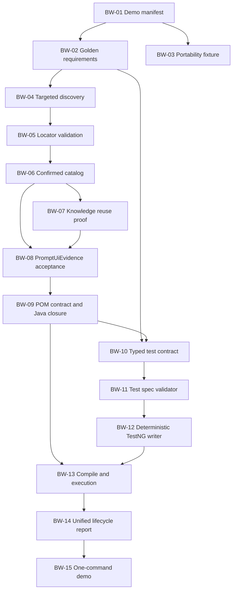

# Build Week E2E Stabilization Plan

## 1. Purpose

This document is the execution plan for the next several development days. Its goal is not to finish every platform capability. The goal is to prove one stable, reviewable, end-to-end UI automation pipeline:

```text
Project profile + requirements
  -> deterministic requirement normalization
  -> UI discovery and PageModel
  -> locator candidates, scoring, and live validation
  -> confirmed UI capability catalog
  -> optional Neo4j/Qdrant persistence and reuse
  -> requirement-scoped PromptUiEvidence
  -> POM contract JSON
  -> deterministic Page Object Java
  -> test specification JSON
  -> deterministic TestNG Java
  -> compile gate
  -> live execution
  -> one lifecycle quality report
```

The implementation must preserve the core platform boundary: an LLM may classify or plan structured contracts, but it must not invent locators, routes, UI elements, or executable Java code.

## 2. Scope Freeze

### Required cross-product authentication flow

The Build Week proof must execute against both OrangeHRM and The Internet. The shared logical lifecycle is:

```text
AUTHENTICATION
  -> AUTHENTICATED_AREA
  -> LOGOUT_ACCESS
  -> LOGOUT
  -> AUTHENTICATION page restored
```

`LOGOUT_ACCESS` is an abstract capability boundary, not an assumption that every product has a user menu:

- OrangeHRM implements `LOGOUT_ACCESS` as `USER_MENU -> logout control`.
- The Internet implements `LOGOUT_ACCESS` as a direct logout control on the authenticated page.

Required fixtures:

- `requirements/orangehrm-authentication-user-menu-logout.md`;
- `requirements/the-internet-authentication-logout.md`.

This distinction is an acceptance requirement. The mapper must discover the product-specific component topology and must not invent `USER_MENU` for The Internet merely to match the OrangeHRM implementation.

### OrangeHRM implementation

```text
/auth/login
  -> authenticate
  -> /dashboard/index
  -> open user menu
  -> logout control visible
  -> click logout
  -> /auth/login
```

### The Internet implementation

```text
/login
  -> authenticate
  -> /secure
  -> direct logout control visible
  -> click logout
  -> /login
```

Together these fixtures prove that the flow is capability-driven and is not tied to OrangeHRM page names, CSS classes, routes, or user-menu topology.

The large `requirements/the-internet-test-flow.md` suite is not a Build Week acceptance dependency. It remains a discovery and capability-expansion fixture.

### Non-goals for this iteration

- Complete support for every alert, window, upload, hover, slider, and HTTP-auth scenario.
- Full autonomous exploration of every SPA state.
- Production-complete self-healing.
- Generic CRUD generation for every application type.
- Repository intelligence enrichment as a requirement for the demo.
- A mandatory Qdrant dependency. Vector retrieval must remain optional and observable.

## 3. Status Legend

| Status | Meaning |
|---|---|
| READY | Implemented, active in the target workflow, and covered by tests or a stable live artifact. |
| PARTIAL | Core implementation exists, but the active workflow, live proof, or acceptance coverage is incomplete. |
| NOT READY | Only a model, legacy implementation, or inactive path exists. |
| PLANNED | Work is intentionally deferred beyond the Build Week critical path. |

## 4. Current Platform Compliance

Assessment date: 2026-07-18. This assessment is based on repository code, workflow composition, artifacts, and 330 passing unit/regression tests. Live browser readiness must be reconfirmed after the latest binding changes.

| # | Plan capability | Status | Current evidence | Main gap |
|---:|---|---|---|---|
| 1 | Fixed demo scope | READY | Versioned OrangeHRM and The Internet demo manifests resolve real profiles, requirement fixtures, routes, logout topology, schemas, and executable preflight validation. | Live run evidence is produced by later checkpoints. |
| 2 | Requirements pipeline | READY | `RequirementReaderAgent`, `RequirementNormalizationAgent`, `RuleBasedRequirementNormalizer`, structured behavior contracts, canonical test-case planning, and versioned BW-02 golden snapshots. | Cross-product authentication acceptance is the next requirements-level proof. |
| 3 | UI discovery and PageModel | PARTIAL | Selenium crawler, DOM parser, readiness waits, interactive extraction, component grouping, SPA inventory, runtime evidence. | Repeat-run stability and requirement-targeted coverage are not yet consistently proven for every demo state. |
| 4 | Locator candidate generation | READY | Page locator models, mapped locator candidates, component-scoped candidates, origin metadata. | Add an explicit demo coverage assertion for automation-relevant elements. |
| 5 | Deterministic locator scoring | READY | `LocatorQualityEvaluator`, origin resolver, risk classifier, stability tracker, evidence classifier. | Ranking explanation and primary/standby selection are not yet exposed as one compact acceptance artifact. |
| 6 | Live locator validation | PARTIAL | Browser global/scoped counts, targeted locator/action verification, evidence promotion. | Not every selected primary locator is proven by a single acceptance gate before catalog/prompt use. |
| 7 | Confirmed UI catalog | PARTIAL | `ConfirmedPageRegistry`, capability contracts, confirmed/candidate/fallback evidence types. | Page, component, action, and locator confirmation are still spread across several contracts rather than one demo catalog artifact. |
| 8 | Neo4j and Qdrant knowledge | PARTIAL | Page knowledge writers, Neo4j graph query, stable capability lookup, artifact/flow registries, Qdrant summaries. | Knowledge reuse must be demonstrated as quality-preserving; DB cannot be the only source for current requirement ownership. |
| 9 | Target-aware context | PARTIAL | Ownership slicer, locator selectors, prioritizer, quality gate, `PromptUiEvidence`, evidence funnel. | A new live run must prove non-zero requirement-scoped locators and prompt-eligible pages after final binding. |
| 10 | Restricted AI enrichment/specification | PARTIAL | Page enrichment and POM contract planning are active and schema-bound. | Test specification generation is not part of the active AI prompt workflow. Enrichment efficiency still needs live confirmation. |
| 11 | Specification validation | PARTIAL | POM schema, scope gate, semantic quality rules, prompt linter, source-map validation. | Equivalent active validation is not closed for generated test-spec JSON. |
| 12 | Deterministic POM writer | READY | `PomContractSpec`, `PomContractQualityGate`, `DeterministicPomJavaWriter`, writer agent and source map. | Reconfirm golden output and compilation after the latest mapper/binding changes. |
| 13 | Deterministic test writer | NOT READY | Legacy/template test writers and `AiUiTestSpec` models exist. | AI test-spec and writer agents are absent from `AiPromptWorkflowFactory`; no accepted typed test contract drives executable TestNG generation. |
| 14 | Compile gate | READY for POM | Persisted generated sources feed `GeneratedCodeCompileAgent`; compile artifact is written. | Must include generated tests before declaring full E2E compile readiness. |
| 15 | Selenium/TestNG execution | PARTIAL | Generated UI smoke and live capability smoke exist. | The active AI flow validates generated POM behavior, not a generated atomic TestNG test. |
| 16 | Quality report | PARTIAL | Run summary, evidence funnel, artifact reuse metrics, DB comparison, compile/review/smoke artifacts. | Reports are fragmented; one requirement lifecycle report is still missing. |
| 17 | One-command demo | PARTIAL | `DemoRunner` and project profile loading provide one entry point. | The command does not yet close test-spec generation, deterministic TestNG writing, compile, and generated-test execution. |

### Current readiness summary

| Area | Readiness |
|---|---:|
| Requirements and canonical planning | 85% |
| Discovery and PageModel | 70% |
| Locator intelligence | 78% |
| Confirmed catalog and requirement binding | 60% |
| Knowledge persistence and reuse | 60% |
| PromptUiEvidence and POM contract | 65% |
| Deterministic POM Java | 85% |
| Typed test specification | 35% |
| Deterministic TestNG generation | 30% |
| Full one-command E2E proof | 45% |

## 5. Execution Order

The work is divided into five daily checkpoints. A day is complete only when its acceptance artifacts exist and its gate passes. Later stages must not compensate for missing evidence from an earlier stage.

## Day 1: Freeze Demo Inputs and Requirement Contracts

### BW-01: Add a demo manifest

Status: **COMPLETE** on branch `feature-orangehrm-demo`.

Implemented artifacts:

- `demo/orangehrm-login-logout/demo-manifest.yaml`;
- `demo/orangehrm-login-logout/project-profile.yaml`;
- `demo/orangehrm-login-logout/requirements.md`;
- expected requirement, canonical-test, and POM shape descriptors;
- typed manifest loader and preflight service;
- strict no-fallback requirement resolution;
- AI-run preflight artifact at `target/ai-run/quality/demo-input-readiness.json`.

Create a versioned demo descriptor containing:

- project profile path;
- requirement fixture path;
- required environment variable names;
- expected page capabilities;
- expected scenario IDs;
- expected POM names;
- expected final route/state;
- database mode policy (`environment-controlled` for paired DB/no-DB runs, or a fixed mode for a dedicated baseline);
- AI mode;
- schema versions.

Recommended location:

```text
demo/orangehrm-login-logout/
  demo-manifest.yaml
  requirements.md
  expected/
    normalized-requirements.json
    canonical-test-cases.json
    pom-contract-shape.json
```

Do not duplicate secrets in the manifest. Store only environment variable names.

Expected result: one immutable input bundle identifies exactly what the demo run must process.

Acceptance gate:

- one profile and one requirement file resolve without fallback routes;
- no ecommerce or unrelated module capability is present;
- missing credential variables produce one explicit preflight failure.

### BW-02: Golden requirement normalization

Status: **COMPLETE** on branch `codex/feature-orangehrm-demo`.

Implemented artifacts:

- deterministic `GoldenRequirementSnapshotBuilder` over the production normalization, behavior-contract, governance, and canonical-scenario services;
- versioned normalized-requirement, structured-behavior, canonical-test-case, and governance JSON snapshots;
- ordering and run-metadata normalization without DB/cache participation;
- repeated-execution, typed assertion, expected-value, route, and page-ownership acceptance tests;
- regression coverage proving that logout remains owned by the authenticated source page and is not downgraded to an open-menu action.

Add a snapshot test for:

```text
RequirementDocument
  -> NormalizedRequirementBundle
  -> StructuredBehaviorContracts
  -> CanonicalTestCaseBundle
```

The snapshot must normalize ordering and run-specific metadata.

Expected artifacts:

- normalized requirement bundle;
- structured behavior contracts;
- canonical test-case bundle;
- governance requirements reported separately from executable scenarios.

Acceptance gate:

- repeated execution produces an identical normalized snapshot;
- each executable requirement has capability, source/target context, action, and typed assertion;
- no `expectedValue=null`;
- no cross-page ownership ambiguity.

### BW-03: Cross-product authentication acceptance

Status: **COMPLETE** on branch `codex/feature-orangehrm-demo`.

Implemented artifacts and controls:

- versioned `demo/the-internet-authentication-logout` manifest and project profile;
- product-neutral demo preflight for `USER_MENU` and `DIRECT_CONTROL` logout topologies;
- resolved profile, requirement, route, POM-name, scenario, and lifecycle identity in `demo-input-readiness.json`;
- shared `LogoutAccessMode` capability contract and structured `logoutAccessMode` parsing;
- canonical atomicity fix that recreates the user-menu-open state before OrangeHRM logout;
- real manifest/profile/fixture acceptance using the same normalizer and canonical planner for both products;
- regression checks preventing Dashboard routes/page names/menu operations from entering The Internet artifacts;
- schema equality checks proving both fixtures retain the same POM contract and supporting contracts.

Run the same logical authentication/logout lifecycle for both required fixtures. Keep the existing The Internet authentication acceptance test and add real profile/fixture resolution assertions for both products.

Expected result:

- OrangeHRM resolves the logout sequence through a confirmed `USER_MENU` component;
- The Internet resolves logout through a confirmed direct control;
- switching only profile and requirements changes routes, page names, and component topology;
- shared orchestration, evidence contracts, POM contract schema, writer, and quality gates remain unchanged.

Acceptance gate:

- OrangeHRM: `AUTHENTICATION -> AUTHENTICATED_AREA -> USER_MENU -> LOGOUT` is confirmed;
- The Internet: `AUTHENTICATION -> AUTHENTICATED_AREA -> DIRECT_LOGOUT_CONTROL -> LOGOUT` is confirmed;
- no OrangeHRM route, CSS class, page name, or menu assumption appears in The Internet artifacts;
- no direct-logout assumption bypasses OrangeHRM's required menu-opening step.

Day 1 completion artifact: `target/ai-run/quality/demo-input-readiness.json`. It now includes the resolved
non-secret input identity and expected lifecycle topology for the selected product.

## Day 2: Close Discovery, Locator Validation, and Catalog

### BW-04: Requirement-targeted discovery acceptance

Status: **COMPLETE** on branch `codex/feature-orangehrm-demo`.

Implemented artifacts and controls:

- `ui-evidence-funnel.v3` carries one typed `UiEvidenceRequirementTrace` per executable requirement;
- source page, route, and state are resolved from `SourceStateBinding` plus the current-run state graph;
- required component capabilities are recovered from bound current-run component inventory when normalized prose no longer contains them;
- expected action intents are derived from the structured requirement, bound behavior steps, and selected candidate actions;
- target page, route, and state come from `LiveTransitionDiscovery` and `TargetStateBinding` without inferred fallback pages;
- discovery route provenance is explicit (`PROJECT_PROFILE`, `CURRENT_RUN_INVENTORY`, or `LIVE_TRANSITION_DISCOVERY`);
- partial evidence paths remain visible when the requirement stops before POM eligibility;
- requirement-level readiness is projected from the canonical `EvidenceProjectionTrace`; the funnel no longer
  reconstructs locator ownership independently from final catalog/prompt decisions;
- the funnel agent consumes the existing source-binding and live-transition DAG artifacts directly; no parallel discovery pipeline was introduced;
- cross-product acceptance covers all four OrangeHRM and The Internet requirements and verifies their different logout component topologies;
- the acceptance gate rejects confirmed paths that omit source state, action intent, target state, or route provenance.

Verification: 385 unit/regression tests pass, including the BW-04 cross-product requirement-targeted discovery acceptance.

For each primary demo requirement, record:

- source page/state;
- required component;
- expected action intent;
- target page/state;
- discovery route source;
- stoppedAt/reason/remediation when evidence is missing.

Use the existing source binding, live transition discovery, target binding, and evidence funnel. Do not create a second discovery pipeline.

Expected result: every requirement has either a confirmed evidence path or one precise stopped reason.

### BW-05: Locator candidate coverage report

Status: **IMPLEMENTED; LIVE ACCEPTANCE PENDING** on branch `codex/feature-orangehrm-demo`.

Implemented:

- typed `LocatorCandidateCoverageReport` with one compact record per requirement-owned element;
- deterministic primary/standby selection, preferring different selector families;
- pre-catalog safety policy for same-origin, visibility/token, absolute XPath, dynamic hash,
  positional-selector, uniqueness, and browser-verification checks;
- candidate and rejected evidence stays in the report and never becomes prompt-allowed evidence;
- DAG artifact `LOCATOR_CANDIDATE_COVERAGE_REPORT` and
  `quality/locator-candidate-coverage.json`;
- regression coverage for authentication controls and the user-menu/logout sequence.

Add a compact per-element artifact:

```json
{
  "elementId": "loginButton",
  "componentId": "loginForm",
  "candidateCount": 3,
  "liveVerifiedCount": 2,
  "primaryLocatorId": "loginButtonByType",
  "standbyLocatorId": "loginButtonByText",
  "rejected": []
}
```

The primary and standby locators must use different selector families where possible. Candidate/fallback locators remain debug/review evidence and do not enter `Allowed locators`.

Expected result: all demo-owned interactive elements expose at least one live-verified candidate or an explicit coverage gap.

Acceptance gate:

- 100% of required demo elements have at least one candidate;
- 100% of prompt-allowed locators are `CONFIRMED_LOCATOR`;
- every confirmed locator is same-origin, browser-verified, stable, and component/page unique;
- external, hidden, token, absolute XPath, dynamic hash, and unsafe selectors are rejected before catalog assembly.

### BW-06: Assemble a single confirmed demo catalog

Status: **IMPLEMENTED; LIVE ACCEPTANCE PENDING** on branch `codex/feature-orangehrm-demo`.

Implemented:

- typed `ConfirmedUiCatalog` read model over the effective SPA inventory, live verification,
  locator coverage, component actions, state graph, and assertion contracts;
- catalog hierarchy `capability -> page/state -> component -> action -> primary/standby locator -> assertions`;
- only `CONFIRMED_LOCATOR` records can enter primary or standby catalog slots;
- deterministic resolution flags for `AUTHENTICATION`, `USER_MENU`, and `LOGOUT`;
- DAG artifact `CONFIRMED_UI_CATALOG` and `quality/confirmed-ui-catalog.json`;
- the UI evidence funnel now depends on both compact quality artifacts, preserving one pipeline.

The next live run must still prove `pomReadinessPassed=true` and zero unexplained binding failures.

Create a compact read model over existing page/component/action/locator contracts. Do not replace the detailed raw and curated artifacts.

Minimum catalog structure:

```text
PageCapability
  -> Page/State
  -> Component
  -> Semantic Action
  -> Confirmed Primary Locator
  -> Optional Standby Locator
  -> Assertion Evidence
```

Expected result: `AUTHENTICATION` resolves deterministically to the login form controls; `USER_MENU` and `LOGOUT` resolve to the confirmed Dashboard sequence.

Day 2 completion artifacts:

- `quality/ui-evidence-funnel.json` with `pomReadinessPassed=true`;
- compact confirmed catalog artifact;
- locator coverage report;
- zero unexplained requirement-binding failures.

## Day 3: Close Knowledge Reuse, Prompt Evidence, and POM Generation

### BW-07: Prove DB as a quality layer

Run the primary fixture in two controlled modes:

1. Clean run without DB reuse.
2. Run with Neo4j/Qdrant and stable artifact reuse enabled.

Neo4j may supply stable page/component/action/locator/flow evidence. Current requirement ownership, assertions, and actions must always be rebuilt from the current requirement set.

Qdrant is optional. If unavailable, the run must continue and record `vectorUnavailableReason`.

Expected result:

- the with-DB run reuses only schema-compatible, namespace-compatible, smoke-confirmed artifacts;
- degraded or stale evidence is rejected;
- quality does not decrease;
- enrichment/POM LLM calls are skipped only when a validated artifact is reused.

Acceptance gate:

- explicit `neo4jHit`, `qdrantHit`, `stableCacheUsed`, and retrieval mode;
- no DB locator enters a prompt without confirmed provenance;
- no cached requirement traceability leaks into the current run;
- DB comparison reports actual LLM calls and schema/compile/smoke validity.

### BW-08: PromptUiEvidence acceptance

Validate the active staged pipeline:

```text
PageOwnershipSlicer
  -> LocatorEvidenceSelector
  -> SemanticActionEvidenceSelector
  -> PromptEvidencePrioritizer
  -> PromptEvidenceQualityGate
  -> PromptUiEvidenceAssembler
```

Expected result: POM planning sees only:

- target page, route, and capability;
- page-owned actions;
- page-owned assertions and expected values;
- confirmed locator IDs;
- required component sequence;
- minimal source trace;
- coverage gaps.

It must not see raw DOM, raw RAG text, excluded locators, unrelated test cases, or another page's actions.

### BW-09: Golden POM contract and Java closure

For Login and Dashboard:

```text
PromptUiEvidence
  -> pom-contract-v1
  -> schema validation
  -> scope/semantic quality gate
  -> deterministic Java writer
  -> persisted source
  -> compile
  -> review
  -> live smoke through compiled generated POM methods
```

Expected result:

- deterministic Login Page Object;
- honest Dashboard Page Object containing only confirmed route/header/user-menu/logout evidence;
- no Java body generated by the LLM;
- stable source map from methods/fields to actionId/locatorId.

Acceptance gate:

- valid POM contract rate 100%;
- deterministic writer success 100%;
- compile PASS;
- review has zero blockers;
- live login/dashboard/logout smoke PASS;
- `live-ui-smoke-result.json` reports `executionMode=COMPILED_GENERATED_POM_API`;
- identical normalized contract produces identical Java source.

Day 3 completion artifact: one POM lifecycle report linking requirement IDs to evidence, contract, source, compile, review, and smoke.

## Day 4: Introduce the Typed Test Specification Pipeline

This is the largest missing part of the attached plan. Do not reactivate legacy test generation unchanged.

### BW-10: Define a deterministic test contract

Introduce or finalize a contract equivalent to:

```text
UiTestContractSpec
  scenarioId
  capability
  sourcePage
  targetPage
  preconditions
  ordered actions
  typed assertions
  data references
  requirement traceability
```

Action steps reference Page Object method IDs, not Selenium operations or locators. Assertions reference typed POM assertion methods and expected values.

Expected result: exactly one atomic test contract per canonical executable scenario.

### BW-11: Add JSON Schema and specification validator

Validation rules must prove:

- referenced pages exist;
- referenced POM methods exist in validated contracts;
- action ownership matches the page;
- assertion ownership and expected values are resolved;
- credentials/scenario data are referenced only when required;
- no raw Selenium, locator, driver, waits, or page internals appear;
- setup state is created inside the same test;
- no dependency on test execution order.

Expected result: unsupported LLM suggestions become `needs-review` and never reach Java generation.

### BW-12: Deterministic TestNG writer

Connect the validated test contract to a deterministic writer. Existing `AiUiTestSpec` and writer classes may be reused only after their contract is aligned with the new typed model and quality gate.

Expected result: generated tests use only BaseTest helpers, generated Page Objects, `UiAssertions`, and typed data providers.

Acceptance gate:

- no raw Selenium API in generated tests;
- exactly one atomic test per contract;
- writer output is deterministic;
- generated tests compile together with generated Page Objects.

Day 4 completion artifacts:

- test-contract JSON;
- schema validation report;
- test specification quality report;
- generated TestNG source;
- source map from requirement/scenario/action/assertion to generated lines.

## Day 5: Execute the Generated Test and Produce One Demo Report

### BW-13: Full compile and execution gate

Required chain:

```text
POM contracts
  -> POM sources
  -> test contracts
  -> TestNG sources
  -> persisted sources
  -> test-compile
  -> generated test execution
  -> runtime feedback
```

The execution result must include:

- requirement/scenario ID;
- generated source paths;
- PASS/FAIL;
- duration;
- failed step and assertion;
- screenshot/runtime evidence on failure;
- exact locator/action IDs used;
- DB feedback update status.

### BW-14: Unified lifecycle report

Generate one JSON and one Markdown report containing:

- requirement coverage;
- requirement to page/action/assertion traceability;
- discovery and locator funnel;
- locator confidence and provenance;
- DB/reuse mode;
- LLM calls and token usage;
- POM/test contract validity;
- deterministic writer results;
- compile/review/smoke/execution results;
- unresolved/needs-review items;
- links to detailed debug artifacts.

The unified report is the primary review entry point. Existing detailed reports remain supporting evidence.

### BW-15: One-command demo

Provide one documented command that accepts only the selected project profile plus environment-backed secrets. The requirement file is resolved from the profile/demo manifest.

Expected console stages:

```text
[1] Inputs and credentials preflight
[2] Requirements normalized
[3] UI discovery completed
[4] Required locators live-verified
[5] Catalog and knowledge updated/reused
[6] Prompt evidence assembled
[7] POM contracts validated
[8] Page Objects generated
[9] Test contracts validated
[10] TestNG sources generated
[11] Compilation passed
[12] Generated tests executed
[13] Quality report written
RESULT: PASS
```

Acceptance gate:

- the command returns non-zero on blocking quality, compile, or execution failure;
- a failure names the exact stopped stage and remediation;
- the primary demo passes three consecutive clean runs;
- one with-DB run reuses confirmed artifacts without reducing quality;
- the secondary authentication fixture reaches the same deterministic POM/test contract boundary without product-specific fallbacks.

## 6. Dependency Graph



## 7. Mandatory Guardrails

These controls may not be relaxed to make the demo pass:

1. Only confirmed, same-origin, live-verified locators may enter POM actions/checks.
2. Candidate and fallback evidence may be persisted or reviewed but not exposed as allowed POM evidence.
3. Requirement/page/action/assertion ownership is rebuilt from the current requirement set.
4. LLM output must pass JSON Schema plus semantic validation.
5. LLM output must never contain executable Java or raw Selenium operations.
6. Deterministic writers consume only validated typed contracts.
7. Generated code must compile before smoke or test execution.
8. Missing evidence produces a coverage gap or needs-review item, not an invented method.
9. Knowledge stores are optional for execution but observable when enabled.
10. A quality score cannot exceed 90 when required locators, contracts, compile, or execution evidence are missing.

## 8. Build Week Definition of Done

The iteration is complete when all of the following are true:

- one immutable demo profile and requirement fixture drive the run;
- normalized requirements and canonical scenarios are deterministic;
- every demo requirement has confirmed evidence or one explicit stopped reason;
- Login and Dashboard POM contracts are valid and contain only confirmed evidence;
- deterministic Page Objects compile without manual changes;
- one typed atomic test contract is generated and validated;
- deterministic TestNG Java compiles without raw Selenium usage;
- the generated login/logout test passes live execution;
- runtime feedback references exact action and locator IDs;
- one unified report links requirement to execution result;
- the complete primary flow passes three consecutive runs;
- both OrangeHRM and The Internet authentication/logout fixtures pass using the same capability-driven pipeline;
- a with-DB run demonstrates valid reuse without quality regression.

## 9. Immediate Next Task

Run three consecutive OrangeHRM demo cycles without DB and three with DB. Use the live artifacts to close the
pending BW-05/BW-06 acceptance gates and prove BW-07 through BW-09 without projection drift. Each run must show:

- exactly the two requirement-owned Login/Dashboard pages;
- no unrelated authenticated navigation such as Change Password;
- every executable requirement has a confirmed evidence path;
- `pomReadinessPassed=true` and non-zero confirmed prompt locators;
- both generated POMs compile and pass review;
- live smoke executes the compiled generated POM API and passes login, user-menu, and logout transitions.
