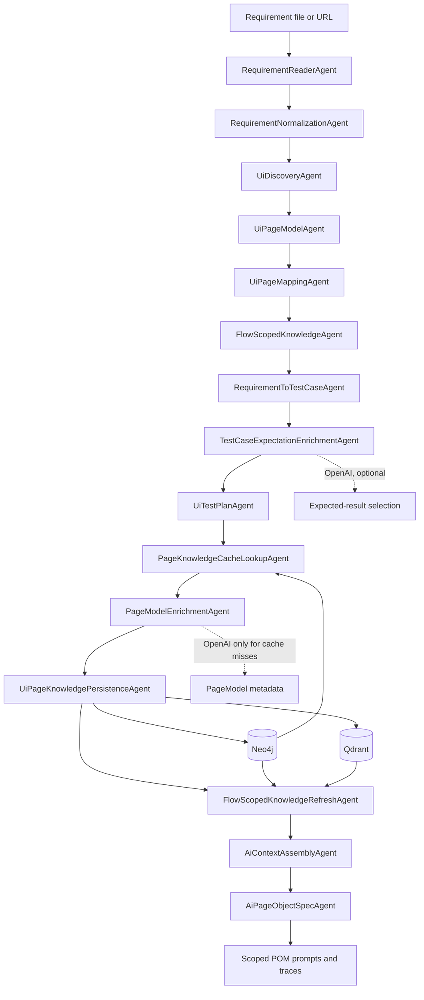
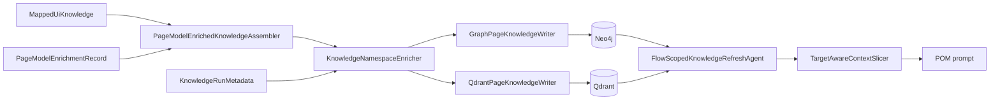

# Current AI UI Architecture

## 1. Purpose and Boundary

This document describes the active requirement-driven UI automation architecture in this repository. The platform turns a requirement document into scoped Selenium Page Object **prompts** and retains deterministic writers for the non-AI path.

The active AI mode is intentionally prompt-only:

- LLMs enrich requirement-to-expected-result links and PageModel metadata.
- The system builds deterministic, reviewable Page Object prompts.
- The active AI workflow does **not** generate or persist Java Page Objects or TestNG tests.
- Page Objects remain the owner of Selenium locators and interactions; tests use public Page Object APIs only.

The architecture is designed to prevent a useful but dangerous failure mode: a plausible LLM answer must never become an untraceable UI locator, assertion, or page method.

## 2. Current Workflow



### AI mode versus deterministic mode

| Mode | Entry point | Output | LLM role |
|---|---|---|---|
| Deterministic | `DemoRunner` without `--ai` | Java POMs, TestNG tests, validation and review reports | None |
| AI prompt mode | `DemoRunner --ai ...` | Enrichment artifacts, context, POM prompts, scope traces | Expected-result and PageModel metadata only |

The AI branch deliberately stops after `AiPageObjectSpecAgent`. It does not invoke `AiPageObjectWriterAgent`, `AiUiTestSpecAgent`, `AiUiTestWriterAgent`, or any source-file persistence agent.

## 3. Main Modules and Classes

### Orchestration

| Class / package | Responsibility |
|---|---|
| `app.DemoRunner` | Creates collaborators, selects deterministic or AI mode, and registers workflow agents. |
| `orchestration.AgentOrchestrator` | Builds a dependency graph from agent `requires()` / `produces()`, executes the resulting DAG, records audit events, and stops on a failure. |
| `orchestration.WorkflowState` | Compatibility run state for objective, requirement input, audit, failure, and legacy artifact storage. The long-term target is a run envelope, not shared business state. |
| `orchestration.WorkflowAgent` | Common agent interface: `name`, `requires`, `produces`, `order`, `supports`, `execute`; `order()` is now only a tie-breaker/backward-compatible fallback. |
| `orchestration.WorkflowArtifact` | Typed artifact keys used to connect agents, for example `RequirementDocument`, `PageModelBundle`, `MappedUiKnowledge`, and `AiContextPackage`. |
| `orchestration.pipeline.PipelineAgent` | Typed stage interface: `input()`, `output()`, `supports(input, envelope)`, and `execute(input, envelope)`. |
| `orchestration.pipeline.PipelineArtifactStore` | Bridge that reads typed artifacts from `WorkflowState`, passes them to migrated agents, and syncs typed outputs back during the migration. |
| `orchestration.pipeline.WorkflowRunEnvelope` | Immutable run metadata snapshot used by typed agents instead of direct `WorkflowState` access. |
| `orchestration.pipeline.WorkflowStatePipelineAdapter` | Compatibility adapter that writes a typed stage output back to legacy `WorkflowState`. |
| `orchestration.pipeline.StageOutputPublisher` | Centralized publisher for legacy side effects: state setters, artifact key/value entries, findings, and JSON artifact files. |

### Requirement processing

| Class / package | Responsibility |
|---|---|
| `requirements.agent.RequirementReaderAgent` | Typed `PipelineAgent<RequirementInput, RequirementDocument>` that reads a local file or URL. |
| `requirements.normalization.RuleBasedRequirementNormalizer` | Parses headings and bullets into `NormalizedRequirement` records. |
| `requirements.normalization.model.NormalizedRequirement` | Stores `id`, `title`, `statement`, `expectedResult`, relevance flags, tags, and source reference. |
| `requirements.normalization.agent.RequirementNormalizationAgent` | Typed `PipelineAgent<RequirementDocument, NormalizedRequirementBundle>`. |

`expectedResult` is populated when a bullet originates in `## Assertion Requirements` or a compatible expected-result heading. This preserves the document's assertion intent as structured data rather than relying on the POM prompt to infer it from prose.

### UI discovery, PageModel, and mapper

| Class / package | Responsibility |
|---|---|
| `ui.discovery.agent.UiDiscoveryAgent` | Runs discovery and builds canonical page-flow data. |
| `ui.discovery.selenium.SeleniumUiDiscoveryService` | Uses Selenium to collect pages, links, elements, forms, and transitions. |
| `ui.discovery.selenium.crawler.SafeNavigationCrawler` | Enforces crawl policy and authentication bridge while navigating the application. |
| `ui.discovery.pagemodel.PageModelBuilder` | Converts raw discovery into structured `PageModel` records. |
| `ui.discovery.agent.UiPageModelAgent` | Typed `PipelineAgent<UiPageModelInput, PageModelBundle>`. |
| `ui.discovery.mapping.RuleBasedPageMapper` | Converts PageModel evidence into `MappedUiKnowledge`. |
| `ui.discovery.agent.UiPageMappingAgent` | Typed `PipelineAgent<UiPageMappingInput, MappedUiKnowledge>`. |
| `ui.catalog.ConfirmedPageSourceResolver` | Resolves confirmed page candidates from explicit profile routes, requirement routes, discovery snapshots, and stable page cache records. |
| `ui.catalog.ConfirmedPageRegistry` | Current source of truth for confirmed pages, routes, capabilities, and evidence-backed page names. |

The old `GenericUiPageCatalog` compatibility adapter has been removed. New page selection must go through `ConfirmedPageSourceResolver` and `ConfirmedPageRegistry`.

Key mapper contracts:

| Model | Meaning |
|---|---|
| `PageModel` | Discovered page, elements, forms, locator candidates, page flows, and feature guess. |
| `MappedPage` | Semantic page identity, route, actions, assertion hints, elements, and forms. |
| `MappedUiKnowledge` | Full mapper output: pages, transitions, graph nodes/edges, and Qdrant documents. |
| `LocatorCandidate` | Quality-gated Selenium locator with strategy, value, stability score, origin metadata, accessibility/text evidence, uniqueness/stability flags, and risk tags. |
| `PageCapability` | Generic page capability contract: `NAVIGATION`, `AUTHENTICATION`, `AUTHENTICATED_AREA`, `FORM`, `RECORD_LIST`, `RECORD_DETAILS`, `CONTAINER`, `DASHBOARD`, `SECURITY`, `RECOVERY`, and `GENERIC`. |

Page naming is now evidence-driven. A confirmed capability may use its generic default only when no stronger route/page evidence exists. For example:

```text
/login                + AUTHENTICATION -> LoginPage
/pim/viewEmployeeList + RECORD_LIST    -> EmployeeListPage
/dashboard/index      + DASHBOARD       -> DashboardPage
```

This prevents a second application from inheriting stale names such as `ListingPage`, `DetailsPage`, or `CartPage` unless those names are actually confirmed by profile, requirements, discovery, or stable cache.

### Flow, test cases, and expected-result enrichment

| Class / package | Responsibility |
|---|---|
| `ai.flow.BusinessFlowResolver` | Resolves relevant routes, target operations, and target `PageCapability` values from requirements and planning artifacts. |
| `ai.flow.FlowScopedKnowledgeService` | Builds a requirement-scoped slice of mapper knowledge and retrieval context. |
| `testcase.generator.RuleBasedRequirementToTestCaseGenerator` | Creates `CanonicalTestCase` records from capability slots, not ecommerce roles. |
| `testcase.agent.RequirementToTestCaseAgent` | Stores canonical test-case bundle. |
| `ai.expectationenrichment.agent.TestCaseExpectationEnrichmentAgent` | Resolves one reviewable expected result per test case before UI planning. |
| `ai.expectationenrichment.service.RuleBasedTestCaseExpectationEnrichmentClient` | Deterministic route and lexical fallback resolver. |
| `ai.expectationenrichment.service.OpenAiTestCaseExpectationEnrichmentClient` | Optional OpenAI candidate selector with strict output validation. |

The expected-result layer uses three important models:

| Model | Meaning |
|---|---|
| `ExpectedResultCandidate` | One assertion outcome extracted from `Assertion Requirements`, with requirement ID and source line. |
| `ResolvedExpectedResult` | Selected value, source requirement, confidence, status, and rationale for one test case. |
| `CanonicalTestCase` | The execution contract consumed by UI planning, PageModel enrichment, and POM prompts. |
| `AssertionContract` | Deterministic typed assertion contract: requirement, test case, assertion type, expected value, owner page, route, confidence, and source. |

Only a `ResolvedExpectedResult` with `status=resolved` and `confidence >= 0.80` replaces a non-route `AssertionIntent.expectedValue`. Route assertions are resolved from `ProjectProfile` and are not sent to the LLM for replacement.

After expected-result enrichment, `ai.assertions.agent.AssertionContractAgent` converts assertion intents into typed contracts. Supported `AssertionType` values are `TEXT_VISIBLE`, `ELEMENT_VISIBLE`, `URL_CONTAINS`, `ROUTE_EQUALS`, `FORM_VISIBLE`, `ERROR_MESSAGE_VISIBLE`, `AUTHENTICATED_AREA_VISIBLE`, and `DATA_STATE_MATCHES`. The LLM may receive these contracts in prompts, but the final contract structure is deterministic and validated by Java code.

Typed assertion contracts are written to `target/ai-run/expectations/assertion-contracts.json` and are sliced by `TargetAwareContextSlicer` using scoped test-case IDs and requirement IDs.

### Capability-based test-case flow

The test-case generator no longer treats pages as fixed domain roles such as `catalog`, `details`, or `cart`. It first resolves capability slots:

```text
NAVIGATION
AUTHENTICATION
AUTHENTICATED_AREA
FORM
RECORD_LIST
RECORD_DETAILS
CONTAINER
```

Each slot is filled only by confirmed evidence from the current mapper context or project profile. If a requirement asks for a details-like operation but no `RECORD_DETAILS` page is confirmed, the generator falls back to the closest confirmed page instead of inventing `DetailPage`. Locator hints are also evidence-only; hardcoded fallback selectors such as `a[href*='/products/']` are not injected.

`BusinessFlowContext` now carries `targetCapabilities` in addition to operations, routes, terms, and page names. `FlowScopedKnowledgeService` scores mapped pages by canonical capability instead of product/cart/listing text heuristics. Container words such as cart or basket may still help classify a requirement into `CONTAINER`, but downstream selection is capability-based.

### Locator Quality Gate

Locator quality is evaluated before PageModel evidence is converted into `MappedUiKnowledge`.
Selenium discovery runs a small repeated crawl by default and uses the repeated observations to decide whether a locator is stable across runs.

| Class / package | Responsibility |
|---|---|
| `ui.discovery.mapping.LocatorQualityEvaluator` | Builds the final `LocatorCandidate` contract and assigns a normalized stability score. |
| `ui.discovery.mapping.LocatorOriginResolver` | Resolves `href`, `originHost`, and `sameOrigin` from page URL, element href, and locator value. |
| `ui.discovery.mapping.LocatorStabilityTracker` | Marks candidates as `uniqueOnPage` and `stableAcrossRuns` from deterministic selector evidence. |
| `ui.discovery.mapping.LocatorRiskClassifier` | Adds risk tags such as `external-origin`, `external-link-text-xpath`, `visible-text-xpath`, and `not-proven-stable`. |
| `ui.discovery.selenium.stability.SeleniumDiscoveryStabilityAggregator` | Aggregates locator observations from repeated Selenium crawl runs. |

The gate rejects forbidden candidates before they reach enrichment or prompts. XPath locators based only on visible text for outbound links are blocked because the element `href` carries an external `originHost`.
When repeated discovery is enabled, a locator must be observed in every successful crawl run to get `stableAcrossRuns=true`; partial observations keep the locator but add `UNSTABLE_DISCOVERY` and reduce its score.

Repeat count defaults to `3` and can be adjusted with `ui.discovery.repeat-runs` or `UI_DISCOVERY_REPEAT_RUNS` (`1..5`).

Current scoring baseline:

| Locator evidence | Score |
|---|---:|
| `data-testid`, `data-test`, `data-qa` | 0.95 |
| Stable `id` | 0.90 |
| `name` for form fields | 0.80 |
| `aria-label` / role / accessible-name evidence | 0.75 |
| Short CSS with stable class or attribute | 0.60 |
| XPath by visible text | 0.35 |
| Long or absolute XPath | 0.10 |
| External link text XPath | 0.05 / forbidden |

### PageModel enrichment and knowledge stores

| Class / package | Responsibility |
|---|---|
| `ai.pageenrichment.agent.PageKnowledgeCacheLookupAgent` | Checks Neo4j for existing page enrichment by `appId`, `baseUrlHash`, `schemaVersion`, `pageId`, and `pageFingerprintHash`; cache hits skip OpenAI page enrichment. |
| `ui.discovery.persistence.knowledge.PageKnowledgeFingerprintCalculator` | Creates a deterministic hash from mapped page identity, elements, locators, forms, and actions. |
| `ai.pageenrichment.agent.PageModelEnrichmentAgent` | Builds page-scoped enrichment input only for cache misses, combines cached and newly generated records, and rebinds cached records to the current requirement evidence. |
| `ai.pageenrichment.service.RuleBasedPageModelEnrichmentClient` | Deterministic fallback enrichment. |
| `ai.pageenrichment.service.OpenAiPageModelEnrichmentClient` | Optional OpenAI metadata enrichment; validates page identity, locator whitelist, and traceability. |
| `ai.pageenrichment.service.PageModelEnrichedKnowledgeAssembler` | Adds reconstructable enrichment nodes/documents to mapper knowledge before persistence. |
| `ui.discovery.agent.UiPageKnowledgePersistenceAgent` | Writes scoped mapper and enrichment knowledge to enabled stores. |
| `ui.discovery.persistence.knowledge.GraphPageKnowledgeWriter` | Writes page/element/action/enrichment graph facts to Neo4j. |
| `ui.discovery.persistence.knowledge.QdrantPageKnowledgeWriter` | Embeds and writes UI documents to Qdrant. |

`PageModelEnrichmentRecord` contains page intent, summary, supported actions, stable locator facts, risks, coverage gaps, traceability, and requirement provenance:

```text
actionsByRequirement:       requirement ID -> owned source-page actions
postconditionsByRequirement: requirement ID -> owned target-page assertions
```

This provenance lets later prompt slicing remove facts from other requirements even when they refer to the same page.

### Context slicing and prompt composition

| Class / package | Responsibility |
|---|---|
| `ai.context.AiContextAssembler` | Builds the full `AiContextPackage`. |
| `ai.context.AiContextScopeResolver` | Determines the POM scope: page name, exact routes, scenario IDs, and requirement IDs. |
| `ai.context.TargetAwareContextSlicer` | Produces a strict page/route/requirement slice for one POM prompt. |
| `ai.context.UiKnowledgeRetrievalService` | Retrieves route-scoped Qdrant and Neo4j evidence from `UiKnowledgeRetrievalRequest`; the `WorkflowState` overload is now a compatibility adapter. |
| `ai.ui.prompt.AiPromptContextFormatter` | Formats defined test cases, expected values, enrichment facts, and compact DB evidence. |
| `ai.ui.prompt.PageObjectCapabilityContractFormatter` | Computes source-page actions, target-page assertions, required locators, forbidden methods, and reusable baseline methods. |
| `ai.ui.prompt.AiPageObjectPromptBuilder` | Builds the final `# Goal` / `# Context` / `# Constraints` / `# Input` / `# Expected Output` POM prompt. |
| `ai.ui.agent.AiPageObjectSpecAgent` | Writes prompt files and scope traces; does not generate Java source. |

## 4. Agent Order in AI Mode

The orchestrator no longer relies on numeric order as the primary workflow definition. Each agent declares typed dependencies:

```text
RequirementNormalizationAgent
  requires: RequirementDocument
  produces: NormalizedRequirementBundle

UiPageMappingAgent
  requires: UiDiscoverySnapshot, PageModelBundle
  produces: MappedUiKnowledge

AiContextAssemblyAgent
  requires:
    - CanonicalTestCaseBundle
    - AssertionContracts
    - PageModelEnrichmentRecords
    - RefreshedFlowScopedKnowledgePackage
  produces: AiContextPackage
```

`order()` still exists as a stable tie-breaker when two agents are independent or when a legacy agent has not declared artifacts yet. The AI POM workflow now follows this dependency path:

```text
RequirementDocument
  -> NormalizedRequirementBundle
  -> UiDiscoverySnapshot + PageModelBundle
  -> MappedUiKnowledge
  -> CanonicalTestCaseBundle
  -> AssertionContracts + UiTestPlan
  -> PageModelEnrichmentRecords + EnrichedMappedUiKnowledge
  -> UiKnowledgePersisted
  -> RefreshedFlowScopedKnowledgePackage
  -> AiContextPackage
  -> AiPageObjectSpecs
```

### Typed pipeline migration status

The platform is in a staged migration from shared mutable `WorkflowState` to typed stage contracts.

Current migrated agents:

| Agent | Typed input | Typed output | Legacy adapter |
|---|---|---|---|
| `RequirementReaderAgent` | `RequirementInput` | `RequirementDocument` | `StageOutputPublisher.publishRequirementDocument` |
| `RequirementNormalizationAgent` | `RequirementDocument` | `NormalizedRequirementBundle` | `StageOutputPublisher.publishNormalizedRequirementBundle` |
| `PolicyLoadingAgent` | `RequirementInput` | `GenerationPolicy` | `StageOutputPublisher.publishGenerationPolicy` |
| `UiDiscoveryAgent` | `UiDiscoveryInput` | `UiDiscoveryOutput` | `StageOutputPublisher.publishUiDiscoveryOutput` |
| `UiPageModelAgent` | `UiPageModelInput` | `PageModelBundle` | `StageOutputPublisher.publishPageModelBundle` |
| `UiPageMappingAgent` | `UiPageMappingInput` | `MappedUiKnowledge` | `StageOutputPublisher.publishMappedUiKnowledge` |
| `FlowScopedKnowledgeAgent` | `FlowScopedKnowledgeInput` | `FlowScopedKnowledgePackage` | `StageOutputPublisher.publishFlowScopedKnowledgePackage` |
| `RequirementToTestCaseAgent` | `RequirementToTestCaseInput` | `CanonicalTestCaseBundle` | `StageOutputPublisher.publishCanonicalTestCaseBundle` |
| `TestCaseExpectationEnrichmentAgent` | `TestCaseExpectationEnrichmentInput` | `TestCaseExpectationEnrichmentOutput` | `StageOutputPublisher.publishExpectationEnrichment` |
| `PageKnowledgeCacheLookupAgent` | `PageKnowledgeCacheLookupInput` | `PageKnowledgeCacheLookupOutput` | `StageOutputPublisher.publishPageKnowledgeCacheLookup` |
| `PageModelEnrichmentAgent` | `PageModelEnrichmentInputBundle` | `PageModelEnrichmentOutput` | `StageOutputPublisher.publishPageModelEnrichment` |
| `UiPageKnowledgePersistenceAgent` | `UiKnowledgePersistenceInput` | `UiKnowledgePersistenceOutput` | `StageOutputPublisher.publishKnowledgePersistence` |
| `FlowScopedKnowledgeRefreshAgent` | `FlowScopedKnowledgeInput` | `FlowScopedKnowledgePackage` | `StageOutputPublisher.publishRefreshedFlowScopedKnowledgePackage` |
| `AssertionContractAgent` | `CanonicalTestCaseBundle` | `List<AssertionContract>` | `StageOutputPublisher.publishAssertionContracts` |
| `AiContextAssemblyAgent` | `AiContextAssemblyInput` | `AiContextPackage` | `StageOutputPublisher.publishAiContextPackage` |
| `AiPageObjectSpecAgent` | `AiPageObjectSpecInput` | `AiPageObjectGenerationResult` | `StageOutputPublisher.publishAiPageObjectGenerationResult` |

For a migrated agent, `AgentOrchestrator` no longer calls `supports(WorkflowState)`.
It resolves input from `PipelineArtifactStore`, evaluates `supports(input, WorkflowRunEnvelope)`, and calls `execute(input, WorkflowRunEnvelope)`.
The legacy `execute(WorkflowState)` method remains only as a thin adapter for backward compatibility and direct old-style invocations.

`StageOutputPublisher` is intentionally transitional. It centralizes writes to `WorkflowState` and artifact files so the typed `execute(...)` methods can remain side-effect free. Once downstream agents are migrated, publisher logic can move behind a run-level artifact sink.

The following domain services now also expose typed entry points:

| Service | Typed input | Legacy status |
|---|---|---|
| `RuleBasedRequirementToTestCaseGenerator` | `RequirementToTestCaseInput` | `generate(WorkflowState)` is an adapter. |
| `BusinessFlowResolver` | `FlowScopedKnowledgeInput` | `resolve(WorkflowState)` is an adapter. |
| `FlowScopedKnowledgeService` | `FlowScopedKnowledgeInput` | `scope(WorkflowState)` is an adapter. |
| `UiKnowledgeRetrievalService` | `UiKnowledgeRetrievalRequest` | `retrieve(WorkflowState, ...)` is an adapter. |
| `AiRunQualitySummaryService` | `AiRunQualitySummaryInput` | `summarize(WorkflowState)` is an adapter. |
| `AiPageObjectSpecGenerator` | `AiPageObjectGenerationRequest` | `generate(WorkflowState, ...)` is an adapter. |

`AiPageObjectSpecAgent` now invokes the typed page-object generation path directly. The legacy `generate(WorkflowState, ...)` method remains as a compatibility adapter for old direct callers, but the prompt-side workflow is split into typed services:

| Stage service | Responsibility |
|---|---|
| `AiPageObjectScopeResolverStage` | Resolves page scopes, route/page matches, scoped scenarios, baseline specs, and scope trace metadata. |
| `AiPageObjectPromptBuildStage` | Builds the deterministic POM prompt and prompt metadata from a typed scope. |
| `AiPageObjectPromptLintStage` | Runs executable prompt-quality validation before a prompt can proceed. |
| `AiPageObjectPromptArtifactWriter` | Writes scope trace, prompt text, prompt trace, and prompt-quality report artifacts. |
| `AiRunQualitySummaryWriter` | Writes run-level quality summary and delegates artifact diff archiving. |
| `AiRunArtifactDiffWriter` | Writes the artifact diff report for the current quality summary. |

Blocking prompt-quality issues are enforced after prompt artifacts are written, so failed runs still leave enough evidence for review.

## 5. Exact Scope and Safety Rules

### Route-aware selection

The scope resolver and `TargetAwareContextSlicer` use exact routes before page names:

```text
exact route match
  -> exact page-name match only when no route is available
  -> no cross-page graph/vector fallback
```

When a route match does not exist, `UiKnowledgeRetrievalService` returns `SKIPPED_NO_ROUTE_MATCH`; it does not fill the prompt with a semantically similar page from Neo4j or Qdrant.

Confirmed route filtering is enforced before retrieval and prompt generation:

```text
ProjectProfile routes
  + requirement routes
  + current discovery snapshot routes
  + stable page cache candidates
  -> ConfirmedPageRegistry
  -> mapper filter / retrieval filter / prompt slicer
```

If a route is not explicit or confirmed by requirements, discovery, or stable cache, it does not become mapper evidence, DB retrieval scope, or POM prompt scope.

Typed retrieval now uses `UiKnowledgeRetrievalRequest`:

```text
UiKnowledgeRetrievalRequest
  projectProfile
  testPlan / uiTestPlan / canonicalTestCaseBundle
  mappedUiKnowledge
  knowledgeRunMetadata
  canonicalInteractionModel
  preferredPageIds / preferredTerms / querySeed
```

`AiContextAssembler.assemble(AiContextAssemblyInput)` can therefore execute DB-backed retrieval without receiving `WorkflowState`. The older `retrieve(WorkflowState, ...)` overload remains only as an adapter for legacy callers.

### Requirement-aware enrichment slicing

For a requested POM page, the slicer:

1. filters `PageModelEnrichmentRecord` by the page route;
2. filters traceability by `scope.targetRequirementIds`;
3. flattens only `actionsByRequirement` and `postconditionsByRequirement` for those IDs;
4. passes the resulting record to the prompt formatter.

### External navigation boundary

The locator quality gate excludes external-origin locator candidates before PageModel enrichment. The POM prompt additionally forbids external-origin locators and navigation methods.

The remaining limitation is XPath text locators for outbound links: an XPath such as `//a[normalize-space()='Elemental Selenium']` contains no URL and may still be discovered. It is treated as a risk and must not become an in-app POM method without origin evidence.

## 6. Prompt Contract

Each generated POM prompt has this stable shape:

```text
# Goal
# Context
# Constraints
# Input
  - Page capability contract
  - PageModel enrichment facts
  - Compact Neo4j/Qdrant evidence
  - Deterministic baseline POM spec
# Expected Output
# Success Criteria
# Notes
```

The final prompt intentionally does **not** include a separate `Page object discovery facts` section. Discovery evidence reaches the prompt through the PageModel/mapper contract and PageModel enrichment, avoiding duplicated noisy blocks.

The Page Object prompt contract includes the confirmed capability:

```text
- pageName=EmployeeListPage | route=/pim/viewEmployeeList | openMethodName=openEmployeeListPage
- confirmedCapability=RECORD_LIST | pageContract=page with RECORD_LIST capability
```

This wording is deliberate. The LLM should reason from the capability and scoped evidence, not from a legacy generic class name such as `ListingPage`. Prompt scope still uses the final Java class name, but that class name is now expected to be a consequence of capability plus evidence.

Prompt constraints enforce:

- JSON only for the target schema;
- one Page Object for one scoped page;
- declared locator fields must be reused in method bodies;
- `elements.type(...)` is forbidden; use the available BasePage helper API;
- no raw driver, waits, locators, or `WebElement` exposure to tests;
- result pages expose assertions, while source pages own actions;
- no weak `!getCurrentUrl().isBlank()` state check;
- no external-origin navigation API.

## 7. LoginPage POM: Before and After Enrichment

The following comparison is a design-level illustration. AI mode currently generates the **prompt/spec contract**, not this Java source automatically.

### Before: deterministic baseline with weak context

Before requirement-aware expected-result enrichment, the input to the LLM could contain generic assertions such as `CONTENT_VISIBLE, expectedValue=null`. A minimal LoginPage spec was likely to collapse to the interaction method alone:

```java
public class LoginPage extends BasePage {
    private final By usernameInput = By.name("username");
    private final By password = By.id("password");
    private final By loginButton = By.cssSelector("button[type='submit'], input[type='submit']");

    public void login(String username, String password) {
        elements.clearAndType(usernameInput, username);
        elements.clearAndType(this.password, password);
        elements.click(loginButton);
    }
}
```

This is syntactically plausible, but it does not express why a login is successful, which route is expected, or which requirement owns the assertion.

### After: enriched LoginPage contract

The current prompt includes resolved expected values, exact route expectations, page ownership, baseline API, and filtered enrichment facts. The target POM contract is therefore closer to:

```java
public class LoginPage extends BasePage {
    private final By usernameInput = By.id("username");
    private final By passwordInput = By.id("password");
    private final By loginButton = By.id("login");

    public void enterUsername(String username) {
        clearAndType(usernameInput, username);
    }

    public void enterPassword(String password) {
        clearAndType(passwordInput, password);
    }

    public void login(String username, String password) {
        enterUsername(username);
        enterPassword(password);
        click(loginButton);
    }

    public boolean isLoginFormVisible() {
        return elements.isVisible(usernameInput)
                && elements.isVisible(passwordInput)
                && elements.isVisible(loginButton);
    }

    public boolean routeMatchesLogin() {
        return getCurrentUrl().contains("/login");
    }
}
```

The post-login assertion belongs to `SecureAreaPage`, not `LoginPage`. Its test-case expected result is resolved from `Assertion Requirements`, for example `User logged with valid credentials and redirected to the authenticated area`; route verification uses `/secure` from `ProjectProfile`.

### Evidence from the latest run

The Login prompt generated at `2026-06-26 14:23` contains:

```text
REQ-003
  AssertionIntent[CONTENT_VISIBLE,
    expectedValue=User logged with valid credentials and redirected to the authenticated area]

REQ-007
  AssertionIntent[PAGE_VISIBLE,
    expectedValue=Username and password input field and login button are present]

REQ-010
  AssertionIntent[URL_CONTAINS, expectedValue=/login]
```

See `target/ai-run/page-object-spec/LoginPage-prompt.txt` after a local run. This is the intended hand-off to a later reviewed POM generation stage.

## 8. Persistence and Retrieval



| Store | Default role | Persisted facts |
|---|---|---|
| Neo4j | Graph relationships | Pages, elements, actions, transitions, `PageEnrichment`, `PAGE_ENRICHED_BY` edges |
| Qdrant | Retrieval documents | Page summaries, mapper facts, page-enrichment documents |
| Local artifacts | Human review and debugging | Raw discovery, PageModel, mapper, expectations, context, prompts, traces |

The UI knowledge collection is separate from the optional repository-RAG collection. Historical `target/ai-run/repository-intelligence/` files are not evidence for page-scoped POM prompts.

Before writes, `KnowledgeNamespaceEnricher` attaches current-run metadata:

| Field | Meaning |
|---|---|
| `runId` | Unique current UI knowledge run namespace. |
| `appId` | Project profile ID. |
| `baseUrlHash` | Hash of configured project base URL. |
| `requirementSetHash` | Hash of the normalized requirement set. |
| `discoverySessionId` | Hash of discovery page fingerprints. |
| `schemaVersion` | UI knowledge schema version, currently `ui-knowledge-v2`. |
| `createdAt` | UTC timestamp for the persisted knowledge run. |
| `sourceAgent` | Agent that prepared the persisted knowledge. |
| `confidence` | Producer confidence for the persisted namespace. |

Neo4j node IDs are namespaced as `runId::nodeId`, while `originalNodeId` is preserved in metadata. Qdrant points use run-scoped IDs and payload fields for namespace filtering.

Retrieval is current-run only by default for prompt evidence. `UiKnowledgeRetrievalService` skips DB retrieval if no `KnowledgeRunMetadata` exists, and otherwise sends `runId`, `appId`, and `schemaVersion` filters to Qdrant and Neo4j so stale records from older runs cannot influence prompts.

Page enrichment cache lookup intentionally uses a different, stricter key: `appId + baseUrlHash + schemaVersion + pageId + pageFingerprintHash`. This allows stable page-level knowledge to be reused across runs without sending the same unchanged page to OpenAI again. Cached records are rebound to the current requirement actions/postconditions before prompt assembly, so old requirement traceability is not reused as-is.

## 9. Latest Run Snapshot

The latest local AI run available while this document was updated completed at `2026-06-26 14:23`.

| Signal | Observed value |
|---|---:|
| PageModel enrichment records | 3 |
| OpenAI PageModel enrichment records | 3 |
| PageModel enrichment failures | 0 |
| Expected-result candidates from `Assertion Requirements` | 4 |
| Canonical test cases | 12 |
| Expected results approved by enrichment | 9 |
| Expected results marked `needs-review` | 3 |
| POM prompts | HomePage, LoginPage, SecureAreaPage |
| Login scope | 1 mapped page, 1 PageModel, 7 canonical cases, no route collision |

The artifacts show the expected-result mechanism is operating, but they also expose quality work still required: some functional requirements remain `needs-review`, and the mapper still exposes noisy generic/external-link evidence. These are input-quality issues; the architecture now keeps them traceable instead of silently converting them into POM methods.

## 10. Artifacts to Review After Each AI Run

| Path | What to inspect |
|---|---|
| `target/ai-run/expectations/expected-result-candidates.json` | Which `Assertion Requirements` became eligible expected-result candidates. |
| `target/ai-run/expectations/test-case-expected-results.json` | Selected value, source requirement, confidence, status, and rationale per test case. |
| `target/ai-run/expectations/assertion-contracts.json` | Typed assertion contracts consumed by POM and test prompts. |
| `target/ai-run/enrichment/page-model-enrichments.json` | Page intent, safe locator facts, risks, traceability, and requirement provenance. |
| `target/ai-run/enrichment/page-model-enrichment-report.json` | Number of OpenAI records and page-level fallback failures. |
| `target/ai-run/flow-scoped-knowledge/flow-scoped-knowledge-package.json` | Requirement-scoped mapper/retrieval context. |
| `target/ai-run/context/ai-context-package.json` | Full prompt-ready state before per-page slicing. |
| `target/ai-run/page-object-spec/<Page>-scope-trace.json` | Accepted/rejected scenarios, matched pages, PageModels, and route collisions. |
| `target/ai-run/page-object-spec/<Page>-prompt.txt` | Exact POM prompt for LLM quality review. |
| `target/ai-run/page-object-spec/<Page>-prompt-trace.json` | Prompt path, length, and scope metadata. |

## 11. Configuration and Secrets

Relevant configuration is in `src/main/resources/framework.properties`.

| Concern | Configuration |
|---|---|
| Project identity and routes | `project.*` |
| Expected application messages | `project.message.*` |
| Browser and timeout | `ui.*` |
| Protected-page discovery bridge | `discovery.auth.*` |
| OpenAI runtime | `openai.*`, `rag.openai.*` |
| Qdrant | `knowledge.vector.*` |
| Neo4j | `knowledge.graph.neo4j.*` |

Never commit API keys. Environment variables and local non-committed overrides take precedence over checked-in defaults.

## 12. Running and Verification

Compile:

```powershell
mvn --batch-mode "-Duser.home=." "-Dmaven.repo.local=.m2repo" compile
```

Run deterministic generation:

```powershell
mvn --batch-mode "-Duser.home=." "-Dmaven.repo.local=.m2repo" exec:java
```

Run AI prompt-only workflow:

```powershell
mvn --batch-mode "-Duser.home=." "-Dmaven.repo.local=.m2repo" exec:java "-Dexec.args=--ai requirements/valid-author.md"
```

Minimum AI-run acceptance checks:

1. `test-case-expected-results.json` has concrete approved values for assertion-driven scenarios and explicit `needs-review` entries for unresolved ones.
2. Route assertions use project routes, not LLM-selected prose.
3. Each POM scope trace contains one route-matched `MappedPage` and one route-matched `PageModel` where discovery evidence exists.
4. A POM prompt contains typed `assertionContracts`, capability contract, filtered PageModel enrichment, and compact current-run DB evidence.
5. No generated prompt introduces external-origin page navigation, raw WebDriver access, undeclared locator reuse, or weak URL-nonblank assertions.

## 13. Current Limitations and Next Engineering Work

- Assertion Requirements currently provide semantic expected outcomes. A requirement such as `matches the project profile expectation` still needs a separate typed profile value when the exact UI text must be asserted.
- AI expectation selection is bounded to provided candidates, but some functional requirements legitimately remain `needs-review` until stronger requirement-to-assertion matching is implemented.
- Mapper locator quality remains decisive. Prompt-side filtering reduces risk, but incorrect DOM evidence or stale canonical locator hints still need mapper-level correction.
- Historical Neo4j/Qdrant records are now isolated by current-run namespace, but long-term retention/cleanup policies are still needed.
- AI mode does not yet generate reviewed Java. Re-enabling AI code generation requires contract validation, compile gates, review gates, and a controlled write policy.

### Remaining work to make `WorkflowState` a run envelope

1. Migrate the remaining non-AI writer/validation/review agents to `PipelineAgent<I, O>`:
   `UiTestPlanAgent`, `UiDiscoveryArtifactPersistenceAgent`, `PageObjectWriterAgent`,
   `LayeredUiTestWriterAgent`, validation agents, review agent, and local file persistence.
2. Replace direct `state.addArtifact`, `state.addFinding`, and `state.addAiArtifactFile` calls outside migrated agents with `StageOutputPublisher` or a new run-level artifact sink.
3. Move `PipelineArtifactStore` from a compatibility bridge to the primary artifact source. At that point `WorkflowState` should only expose run metadata, audit, failure, and artifact file references.
4. Replace legacy `supports(WorkflowState)` implementations after every agent has typed readiness. The method still exists because `WorkflowAgent` must support old agents during the transition.
5. Remove remaining direct `WorkflowState` dependencies from artifact persistence, validation, review, deterministic writer services, and old direct prompt-generation callers.
6. Split or disable the remaining monolithic AI code-generation services, especially test-spec generation, before re-enabling LLM-backed Java writes.
7. Once no agent needs mutable business fields on `WorkflowState`, collapse it into:

```text
WorkflowRunEnvelope
  objective
  requirementInput
  runId / namespace metadata
  artifacts
  findings
  auditTrail
  failed / failureReason
```
