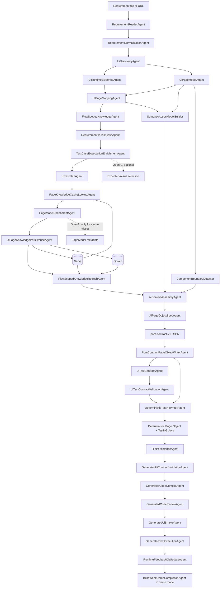
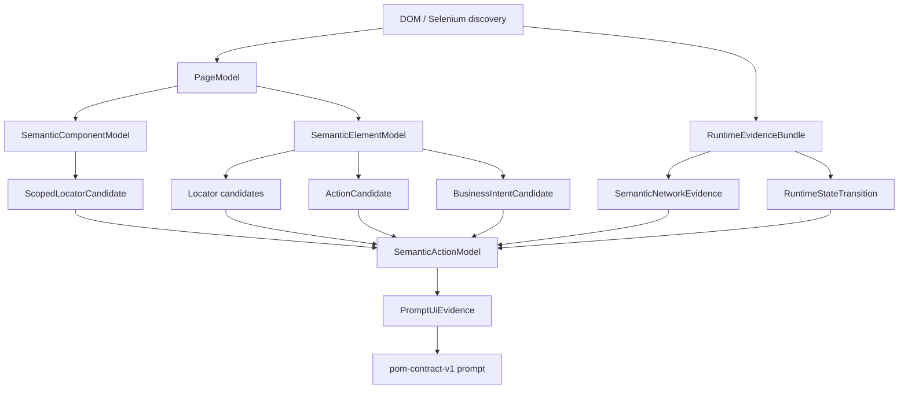
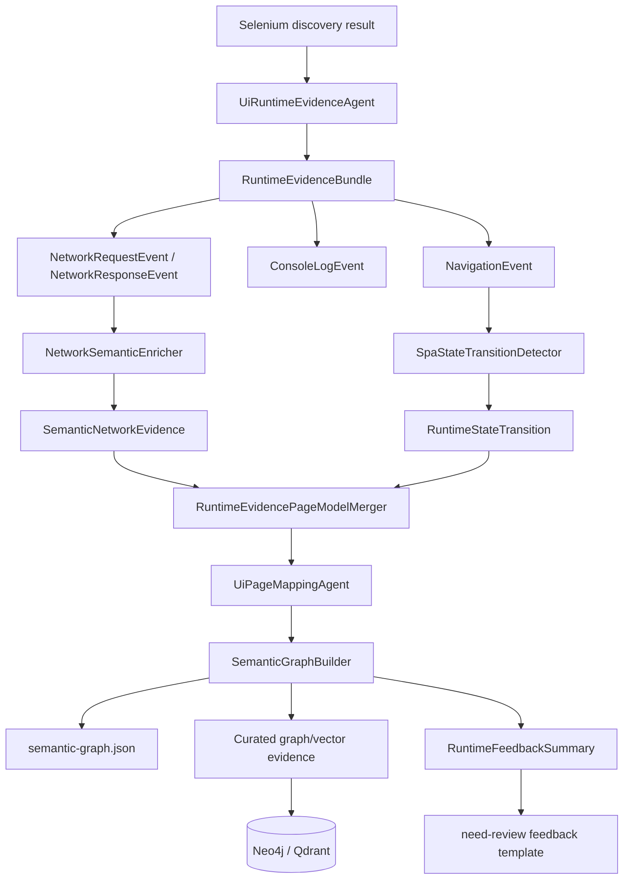
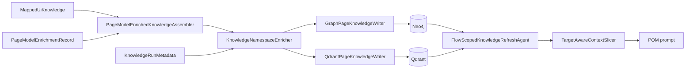

# Current AI UI Architecture

> Refactor note (2026-07-18): mapper, live verification, context slicing, component detection,
> behavior binding, evidence funnel, and POM generation now expose typed stages. The large public
> classes remain compatibility-stable facades, but business decisions live in the stage services
> documented in `MAPPER_STABILIZATION_REFACTORING_PLAN.md`.

## 1. Purpose and Boundary

This document describes the active requirement-driven UI automation architecture in this repository. The platform turns a requirement document into scoped Selenium Page Object **contracts** and uses deterministic writers for Java source generation.

The active AI mode is intentionally contract-first:

- LLMs enrich requirement-to-expected-result links and PageModel metadata.
- The system builds deterministic, reviewable Page Object prompts.
- When enabled, the LLM returns only `pom-contract-v1` JSON.
- Java Page Objects are generated by `DeterministicPomJavaWriter` from the validated contract.
- Canonical scenarios are converted into `ui-test-contract-bundle.v1`; validated contracts are rendered by `DeterministicTestNgWriter` without LLM-authored Java.
- Page Objects remain the owner of Selenium locators and interactions; tests use public Page Object APIs only.

The architecture is designed to prevent a useful but dangerous failure mode: a plausible LLM answer must never become an untraceable UI locator, assertion, or page method.

## 2. Current Workflow



### AI mode versus deterministic mode

| Mode | Entry point | Output | LLM role |
|---|---|---|---|
| Deterministic | `DemoRunner` without `--ai` | Java POMs, TestNG tests, validation and review reports | None |
| AI contract mode | `DemoRunner --ai ...` | Enrichment artifacts, `pom-contract-v1`, typed test contracts, deterministic POM/TestNG Java, validation and source maps | Expected-result/page metadata enrichment and POM contract planning only; Java remains deterministic |

The AI branch lets the LLM plan only a structured POM contract. It does not accept Java method bodies from the LLM. UI tests are assembled from canonical scenarios and validated POM method IDs as `ui-test-contract-bundle.v1`; `DeterministicTestNgWriter` owns Java generation.

## 3. Main Modules and Classes

### Orchestration

| Class / package | Responsibility |
|---|---|
| `app.DemoRunner` | Creates collaborators, selects deterministic or AI mode, and registers workflow agents. |
| `orchestration.AgentOrchestrator` | Builds a dependency graph from agent `requires()` / `produces()`, executes the resulting DAG, records audit events, and stops on a failure. |
| `orchestration.WorkflowState` | Run envelope/read model for objective, requirement input, audit, failure, generated artifact references, and reporting projection. Business data should flow through typed artifacts. |
| `orchestration.WorkflowAgent` | Minimal graph contract: `name`, `requires`, and `produces`. Runtime execution is provided by `PipelineAgent<I, O>`. |
| `orchestration.WorkflowArtifact` | Typed artifact keys used to connect agents, for example `RequirementDocument`, `PageModelBundle`, `MappedUiKnowledge`, and `AiContextPackage`. |
| `orchestration.pipeline.PipelineAgent` | Typed stage interface: `input()`, `output()`, `supports(input, envelope)`, and `execute(input, envelope)`. |
| `orchestration.pipeline.PipelineArtifactStore` | Primary in-run typed artifact registry. It is initialized from the run envelope and expands compound outputs into downstream artifacts. |
| `orchestration.pipeline.WorkflowRunEnvelope` | Immutable run metadata snapshot used by typed agents instead of direct `WorkflowState` access. |
| `orchestration.pipeline.StageOutputPublisher` | Centralized projection layer for artifact files, audit-visible state fields, findings, and generated-source references. |

### Requirement processing

| Class / package | Responsibility |
|---|---|
| `requirements.agent.RequirementReaderAgent` | Typed `PipelineAgent<RequirementInput, RequirementDocument>` that reads a local file or URL. |
| `requirements.normalization.RuleBasedRequirementNormalizer` | Parses headings and bullets into `NormalizedRequirement` records. |
| `requirements.normalization.model.NormalizedRequirement` | Stores `id`, `title`, `statement`, `expectedResult`, relevance flags, tags, and source reference. |
| `requirements.normalization.agent.RequirementNormalizationAgent` | Typed `PipelineAgent<RequirementDocument, NormalizedRequirementBundle>`. |

`expectedResult` is populated when a bullet originates in `## Assertion Requirements` or a compatible expected-result heading. This preserves the document's assertion intent as structured data rather than relying on the POM prompt to infer it from prose.

### UI discovery, PageModel, and mapper

| Class / package | Responsibility |
|---|---|
| `ui.discovery.agent.UiDiscoveryAgent` | Runs discovery and builds canonical page-flow data. |
| `ui.discovery.agent.UiRuntimeEvidenceAgent` | Converts Selenium runtime logs/transitions into `RuntimeEvidenceBundle` before mapping. |
| `ui.discovery.selenium.SeleniumUiDiscoveryService` | Uses Selenium to collect pages, links, elements, forms, and transitions. |
| `ui.discovery.selenium.crawler.SafeNavigationCrawler` | Enforces crawl policy and authentication bridge while navigating the application. |
| `ui.discovery.pagemodel.PageModelBuilder` | Converts raw discovery into structured `PageModel` records. |
| `ui.discovery.agent.UiPageModelAgent` | Typed `PipelineAgent<UiPageModelInput, PageModelBundle>`. |
| `ui.discovery.component.ComponentBoundaryDetector` | Builds SPA-friendly component boundaries from `PageModel`: forms, search blocks, navigation, tables, and content fallback components. |
| `ui.discovery.component.ScopedLocatorValidationService` | Validates locator uniqueness globally and inside the detected component scope. |
| `ui.discovery.semantic.SemanticElementClassifier` | Converts PageModel elements into semantic element types such as `BUTTON`, `INPUT`, `PASSWORD_INPUT`, `LINK`, `SELECT`, and `COLLECTION`. |
| `ui.discovery.semantic.ActionCandidateClassifier` | Produces deterministic action candidates such as `CLICK`, `TYPE`, `SUBMIT_FORM`, `SEARCH`, `LOGOUT`, `READ`, and `UPLOAD`. |
| `ui.discovery.semantic.BusinessIntentResolver` | Resolves business-intent candidates from page context, related elements, and action evidence. |
| `ui.discovery.semantic.SemanticActionModelBuilder` | Builds `SemanticActionModel` from `PageModelBundle` and mapped page identity before prompt evidence is assembled. |
| `ui.discovery.mapping.RuleBasedPageMapper` | Converts PageModel evidence into `MappedUiKnowledge`. |
| `ui.discovery.agent.UiPageMappingAgent` | Typed `PipelineAgent<UiPageMappingInput, MappedUiKnowledge>`. |
| `ui.catalog.ConfirmedPageSourceResolver` | Resolves confirmed page candidates from explicit profile routes, requirement routes, discovery snapshots, and stable page cache records. |
| `ui.catalog.ConfirmedPageRegistry` | Current source of truth for confirmed pages, routes, capabilities, and evidence-backed page names. |

The old `GenericUiPageCatalog` compatibility adapter has been removed. New page selection must go through `ConfirmedPageSourceResolver` and `ConfirmedPageRegistry`.

Key mapper contracts:

| Model | Meaning |
|---|---|
| `PageModel` | Discovered page, elements, forms, locator candidates, page flows, and feature guess. |
| `SemanticComponentModel` | Component-level view of a page with component type, element ownership, scoped locator candidates, confidence, risks, and trace. |
| `ScopedLocatorCandidate` | Locator candidate evaluated globally and within its component, with uniqueness/stability/readability/semantic score breakdown. |
| `SemanticElementModel` | PageModel element reinterpreted as a semantic UI element with locator candidates, possible actions, business intents, and confidence. |
| `ActionCandidate` | Deterministic possible operation for an element, for example `CLICK`, `TYPE`, `SUBMIT_FORM`, `SEARCH`, or `LOGOUT`. |
| `BusinessIntentCandidate` | Business meaning inferred from element/page context, for example `AUTHENTICATE`, `NAVIGATE`, `SEARCH`, `LOGOUT`, or `INSPECT_COLLECTION`. |
| `SemanticActionModel` | Prompt-facing semantic bridge between raw/mapped UI knowledge and `PromptUiEvidence`. |
| `MappedPage` | Semantic page identity, route, actions, assertion hints, elements, and forms. |
| `MappedUiKnowledge` | Full mapper output: pages, transitions, graph nodes/edges, and Qdrant documents. |
| `LocatorCandidate` | Quality-gated Selenium locator with strategy, value, stability score, origin metadata, accessibility/text evidence, uniqueness/stability flags, and risk tags. |
| `PageCapability` | Generic page capability contract: `NAVIGATION`, `AUTHENTICATION`, `AUTHENTICATED_AREA`, `FORM`, `RECORD_LIST`, `RECORD_DETAILS`, `CONTAINER`, `DASHBOARD`, `SECURITY`, `RECOVERY`, and `GENERIC`. |

Page naming is now evidence-driven. A confirmed capability may use its generic default only when no stronger route/page evidence exists. For example:

```text
/login                + AUTHENTICATION -> LoginPage
/pim/viewEmployeeList + RECORD_LIST    -> EmployeeListPage
/dashboard/index      + DASHBOARD       -> DashboardPage
```

This prevents a second application from inheriting stale names such as `ListingPage`, `DetailsPage`, or `CartPage` unless those names are actually confirmed by profile, requirements, discovery, or stable cache.

### Semantic action layer

The mapper now has an explicit semantic bridge before prompt evidence:



This layer answers a higher-level question than the raw mapper: not only "which locator identifies this element?", but "what can this element do, and what business operation might it represent?" The implementation is deterministic and rule-based today:

| Class | Responsibility |
|---|---|
| `SemanticElementClassifier` | Classifies element role/type from tag, input type, accessibility metadata, text, and PageModel semantic hints. |
| `ActionCandidateClassifier` | Combines PageModel action hints with semantic rules to produce possible actions. |
| `BusinessIntentResolver` | Uses page context and related elements to identify candidate business intents. |
| `SemanticActionModelBuilder` | Builds page-scoped semantic actions and intents that can be consumed by `PromptUiEvidenceBuilder`. |
| `SemanticActionModelArtifactWriter` | Writes `target/discovery/semantic-action-model.json` for review before prompt generation. |

The LLM is still not the source of truth for actions or locators. Later AI enrichment may review or label semantic candidates, but Java validators decide which candidates can become prompt evidence or POM contract methods.

### Runtime evidence and BiDi-ready layer

Runtime evidence is now an explicit stage between Selenium discovery and UI mapping:



The current production-safe implementation can use Selenium log evidence or the live BiDi buffer:

| Class / package | Responsibility |
|---|---|
| `ui.discovery.runtime.SeleniumLogRuntimeEvidenceCollector` | Builds runtime evidence from existing Selenium performance/network logs, browser console logs, and discovered transitions. |
| `ui.discovery.runtime.NetworkSemanticEnricher` | Converts relevant network responses into semantic facts such as `AUTHENTICATE`, `LOAD_DATA`, `CREATE_DATA`, `UPDATE_DATA`, and `DELETE_DATA`. |
| `ui.discovery.runtime.SpaStateTransitionDetector` | Classifies route/state transitions as `SPA_ROUTE_CHANGE`, `DOCUMENT_NAVIGATION`, or `STATE_REFRESH`. |
| `ui.discovery.runtime.RuntimeEvidencePageModelMerger` | Adds semantic runtime API relations to matching `PageModel` records before mapping. |
| `ui.discovery.runtime.RuntimeEvidenceArtifactWriter` | Writes `target/discovery/runtime/runtime-evidence.json`, `runtime-network-evidence.json`, and `spa-state-transitions.json`. |
| `ui.discovery.semanticgraph.SemanticGraphBuilder` | Builds a reviewable semantic graph from PageModel, SemanticActionModel, component model, and runtime evidence. |
| `ui.discovery.semanticgraph.SemanticGraphArtifactWriter` | Writes `target/discovery/semantic-graph.json`. |
| `ui.discovery.semanticgraph.SemanticGraphMappedKnowledgeEnricher` | Adds semantic graph nodes, edges, and vector summaries to `MappedUiKnowledge` before persistence. |
| `ui.discovery.runtime.feedback.RuntimeFeedbackAnalyzer` | Produces locator/runtime health signals: locator pass rate, flaky risk, network failures, console errors, and review issues. |
| `ui.discovery.runtime.feedback.RuntimeFeedbackArtifactWriter` | Writes `target/discovery/runtime/runtime-feedback-summary.json` and issue artifacts. |

BiDi is introduced as a live runtime evidence boundary. It is not the only source of truth: page models still come from Selenium DOM snapshots, while BiDi enriches them with route, network, console, and DOM lifecycle evidence.

| Class / package | Responsibility |
|---|---|
| `ui.discovery.runtime.bidi.BiDiDiscoveryConfig` | Runtime flags and buffer limits. `ui.runtime.evidence.collector=bidi` or `ui.bidi.enabled=true` activates live collection. |
| `ui.discovery.runtime.bidi.SeleniumBiDiSessionAdapter` | Installs browser-side hooks for fetch/XHR, console calls, history/hash route changes, document lifecycle, and DOM mutations. Events are tagged with page id, page URL, timestamp, type, and raw attributes. |
| `ui.discovery.runtime.bidi.BiDiSessionManager` | Starts, drains, and stops the live event session around each discovery target. It stays active through authentication submit and SPA redirects. |
| `ui.discovery.runtime.bidi.BiDiEventBuffer` | Bounded event buffer for network/log/DOM events. |
| `ui.discovery.runtime.bidi.BiDiRuntimeEvidenceCollector` | Reads the shared discovery-session buffer and falls back to Selenium snapshot replay only when the buffer is empty or not wired. |
| `ui.discovery.runtime.bidi.BiDiEventNormalizer` | Converts buffered BiDi events into the same `RuntimeEvidenceBundle` contract used by the fallback collector, including SPA state transitions. |

This keeps the mapper independent of the transport. The runtime collector can switch between Selenium log mode and BiDi mode without changing `PromptUiEvidence`, PageModel merge logic, or mapper contracts.

The second runtime/BiDi phase promotes runtime evidence into the knowledge layer:

| Phase | Result |
|---|---|
| 6 | `SemanticGraphBuilder` creates a typed graph across pages, components, semantic actions, business intents, runtime network facts, and SPA transitions. |
| 7 | `semantic-graph.json` is written for review before prompt generation. |
| 8 | Semantic graph nodes and edges are merged into curated `MappedUiKnowledge`, so Neo4j receives runtime/component/action evidence through the existing persistence flow. |
| 9 | Semantic graph summaries are added as Qdrant vector documents for page, component, action, intent, network, and transition retrieval. |
| 10 | Runtime feedback is written to discovery artifacts and `target/ai-run/need-review`, giving human reviewers a structured place to approve, reject, or follow up on weak runtime evidence. |

### Generic interaction inventory and SPA state extensions

SPA support is implemented as a universal discovery layer, not as a separate workflow. Classical multi-page sites still pass through the same layer; they usually produce simple components such as a login form or content block. SPA-like pages produce richer component evidence for navigation, search, tables, widgets, and protected content.

```mermaid
flowchart TD
    A[DOM snapshot] --> B[PageModel]
    B --> C[ComponentBoundaryDetector]
    C --> D[SemanticComponentModel]
    D --> E[ScopedLocatorCandidate]
    E --> F[global uniqueness]
    E --> G[component-scoped uniqueness]
    D --> H[SemanticActionModel]
    H --> I[UiInteractionInventory (CANDIDATE only)]
    I --> J[Neo4j candidate inventory]
    I --> J2[Component interaction graph]
    J2 --> L[Live targeted browser verification]
    L --> M[Generated POM live-smoke feedback]
    M --> N[Promotion / degradation / retention]
    N -. confirmed evidence only .-> K[PromptUiEvidence]
```

The inventory layer is universal: it runs for classical pages too, but SPA-heavy pages usually expose more components. Its broad discovery output is intentionally **not** prompt evidence. Every inventory locator and action starts as `CANDIDATE`; targeted verification promotes evidence only after requirement-scoped browser-count validation and the configured lifecycle threshold is reached.

`UiInteractionInventory` is now the single candidate contract for both site types. `spa.inventory.enabled`
controls only optional state-aware SPA extensions; disabling it does not disable generic page/component/action/
locator inventory. The runtime chooses `DOCUMENT_NAVIGATION` or `UI_STATE_TRANSITION` verification from the
semantic action and observed route/state change, then returns to the same scoring, promotion, catalog, and POM path.
The previous top-level `SpaPageInventory`, `SpaInventoryBundle`, and `SPA_*_INVENTORY` workflow artifacts were
removed, so there is no second inventory source of truth.

| Discovery mode | Current boundary |
|---|---|
| `inventory` | Builds a full candidate map from the already discovered pages. Use explicitly for occasional baseline scans. |
| `targeted` | Default mode. Builds inventory only for pages referenced by current canonical test cases, then selects owned components, locators, and actions. |
| `refresh` | Reuses the same targeted lifecycle path for current requirement scope; DB counters decide whether evidence remains degraded or returns to confirmed. |
| `force` | Builds inventory regardless of reuse/cache decisions. |

The P0-P3 contracts and artifacts are:

| Class / artifact | Responsibility |
|---|---|
| `ui.discovery.component.ComponentBoundaryDetector` | Groups PageModel elements into deterministic component boundaries: `HEADER`, `USER_MENU`, `FORM`, `FILTER_PANEL`, `SEARCH`, `NAVIGATION`, `RESULTS_COLLECTION`, `TABLE`, `MODAL`, and `CONTENT`. It prefers nearest DOM landmark/container ancestry and ARIA role before keyword fallback. |
| `ui.discovery.component.ScopedLocatorValidationService` | Computes `globalMatchCount`, `scopedMatchCount`, `uniqueOnPage`, `uniqueWithinComponent`, and score breakdown for each scoped locator. |
| `ui.discovery.component.model.SemanticComponentModel` | Stores component type, owned element IDs, root locator fallback, scoped locators, confidence, risks, and source trace. |
| `ui.discovery.component.model.ScopedLocatorCandidate` | Stores locator strategy/value plus uniqueness, stability, readability, semantic, and final scores. |
| `ui.discovery.component.ComponentModelArtifactWriter` | Writes `target/discovery/component-model.json`. |
| `ui.discovery.selenium.collector.RuntimeLocatorCountCollector` | Verifies candidate locators in the browser with `driver.findElements(...)` and stores global and nearest-component counts on raw elements. |
| `ui.discovery.interaction.inventory.UiInteractionPage` | Product-neutral inventory page: page identity, route, capability, fingerprint, run metadata, and component inventory. |
| `ui.discovery.spa.model.SemanticComponentInventory` | Candidate component boundary with root locator, element ownership, candidate locators, and candidate actions. |
| `ui.discovery.spa.model.CandidateLocatorEvidence` | Candidate locator quality, browser global/component counts, stability, observed evidence type, and risks. |
| `ui.discovery.spa.model.CandidateActionEvidence` | Candidate action intent, owning component, required locator IDs, preconditions, postconditions, and trace. |
| `ui.discovery.interaction.inventory.agent.UiInteractionInventoryAgent` | Runs after mapper output for both traditional and SPA sites and writes `target/discovery/ui-interaction-inventory.json`; inventory remains candidate input and cannot promote locator facts. |
| `ui.discovery.spa.agent.UiSpaTargetedVerificationAgent` | Runs after canonical test-case planning; selects only requirement-owned inventory facts, validates them against browser-derived counts, and writes targeted verification artifacts. |
| `ui.discovery.spa.ComponentInteractionGraphBuilder` | Builds deterministic prerequisite edges between component actions. Example: `OPEN_MENU -> LOGOUT`; a logout control is not treated as independently actionable. |
| `ui.discovery.spa.TypedComponentFlowBuilder` | Produces candidate-only `MODULE_NAVIGATION`, `FILTER_RESULTS`, `TABLE_SORT`, `TABLE_PAGINATION`, and modal flow contracts from component-owned action evidence. |
| `ui.discovery.spa.LiveTargetedVerificationRunner` | Uses a fresh authenticated browser session to replay confirmed component actions. For sidebar/module navigation it clicks only an internal `href` evidence locator, waits for the SPA route, and maps the route to an already inventoried target page when available. |
| `ui.catalog.Neo4jStableCapabilityLookupService` | Reuses only canonical `UiState -> UiLocatorEvidence` pages with a confirmed primary locator and passing runtime quality in the same application/base-url/schema namespace. |
| `ui.discovery.spa.LiveTargetedVerificationRunner` | Uses a fresh browser session to authenticate when required, open the exact confirmed route, wait for readiness, and verify only selected locators/actions. Destructive/session-ending actions are opt-in. |
| `ui.discovery.interaction.persistence.CanonicalInteractionSmokeFeedbackWriter` | Links generated POM source selectors and live-smoke outcome back to canonical `UiLocatorEvidence` / `UiSemanticAction` records. |
| `ui.discovery.interaction.agent.UiInteractionEvidenceAgent` | Owns canonical scoring, requirement scope, verification projection, promotion, catalog, Top-3 graph projection, and projection trace. |
| `ui.discovery.spa.SpaEvidenceRetentionGraphWriter` | Soft-retires expired `DEGRADED` and orphan candidates by default. Hard deletion is explicitly opt-in. |

This is intentionally artifact-first. The component model does not yet force generated Java component classes. It gives the mapper and prompt layers better evidence so later stages can decide whether a component should stay internal to a page or become a reusable `SidebarComponent`, `LoginFormComponent`, `SearchComponent`, or `TableComponent`.

The canonical graph projection carries the knowledge namespace (`runId`, `appId`, `baseUrlHash`, `requirementSetHash`, `discoverySessionId`, and `schemaVersion`) plus `pageFingerprintHash`. `UiState`, `UiComponent`, `UiSemanticElement`, `UiSemanticAction`, and `UiLocatorEvidence` preserve semantic identity. Raw inventory is not a stable DB authority, so an inventory scan cannot silently alter `Allowed locators` or the generated POM contract.

`target/discovery/typed-component-flows.json` is the candidate flow inventory. It is deliberately not direct POM evidence: a flow must first have confirmed locators/actions, live verification, and smoke feedback. `target/ai-run/validation/pom-source-map.json` records generated POM field/method provenance to contract locator/action references. Smoke feedback consumes that structured map rather than searching generated Java source for selector strings.

Each typed flow also declares a `FlowPostconditionContract`. Navigation has a route-transition proof; filter/table/modal flows remain `needs-review` until a requirement supplies an observable result such as row visibility, changed count/order/page, or modal closure. The review queue at `target/ai-run/need-review/spa-evidence-needs-review.json` includes the requirement IDs, exact evidence ID, selector/count/score context, failure reason, and a specific remediation. It is the first artifact to inspect before changing a locator or prompt.

Targeted verification closes that boundary deliberately:

```text
CanonicalTestCaseBundle
  -> page/route ownership match
  -> capability-to-component selection
  -> browser-count + stability + risk check
  -> fresh browser: authenticate -> exact route -> SPA readiness -> targeted locator/action verification
  -> component prerequisites (for example open user menu before logout)
  -> canonical interaction scoring, safety and requirement scope
  -> generated-POM live-smoke feedback linked to canonical locator/action evidence
  -> UiLocatorEvidence lifecycle update
  -> CONFIRMED only after browser verification, promotion policy and passing generated-POM smoke
  -> DbStableLocatorEvidenceService reads promoted same-origin evidence
  -> PromptUiEvidenceAssembler admits CONFIRMED_LOCATOR only
```

Failures do not become fallback POM evidence. A failed candidate remains unavailable to the prompt and becomes `DEGRADED` after the configured failure threshold. This preserves the rule that broad inventory and database cache are never a source of truth by themselves.

Retention is intentionally conservative: `spa.evidence.retention.enabled=true` marks expired degraded/orphan candidates as `RETIRED`, retaining source trace and failure history for review. `spa.evidence.retention.hard-delete=true` is available only for a deliberately managed knowledge database.

SPA-specific locator risks are now classified before promotion:

| Risk | Meaning |
|---|---|
| `dynamic-css-hash` | Selector appears to depend on generated CSS/hash class names. |
| `nth-child-selector` | Selector depends on volatile DOM position. |
| `absolute-dom-path` | XPath starts from document/root hierarchy. |
| `deep-dom-chain` | CSS selector depends on deep anonymous DOM nesting. |
| `framework-generated-class` | Selector appears tied to framework/library-generated classes such as MUI/Chakra/Ant/CSS hashes. |
| `not-component-unique` | Candidate is not unique even inside its component boundary. |

Runtime validation now uses browser evidence when Selenium discovery is available. `RuntimeLocatorCountCollector` counts each candidate locator globally with `driver.findElements(...)`, then finds the nearest stable scope root with browser-side `closest(...)` and counts the same locator inside that scope. The counts are carried through `RawElement -> PageLocatorModel -> ScopedLocatorCandidate`:

```text
browserMatchCount       -> globalMatchCount
browserScopedMatchCount -> scopedMatchCount
browserScope            -> component/browser scope hint
```

If a run does not have Selenium/browser evidence, the component layer falls back to PageModel locator observations and marks the scoped locator with `browser-global-count-missing` or `browser-scoped-count-missing`.

### Flow, test cases, and expected-result enrichment

| Class / package | Responsibility |
|---|---|
| `ai.flow.BusinessFlowResolver` | Resolves relevant routes, target operations, and target `PageCapability` values from requirements and planning artifacts. |
| `ai.flow.FlowScopedKnowledgeService` | Builds a requirement-scoped slice of mapper knowledge and retrieval context. |
| `testcase.planning.ScenarioPipelineRequirementToTestCaseGenerator` | Classifies requirement units, builds atomic scenario candidates, resolves expected-result contracts, and produces capability-based `CanonicalTestCase` records. |
| `testcase.agent.RequirementToTestCaseAgent` | Stores canonical test-case bundle. |
| `ai.expectationenrichment.agent.TestCaseExpectationEnrichmentAgent` | Resolves one reviewable expected result per test case before UI planning. |
| `ai.expectationenrichment.service.RuleBasedTestCaseExpectationEnrichmentClient` | Deterministic route and lexical fallback resolver. |
| `ai.expectationenrichment.service.OpenAiTestCaseExpectationEnrichmentClient` | Optional OpenAI candidate selector with strict output validation. |

The expected-result layer uses three important models:

| Model | Meaning |
|---|---|
| `ExpectedResultCandidate` | One assertion outcome extracted from `Assertion Requirements`, with requirement ID and source line. |
| `ResolvedExpectedResult` | Selected value, source requirement, confidence, status, and rationale for one test case. |
| `CanonicalTestCase` | The execution contract consumed by UI planning, PageModel enrichment, and POM prompts. |
| `AssertionContract` | Deterministic typed assertion contract: requirement, test case, assertion type, expected value, owner page, route, confidence, and source. |

Only a `ResolvedExpectedResult` with `status=resolved` and `confidence >= 0.80` replaces a non-route `AssertionIntent.expectedValue`. Route assertions are resolved from `ProjectProfile` and are not sent to the LLM for replacement.

After expected-result enrichment, `ai.assertions.agent.AssertionContractAgent` converts assertion intents into typed contracts. Supported `AssertionType` values are `TEXT_VISIBLE`, `ELEMENT_VISIBLE`, `URL_CONTAINS`, `ROUTE_EQUALS`, `FORM_VISIBLE`, `ERROR_MESSAGE_VISIBLE`, `AUTHENTICATED_AREA_VISIBLE`, and `DATA_STATE_MATCHES`. The LLM may receive these contracts in prompts, but the final contract structure is deterministic and validated by Java code.

Typed assertion contracts are written to `target/ai-run/expectations/assertion-contracts.json` and are sliced by `TargetAwareContextSlicer` using scoped test-case IDs and requirement IDs.

### Capability-based test-case flow

The test-case generator no longer treats pages as fixed domain roles such as `catalog`, `details`, or `cart`. It first resolves capability slots:

```text
NAVIGATION
AUTHENTICATION
AUTHENTICATED_AREA
FORM
RECORD_LIST
RECORD_DETAILS
CONTAINER
```

Each slot is filled only by confirmed evidence from the current mapper context or project profile. If a requirement asks for a details-like operation but no `RECORD_DETAILS` page is confirmed, the generator falls back to the closest confirmed page instead of inventing `DetailPage`. Locator hints are also evidence-only; hardcoded fallback selectors such as `a[href*='/products/']` are not injected.

`BusinessFlowContext` now carries `targetCapabilities` in addition to operations, routes, terms, and page names. `FlowScopedKnowledgeService` scores mapped pages by canonical capability instead of product/cart/listing text heuristics. Container words such as cart or basket may still help classify a requirement into `CONTAINER`, but downstream selection is capability-based.

### Locator Quality Gate

Locator quality is evaluated before PageModel evidence is converted into `MappedUiKnowledge`.
Selenium discovery runs a small repeated crawl by default and uses the repeated observations to decide whether a locator is stable across runs.

| Class / package | Responsibility |
|---|---|
| `ui.discovery.mapping.LocatorQualityEvaluator` | Builds the final `LocatorCandidate` contract and assigns a normalized stability score. |
| `ui.discovery.mapping.LocatorOriginResolver` | Resolves `href`, `originHost`, and `sameOrigin` from page URL, element href, and locator value. |
| `ui.discovery.mapping.LocatorStabilityTracker` | Marks candidates as `uniqueOnPage` and `stableAcrossRuns` from deterministic selector evidence. |
| `ui.discovery.mapping.LocatorRiskClassifier` | Adds risk tags such as `external-origin`, `external-link-text-xpath`, `visible-text-xpath`, and `not-proven-stable`. |
| `ui.discovery.selenium.stability.SeleniumDiscoveryStabilityAggregator` | Aggregates locator observations from repeated Selenium crawl runs. |

The gate rejects forbidden candidates before they reach enrichment or prompts. XPath locators based only on visible text for outbound links are blocked because the element `href` carries an external `originHost`.
When repeated discovery is enabled, a locator must be observed in every successful crawl run to get `stableAcrossRuns=true`; partial observations keep the locator but add `UNSTABLE_DISCOVERY` and reduce its score.

Repeat count defaults to `3` and can be adjusted with `ui.discovery.repeat-runs` or `UI_DISCOVERY_REPEAT_RUNS` (`1..5`).

Current scoring baseline:

| Locator evidence | Score |
|---|---:|
| `data-testid`, `data-test`, `data-qa` | 0.95 |
| Stable `id` | 0.90 |
| `name` for form fields | 0.80 |
| `aria-label` / role / accessible-name evidence | 0.75 |
| Short CSS with stable class or attribute | 0.60 |
| XPath by visible text | 0.35 |
| Long or absolute XPath | 0.10 |
| External link text XPath | 0.05 / forbidden |

### PageModel enrichment and knowledge stores

| Class / package | Responsibility |
|---|---|
| `ai.pageenrichment.agent.PageKnowledgeCacheLookupAgent` | Checks Neo4j for existing page enrichment by `appId`, `baseUrlHash`, `schemaVersion`, `pageId`, and `pageFingerprintHash`; cache hits skip OpenAI page enrichment. |
| `ui.discovery.persistence.knowledge.PageKnowledgeFingerprintCalculator` | Creates a deterministic hash from mapped page identity, elements, locators, forms, and actions. |
| `ai.pageenrichment.agent.PageModelEnrichmentAgent` | Builds page-scoped enrichment input only for cache misses, combines cached and newly generated records, and rebinds cached records to the current requirement evidence. |
| `ai.pageenrichment.service.RuleBasedPageModelEnrichmentClient` | Deterministic fallback enrichment. |
| `ai.pageenrichment.service.OpenAiPageModelEnrichmentClient` | Optional OpenAI metadata enrichment; validates page identity, locator whitelist, and traceability. |
| `ai.pageenrichment.service.PageModelEnrichedKnowledgeAssembler` | Adds reconstructable enrichment nodes/documents to mapper knowledge before persistence. |
| `ui.discovery.agent.UiPageKnowledgePersistenceAgent` | Writes scoped mapper and enrichment knowledge to enabled stores. |
| `ui.discovery.persistence.knowledge.GraphPageKnowledgeWriter` | Writes page/element/action/enrichment graph facts to Neo4j. |
| `ui.discovery.persistence.knowledge.QdrantPageKnowledgeWriter` | Embeds and writes UI documents to Qdrant. |

`PageModelEnrichmentRecord` contains page intent, summary, supported actions, stable locator facts, risks, coverage gaps, traceability, and requirement provenance:

```text
actionsByRequirement:       requirement ID -> owned source-page actions
postconditionsByRequirement: requirement ID -> owned target-page assertions
```

This provenance lets later prompt slicing remove facts from other requirements even when they refer to the same page.

### Artifact reuse registry

The artifact reuse layer is separate from page knowledge persistence. Page knowledge describes the application; artifact reuse describes generated outputs that may be reused when the same stable input appears again.

| Class / package | Responsibility |
|---|---|
| `artifactreuse.model.ArtifactRecord` | Metadata for a generated artifact: artifact type, target, fingerprint, schema/prompt versions, model settings, status, quality score, writer/compile status, file path, timestamps, and reuse count. |
| `artifactreuse.model.ArtifactTarget` | Target identity for the artifact, currently page-focused but shaped for future flow/API targets. |
| `artifactreuse.model.RunRecord` | Run namespace metadata: `runId`, `appId`, `baseUrlHash`, `requirementSetHash`, `discoverySessionId`, `schemaVersion`, timestamp, and source agent. |
| `artifactreuse.model.QualityGateRecord` | Validation evidence linked to an artifact, such as schema, contract quality, writer, compile, review, or smoke gates. |
| `artifactreuse.fingerprint.PomContractFingerprintBuilder` | Builds deterministic SHA-256 fingerprints from curated POM prompt evidence and stable generation configuration. |
| `artifactreuse.store.FileBackedStableArtifactStore` | Stores full POM contract JSON files under `target/ai-run-history/stable/pom-contracts/`. |
| `artifactreuse.policy.ArtifactReusePolicy` | Decides between `REUSE_STABLE`, `CALL_LLM`, `FORCE_REFRESH`, `REGENERATE_SCHEMA_CHANGED`, and `REGENERATE_PREVIOUS_INVALID`. |
| `artifactreuse.registry.ArtifactRegistry` | Write-side contract for registering validated artifacts. |
| `artifactreuse.registry.neo4j.Neo4jArtifactRegistry` | Neo4j MVP lookup/writer for `Artifact`, `Page`, `Run`, and `QualityGate` nodes and their relationships. |
| `artifactreuse.lifecycle.ArtifactLifecyclePromotionService` | Evaluates writer, compile, review, generated smoke, and live smoke outcomes, then promotes eligible POM contracts to `STABLE`. |
| `artifactreuse.agent.ArtifactLifecyclePromotionAgent` | Workflow stage that writes `validation/artifact-lifecycle-result.json` and lifecycle metrics after smoke validation. |
| `artifactreuse.metrics.ArtifactReuseRunMetricsCollector` | Converts explicit workflow artifacts into run-level POM reuse metrics without inferring LLM calls from prompt files. |
| `artifactreuse.agent.ArtifactReuseMetricsAgent` | Final artifact-reuse metrics stage. Writes `metrics/artifact-reuse-summary.json` and updates `run-summary.json` / `run-summary.md`. |
| `artifactreuse.metrics.RunHistoryStatisticsReporter` | Reads only final run artifacts and writes one `target/ai-run-history/last-10-runs.md` table for the last ten runs. |
| `artifactreuse.agent.RunHistoryStatisticsAgent` | Final DAG stage, after runtime feedback persistence; it updates the cross-run table without affecting generation decisions. |

The Neo4j registry writes:

```text
(:Artifact)-[:GENERATED_FOR]->(:Page)
(:Run)-[:PRODUCED]->(:Artifact)
(:Run)-[:REUSED]->(:Artifact)
(:Artifact)-[:VALIDATED_BY]->(:QualityGate)
```

`AiPageObjectSpecGenerator` now checks artifact reuse before calling `OpenAiResponseGenerationClient.generate(...)`:

```text
PromptReadyPomScope
 -> PomContractFingerprintBuilder
 -> Neo4jArtifactRegistry.findStableArtifact
 -> FileBackedStableArtifactStore
 -> ArtifactReusePolicy
 -> REUSE_STABLE: load pom-contract JSON and skip POM LLM
 -> CALL_LLM: generate pom-contract JSON, parse, rehydrate, save file, register as SCHEMA_VALIDATED
 -> DeterministicPomJavaWriter
 -> File persistence
 -> Compile + review + generated smoke + optional live smoke through compiled generated POM methods
 -> ArtifactLifecyclePromotionAgent
 -> STABLE only when all required gates pass
```

Prompt artifacts and prompt quality gates still run before reuse, so artifact reuse does not bypass prompt-safety validation. Neo4j lookup and `ArtifactReusePolicy` accept only `STABLE`; therefore a failed or unfinished artifact can remain available for audit without becoming a reuse candidate. A `SKIPPED` live smoke is accepted only when live smoke is disabled; if it is enabled but skipped because credentials or capability evidence are missing, the contract remains `NEEDS_REVIEW`. Reused artifacts retain their stable registry status and still pass the current run's deterministic writer, compile, review, and smoke stages.

`LiveCapabilitySmokeService` loads the current run's compiled Page Object classes from `target/test-classes`,
constructs them with the active `WebDriver` and `UiRuntimeConfig`, and invokes their public open, authentication,
route assertion, user-menu, logout visibility, and logout methods. It no longer parses locator fields from Java
source and drives equivalent raw Selenium actions. The artifact records
`executionMode=COMPILED_GENERATED_POM_API`, making this runtime proof distinguishable from static source smoke.

For a reused POM, lifecycle promotion consumes the validated stable-file path from the reuse decision rather than expecting a new stable-file write. This keeps lifecycle metrics aligned with the actual `REUSE_STABLE` decision: a reused artifact that passes writer, compile, review, generated smoke, and enabled live smoke remains `STABLE` and is recorded as a `REUSED` relation in Neo4j.

### Cross-run operational table

`RunHistoryStatisticsAgent` is intentionally downstream of compile, review, generated/live smoke, flow feedback, and runtime DB feedback. It reads final artifacts only and writes one human-readable file:

```text
target/ai-run-history/last-10-runs.md
```

Each row includes requirement/test-case counts, quality score, Neo4j/Qdrant/stable-cache retrieval state, POM and Flow Contract reuse hits/misses, executed/skipped POM LLM calls, lifecycle state, compile/review results, generated/live smoke status, flow feedback persistence, and one final `PASSED`, `WARNING`, or `FAILED` outcome. The report is operational reporting only; it never contributes evidence back into the mapper, RAG, POM prompt, or reuse planner.

`DbImpactComparisonReporter` reads `metrics/artifact-reuse-summary.json` when it exists. This avoids a misleading interpretation of prompt files: prompts are always retained for audit, while `llmCallsExecuted` and `llmCallsSkipped` come from explicit generation and reuse decisions. The comparison distinguishes page knowledge, stable locator, POM contract, and future flow reuse rather than collapsing them into one DB-cache number.

### Flow contracts

`artifactreuse.flow` is the generic workflow knowledge layer. It is intentionally separate from a generated test: a Flow Contract says which preconditions, actions, states, endpoints, and evidence describe a verified business flow. It does not produce Java code and does not change prompt scope by itself.

| Class / package | Responsibility |
|---|---|
| `FlowContractBuilder` | Groups canonical test-case operations into capability-based contracts such as authentication, form entry, search, record mutation, modal confirmation, upload, or pagination. |
| `FlowContractStatus` | Keeps the evidence boundary explicit: `CONFIRMED` versus `NEEDS_REVIEW`. |
| `FlowContractBuilderAgent` | Builds and writes `flow-contracts/flow-contracts.json` after canonical test-case planning. |
| `Neo4jFlowContractRegistry` | Persists flow endpoints, states, steps, requirement traceability, and optional generated-artifact links. |
| `FlowContractPersistenceAgent` | Guards graph persistence with `artifact.reuse.flow-contract.enabled` and the knowledge DB status. |
| `FlowRuntimeFeedbackAgent` | Records generated/live smoke outcomes in Neo4j and updates flow pass/flaky quality metrics. |
| `FlowSemanticIndexAgent` | Optionally indexes only confirmed Flow Contract summaries in Qdrant. |
| `FlowSemanticCandidateAgent` | Uses Qdrant only to rank candidates, then asks Neo4j for exact confirmed-flow expansion. |
| `ReusePlannerAgent` | Emits explainable per-requirement reuse/discovery decisions; it does not mutate canonical tests or POM evidence. |

The graph shape is:

```text
(:FlowContract)-[:STARTS_AT]->(:Page)
(:FlowContract)-[:ENDS_AT]->(:Page)
(:FlowContract)-[:REQUIRES_STATE]->(:FlowState)
(:FlowContract)-[:PRODUCES_STATE]->(:FlowState)
(:FlowContract)-[:HAS_STEP]->(:FlowStep)
(:FlowContract)-[:USES_ARTIFACT]->(:Artifact)  // only when an artifact is explicitly linked
```

The artifact reuse path is deliberately gated:

```text
CanonicalTestCaseBundle + current FlowContractBundle
  -> FlowSemanticIndexer (optional, CONFIRMED contracts only)
  -> Qdrant candidates (namespace filtered)
  -> Neo4j exact confirmed-flow expansion
  -> ReusePlanner
  -> RequirementReusePlan: REUSE_STABLE | DISCOVER | NEEDS_REVIEW
```

Qdrant does not write raw text into a POM prompt and cannot make a reuse decision. If vector retrieval is unavailable, the planner records the reason and remains deterministic. POM reuse is separately guarded by `ArtifactInvalidationPolicy`: fingerprint, schema, prompt template, deterministic writer version, page/action/assertion evidence, lifecycle quality, compile, smoke, and force-refresh changes block reuse.

Flow reuse adds a stricter runtime quality boundary. Every `FlowContract` has a deterministic `contractFingerprint`, `lastSuccessfulSmoke`, `runtimePassRate`, and `flakyRate`. `FlowRuntimeFeedbackAgent` updates these values after smoke validation. `ReusePlanner` accepts a graph-confirmed candidate only when it has a successful smoke, a pass rate of at least `0.90`, and a flaky rate of at most `0.10`; a degraded candidate becomes `NEEDS_REVIEW`, never a silent reuse.

`FlowContractBuilderAgent` creates the shared `KnowledgeRunMetadata` before flow persistence, Qdrant indexing, and reuse planning. This prevents a semantic layer from using an unnamespaced bundle. For POM artifacts, `FileBackedStableArtifactStore` accepts local fallback only when the deterministic lifecycle has written a `.stable` marker beside the contract; a raw contract file cannot bypass Neo4j, quality, compile, review, or smoke checks.

### Context slicing and prompt composition

| Class / package | Responsibility |
|---|---|
| `ai.context.AiContextAssembler` | Builds the full `AiContextPackage`. |
| `ai.context.AiContextScopeResolver` | Determines the POM scope: page name, exact routes, scenario IDs, and requirement IDs. |
| `ai.context.TargetAwareContextSlicer` | Produces a strict page/route/requirement slice for one POM prompt. |
| `ai.context.UiKnowledgeRetrievalService` | Retrieves route-scoped Qdrant and Neo4j evidence from `UiKnowledgeRetrievalRequest`; the `WorkflowState` overload is now a compatibility adapter. |
| `ai.ui.prompt.AiPromptContextFormatter` | Formats defined test cases, expected values, enrichment facts, and compact DB evidence. |
| `ai.ui.prompt.PageObjectCapabilityContractFormatter` | Computes source-page actions, target-page assertions, required locators, forbidden methods, and reusable baseline methods. |
| `ai.ui.prompt.AiPageObjectPromptBuilder` | Builds the final POM contract-planner prompt. The LLM is asked for `pom-contract-v1`, not Java method bodies. |
| `ai.ui.agent.AiPageObjectSpecAgent` | Writes prompt files, scope traces, and validated `pom-contract-v1` artifacts when POM LLM mode is enabled. |
| `ai.ui.agent.PomContractPageObjectWriterAgent` | Runs the deterministic Java writer over validated POM contracts and produces Page Object source files. |
| `ui.testcontract.agent.UiTestContractAgent` | Produces exactly one atomic typed test contract per canonical executable scenario. Actions and assertions reference public POM method IDs only. |
| `ui.testcontract.agent.UiTestContractValidationAgent` | Applies JSON-schema and semantic ownership/data/atomicity gates before Java generation. Unsupported evidence is written to `need-review`. |
| `ui.testcontract.agent.DeterministicTestNgWriterAgent` | Renders validated contracts into TestNG sources and writes requirement/action/assertion-to-line source maps. |
| `ui.testcontract.writer.DeterministicTestNgWriter` | Generates tests using `BaseTest`, generated Page Objects, `UiAssertions`, `UserCredentials`, and `ScenarioData`; it never emits raw Selenium. |
| `validation.agent.GeneratedTestExecutionAgent` | Executes only manifest-owned generated TestNG sources after compile, review, source smoke, and live UI smoke; writes a typed execution result instead of inferring success from compilation. |
| `validation.execution.GeneratedTestExecutionService` | Runs the namespaced generated test classes, parses Surefire XML, and projects per-scenario status with requirement/action/assertion source traceability. |
| `demo.BuildWeekDemoCompletionAgent` | Applies the terminal demo gate against the versioned manifest and writes one JSON/Markdown summary after runtime feedback persistence. |

## 4. Agent Order in AI Mode

The orchestrator no longer relies on numeric order as the primary workflow definition. Each agent declares typed dependencies:

```text
RequirementNormalizationAgent
  requires: RequirementDocument
  produces: NormalizedRequirementBundle

UiPageMappingAgent
  requires: UiDiscoverySnapshot, PageModelBundle
  produces: MappedUiKnowledge

SemanticActionModelBuilder
  requires: PageModelBundle, MappedUiKnowledge, target MappedPage
  produces: page-scoped SemanticActionModel consumed by PromptUiEvidenceBuilder

AiContextAssemblyAgent
  requires:
    - CanonicalTestCaseBundle
    - AssertionContracts
    - PageModelEnrichmentRecords
    - RefreshedFlowScopedKnowledgePackage
  produces: AiContextPackage
```

Runtime execution is dependency-based, not numeric-order based. The orchestrator sorts agents from declared `requires()` / `produces()` artifacts and uses the input registration order only as a deterministic tie-breaker for independent graph nodes. The AI POM workflow follows this dependency path:

```text
RequirementDocument
  -> NormalizedRequirementBundle
  -> UiDiscoverySnapshot + PageModelBundle
  -> SemanticComponentModel + ScopedLocatorCandidate
  -> SemanticElementModel + ActionCandidate + BusinessIntentCandidate
  -> MappedUiKnowledge
  -> CanonicalTestCaseBundle
  -> AssertionContracts + UiTestPlan
  -> PageModelEnrichmentRecords + EnrichedMappedUiKnowledge
  -> UiKnowledgePersisted
  -> RefreshedFlowScopedKnowledgePackage
  -> AiContextPackage + page-scoped PromptUiEvidence
  -> AiPageObjectSpecs
```

### Typed pipeline status

The workflow core has moved to typed stage contracts. Agents execute through `PipelineAgent<I, O>` and exchange business data through `PipelineArtifactStore`; `WorkflowState` is retained as a run envelope/reporting projection.

Representative typed agents:

| Agent | Typed input | Typed output | Legacy adapter |
|---|---|---|---|
| `RequirementReaderAgent` | `RequirementInput` | `RequirementDocument` | `StageOutputPublisher.publishRequirementDocument` |
| `RequirementNormalizationAgent` | `RequirementDocument` | `NormalizedRequirementBundle` | `StageOutputPublisher.publishNormalizedRequirementBundle` |
| `PolicyLoadingAgent` | `RequirementInput` | `GenerationPolicy` | `StageOutputPublisher.publishGenerationPolicy` |
| `UiDiscoveryAgent` | `UiDiscoveryInput` | `UiDiscoveryOutput` | `StageOutputPublisher.publishUiDiscoveryOutput` |
| `UiPageModelAgent` | `UiPageModelInput` | `PageModelBundle` | `StageOutputPublisher.publishPageModelBundle` |
| `UiPageMappingAgent` | `UiPageMappingInput` | `MappedUiKnowledge` | `StageOutputPublisher.publishMappedUiKnowledge` |
| `FlowScopedKnowledgeAgent` | `FlowScopedKnowledgeInput` | `FlowScopedKnowledgePackage` | `StageOutputPublisher.publishFlowScopedKnowledgePackage` |
| `RequirementToTestCaseAgent` | `RequirementToTestCaseInput` | `CanonicalTestCaseBundle` | `StageOutputPublisher.publishCanonicalTestCaseBundle` |
| `TestCaseExpectationEnrichmentAgent` | `TestCaseExpectationEnrichmentInput` | `TestCaseExpectationEnrichmentOutput` | `StageOutputPublisher.publishExpectationEnrichment` |
| `PageKnowledgeCacheLookupAgent` | `PageKnowledgeCacheLookupInput` | `PageKnowledgeCacheLookupOutput` | `StageOutputPublisher.publishPageKnowledgeCacheLookup` |
| `PageModelEnrichmentAgent` | `PageModelEnrichmentInputBundle` | `PageModelEnrichmentOutput` | `StageOutputPublisher.publishPageModelEnrichment` |
| `UiPageKnowledgePersistenceAgent` | `UiKnowledgePersistenceInput` | `UiKnowledgePersistenceOutput` | `StageOutputPublisher.publishKnowledgePersistence` |
| `FlowScopedKnowledgeRefreshAgent` | `FlowScopedKnowledgeInput` | `FlowScopedKnowledgePackage` | `StageOutputPublisher.publishRefreshedFlowScopedKnowledgePackage` |
| `AssertionContractAgent` | `CanonicalTestCaseBundle` | `List<AssertionContract>` | `StageOutputPublisher.publishAssertionContracts` |
| `AiContextAssemblyAgent` | `AiContextAssemblyInput` | `AiContextPackage` | `StageOutputPublisher.publishAiContextPackage` |
| `AiPageObjectSpecAgent` | `AiPageObjectSpecInput` | `AiPageObjectGenerationResult` | `StageOutputPublisher.publishAiPageObjectGenerationResult` |

`AgentOrchestrator` resolves typed input from `PipelineArtifactStore`, evaluates `supports(input, WorkflowRunEnvelope)`, calls `execute(input, WorkflowRunEnvelope)`, stores the output, and then lets the agent publish any required file/reporting projection.

`StageOutputPublisher` keeps side effects out of typed `execute(...)` methods where practical. Its remaining job is projection: write artifacts, expose generated file paths, and keep run reports readable.

The following domain services now also expose typed entry points:

| Service | Typed input | Legacy status |
|---|---|---|
| `ScenarioPipelineRequirementToTestCaseGenerator` | `RequirementToTestCaseInput` | Produces capability-based canonical UI test cases through RequirementUnit -> ExpectedResultContract -> ScenarioCandidate -> quality gate. |
| `BusinessFlowResolver` | `FlowScopedKnowledgeInput` | Resolves flow scope from operations, requirements, and confirmed capabilities. |
| `FlowScopedKnowledgeService` | `FlowScopedKnowledgeInput` | Builds route/requirement-scoped knowledge packages. |
| `UiKnowledgeRetrievalService` | `UiKnowledgeRetrievalRequest` | Retrieves namespace-filtered current-run or stable-cache evidence. |
| `AiRunQualitySummaryService` | `AiRunQualitySummaryInput` | Computes run-level quality score. |
| `AiPageObjectSpecGenerator` | `AiPageObjectGenerationRequest` | Coordinates typed POM contract prompt generation stages. |

`AiPageObjectSpecAgent` invokes the typed page-object generation path directly. The prompt-side workflow is split into typed services:

| Stage service | Responsibility |
|---|---|
| `AiPageObjectScopeResolverStage` | Resolves page scopes, route/page matches, scoped scenarios, baseline specs, and scope trace metadata. |
| `AiPageObjectPromptBuildStage` | Builds the deterministic POM prompt and prompt metadata from a typed scope. |
| `AiPageObjectPromptLintStage` | Runs executable prompt-quality validation before a prompt can proceed. |
| `AiPageObjectPromptArtifactWriter` | Writes scope trace, prompt text, prompt trace, and prompt-quality report artifacts. |
| `AiRunQualitySummaryWriter` | Writes run-level quality summary and delegates artifact diff archiving. |
| `AiRunArtifactDiffWriter` | Writes the artifact diff report for the current quality summary. |

Blocking prompt-quality issues are enforced after prompt artifacts are written, so failed runs still leave enough evidence for review.

### POM contract planning layer

The Page Object prompt no longer asks the LLM to write Java method bodies. The LLM role is now a **Page Object Contract Planner**:

```text
SemanticActionModel
  -> PromptUiEvidence
  -> pom-contract-v1 JSON
  -> PomContractQualityGate
  -> DeterministicPomJavaWriter
  -> internal Java rendering spec / generated Java source
```

The new contract model is:

| Contract | Responsibility |
|---|---|
| `PomContractSpec` | Root contract with schema version, page metadata, locators, actions, assertions, gaps, and rejected suggestions. |
| `PomComponentSpec` | Reusable or complex scoped UI region such as sidebar, header, search, table, modal, widget, or form. |
| `PomActionSpec` | Public action method plus deterministic `PomStepSpec` list. |
| `PomAssertionSpec` | Public assertion/query method plus deterministic `PomCheckSpec` list. |
| `PomStepSpec` | Structured action such as `CLICK`, `CLEAR_AND_TYPE`, `SEND_KEYS`, `SELECT_BY_VISIBLE_TEXT`, `UPLOAD_FILE`, or `OPEN_ROUTE`. |
| `PomCheckSpec` | Structured check such as `VISIBLE`, `TEXT_CONTAINS`, `URL_CONTAINS`, `ATTRIBUTE_EQUALS`, or `LIST_TEXTS`. |
| `PomContractQualityGate` | Validates schema intent: locator ids exist, method contracts are complete, route checks have routes, and unsupported evidence becomes a gap. |
| `DeterministicPomJavaWriter` | Owns Java body generation from the typed contract, including reusable component classes when `components` are present. |
| `AiPageObjectSpec` | Internal deterministic rendering model consumed by the Java template writer; it is not an LLM output contract or prompt authority. |

This removes the most fragile generation surface: raw Java statements from LLM output. The LLM can choose semantic steps and checks, but it cannot call `elements.type(...)`, inline `By.cssSelector(...)`, expose `WebElement`, or invent unsupported helper APIs.

`PromptUiEvidenceBuilder` now uses the semantic action layer before falling back to canonical/mapped action text. As a result, prompts can carry compact, page-owned signals such as:

```text
semantic-business-intent: AUTHENTICATION
semantic-element-intent: loginButton:AUTHENTICATE
semantic-action: CLICK / TYPE / SUBMIT_FORM
```

The prompt still receives only curated evidence. Raw DOM nodes, rejected locators, and full discovery dumps stay in debug artifacts.

When semantic actions are present, `PageObjectCapabilityContractFormatter` gives them priority over canonical prose actions. Canonical test cases still provide coverage and assertion ownership, but public POM action candidates are derived first from `BusinessIntentCandidate` and `ActionCandidate`. For example, a login page with username/password inputs and a submit button is converted into contract-friendly actions such as:

```text
enterUsername(String username)
enterPassword(String password)
clickLoginButton()
login(String username, String password)
```

instead of passing prose like `Authenticate using the configured credentials` into the POM contract.

Protected pages are handled differently from authentication pages. A protected page such as `DashboardPage` may declare `LoginPage` as a prerequisite, but it must not own `enterUsername`, `enterPassword`, `clickLoginButton`, or `login` methods. Authentication is a setup/precondition flow owned by the authentication page; the protected page owns only its own controls and assertions.

### Reusable component POM generation

`pom-contract-v1` now supports reusable components:

```json
{
  "components": [
    {
      "name": "SidebarComponent",
      "type": "NAVIGATION",
      "rootLocatorId": "sidebarRoot",
      "locators": [
        {
          "id": "adminLink",
          "elementName": "admin link",
          "strategy": "css",
          "value": "a[href*='/admin']",
          "role": "link",
          "stabilityScore": 0.84
        }
      ],
      "actions": [],
      "assertions": [],
      "reusable": true
    }
  ]
}
```

When a component contract is present, `DeterministicPomJavaWriter` emits the page object plus component classes:

```text
DashboardPage
  -> SidebarComponent
  -> SearchComponent
  -> TableComponent
```

The generated page object receives accessor methods such as:

```java
public SidebarComponent sidebarComponent() {
    return new SidebarComponent(driver, runtimeConfig, sidebarRoot);
}
```

The component class receives its own scoped locators and methods. Component methods resolve children from the component root instead of forcing every locator to be globally unique. This is the main SPA-specific improvement: repeated links, buttons, and inputs can be stable inside `SidebarComponent`, `SearchComponent`, or `TableComponent` even when they are not globally unique across the full page.

## 5. Exact Scope and Safety Rules

### Route-aware selection

The scope resolver and `TargetAwareContextSlicer` use exact routes before page names:

```text
exact route match
  -> exact page-name match only when no route is available
  -> no cross-page graph/vector fallback
```

When a route match does not exist, `UiKnowledgeRetrievalService` returns `SKIPPED_NO_ROUTE_MATCH`; it does not fill the prompt with a semantically similar page from Neo4j or Qdrant.

Confirmed route filtering is enforced before retrieval and prompt generation:

```text
ProjectProfile routes
  + requirement routes
  + current discovery snapshot routes
  + stable page cache candidates
  -> ConfirmedPageRegistry
  -> mapper filter / retrieval filter / prompt slicer
```

If a route is not explicit or confirmed by requirements, discovery, or stable cache, it does not become mapper evidence, DB retrieval scope, or POM prompt scope.

Typed retrieval now uses `UiKnowledgeRetrievalRequest`:

```text
UiKnowledgeRetrievalRequest
  projectProfile
  testPlan / uiTestPlan / canonicalTestCaseBundle
  mappedUiKnowledge
  knowledgeRunMetadata
  canonicalInteractionModel
  preferredPageIds / preferredTerms / querySeed
```

`AiContextAssembler.assemble(AiContextAssemblyInput)` can therefore execute DB-backed retrieval without receiving `WorkflowState`. The older `retrieve(WorkflowState, ...)` overload remains only as an adapter for legacy callers.

### Requirement-aware enrichment slicing

For a requested POM page, the slicer:

1. filters `PageModelEnrichmentRecord` by the page route;
2. filters traceability by `scope.targetRequirementIds`;
3. flattens only `actionsByRequirement` and `postconditionsByRequirement` for those IDs;
4. passes the resulting record to the prompt formatter.

### External navigation boundary

The locator quality gate excludes external-origin locator candidates before PageModel enrichment. The POM prompt additionally forbids external-origin locators and navigation methods.

The remaining limitation is XPath text locators for outbound links: an XPath such as `//a[normalize-space()='Elemental Selenium']` contains no URL and may still be discovered. It is treated as a risk and must not become an in-app POM method without origin evidence.

## 6. Prompt Contract

Each generated POM contract prompt uses compact mode by default:

```text
# Role
# Goal
# Context
# Input Authority Order
# Constraints
# Input
  - Page capability contract
  - Required POM contract
  - Allowed locators
  - Baseline page object API
# Expected Output
# Success Criteria
# Coverage Gap Rules
```

The final prompt intentionally does **not** include raw `Defined test cases`, `Page object discovery facts`, full PageModel enrichment records, raw Neo4j/Qdrant retrieval dumps, or excluded evidence. Discovery, enrichment, and database retrieval still run before prompt assembly, but their output is curated into `PromptUiEvidence`: page-owned required actions, page-owned assertions with expected values, and mapper-approved allowed locators.

Full diagnostic prompts can still be enabled for troubleshooting with:

```properties
ai.page-object.prompt.mode=debug
```

or:

```properties
ai.prompt.debug=true
```

Debug mode preserves the wider evidence dump for investigation. Compact mode is the default runtime path for LLM review and prompt quality checks.

Allowed locators are now component-grouped when component evidence exists:

```text
Allowed locators:
component: LoginFormComponent | type=FORM
- usernameInput | strategy=name | value=username | uniqueWithinComponent=true | globalCount=1 | scopedCount=1
- passwordInput | strategy=name | value=password | uniqueWithinComponent=true | globalCount=1 | scopedCount=1
- loginButton | strategy=css | value=button[type='submit'] | uniqueWithinComponent=true | globalCount=1 | scopedCount=1

component: NavigationComponent | type=NAVIGATION
- adminLink | strategy=css | value=a[href*='/admin'] | uniqueWithinComponent=true | globalCount=1 | scopedCount=1
```

This keeps the prompt compact while giving the POM contract planner enough structure to avoid treating every SPA link or button as a page-owned business method. Navigation/sidebar/search/table components can be represented as scoped evidence first and promoted to reusable Java components later only when the writer supports that contract.

The Page Object prompt contract includes the confirmed capability:

```text
- pageName=EmployeeListPage | route=/pim/viewEmployeeList | openMethodName=openEmployeeListPage
- confirmedCapability=RECORD_LIST | pageContract=page with RECORD_LIST capability
```

This wording is deliberate. The LLM should reason from the capability and scoped evidence, not from a legacy generic class name such as `ListingPage`. Prompt scope still uses the final Java class name, but that class name is now expected to be a consequence of capability plus evidence.

Prompt constraints enforce:

- JSON only for the target schema;
- one POM contract for one scoped page;
- no Java method bodies in LLM output;
- structured action steps and assertion checks only;
- declared locator ids must be reused by steps/checks;
- `elements.type(...)` is impossible in contract output because Java is generated deterministically;
- no raw driver, waits, locators, or `WebElement` exposure to tests;
- result pages expose assertions, while source pages own actions;
- no weak `!getCurrentUrl().isBlank()` state check;
- no external-origin navigation API.

## 7. LoginPage POM: Before and After Enrichment

The following comparison is a design-level illustration. AI mode currently generates the **prompt/spec contract**, not this Java source automatically.

### Before: deterministic baseline with weak context

Before requirement-aware expected-result enrichment, the input to the LLM could contain generic assertions such as `CONTENT_VISIBLE, expectedValue=null`. A minimal LoginPage spec was likely to collapse to the interaction method alone:

```java
public class LoginPage extends BasePage {
    private final By usernameInput = By.name("username");
    private final By password = By.id("password");
    private final By loginButton = By.cssSelector("button[type='submit'], input[type='submit']");

    public void login(String username, String password) {
        elements.clearAndType(usernameInput, username);
        elements.clearAndType(this.password, password);
        elements.click(loginButton);
    }
}
```

This is syntactically plausible, but it does not express why a login is successful, which route is expected, or which requirement owns the assertion.

### After: enriched LoginPage contract

The current prompt includes resolved expected values, exact route expectations, page ownership, baseline API, and filtered enrichment facts. The target POM contract is therefore closer to:

```java
public class LoginPage extends BasePage {
    private final By usernameInput = By.id("username");
    private final By passwordInput = By.id("password");
    private final By loginButton = By.id("login");

    public void enterUsername(String username) {
        clearAndType(usernameInput, username);
    }

    public void enterPassword(String password) {
        clearAndType(passwordInput, password);
    }

    public void login(String username, String password) {
        enterUsername(username);
        enterPassword(password);
        click(loginButton);
    }

    public boolean isLoginFormVisible() {
        return elements.isVisible(usernameInput)
                && elements.isVisible(passwordInput)
                && elements.isVisible(loginButton);
    }

    public boolean routeMatchesLogin() {
        return getCurrentUrl().contains("/login");
    }
}
```

The post-login assertion belongs to the authenticated target page, not `LoginPage`. In the OrangeHRM golden slice this target is `DashboardPage`; route verification uses `/dashboard/index` from `ProjectProfile`.

### Evidence from the latest run

The current Login prompt contains compact, page-owned evidence:

```text
targetPage=LoginPage
targetRoute=/auth/login
confirmedCapability=AUTHENTICATION

Allowed locators:
- usernameInput | strategy=name | value=username | evidenceType=CONFIRMED_LOCATOR
- passwordInput | strategy=name | value=password | evidenceType=CONFIRMED_LOCATOR
- loginButton | strategy=css | value=button[type='submit'] | evidenceType=CONFIRMED_LOCATOR
```

See `target/ai-run/page-objects/LoginPage-prompt.txt` and `LoginPage-pom-contract.json` after a local run. The LLM output is a contract; Java is written by `DeterministicPomJavaWriter`.

## 8. Persistence and Retrieval



| Store | Default role | Persisted facts |
|---|---|---|
| Neo4j | Graph relationships | Pages, elements, actions, transitions, `PageEnrichment`, `PAGE_ENRICHED_BY` edges |
| Qdrant | Retrieval documents | Page summaries, mapper facts, page-enrichment documents |
| Local artifacts | Human review and debugging | Raw discovery, PageModel, mapper, expectations, context, prompts, traces |

The UI knowledge collection is separate from the optional repository-RAG collection. Historical `target/ai-run/repository-intelligence/` files are not evidence for page-scoped POM prompts.

Before writes, `KnowledgeNamespaceEnricher` attaches current-run metadata:

| Field | Meaning |
|---|---|
| `runId` | Unique current UI knowledge run namespace. |
| `appId` | Project profile ID. |
| `baseUrlHash` | Hash of configured project base URL. |
| `requirementSetHash` | Hash of the normalized requirement set. |
| `discoverySessionId` | Hash of discovery page fingerprints. |
| `schemaVersion` | UI knowledge schema version, currently `ui-knowledge-v2`. |
| `createdAt` | UTC timestamp for the persisted knowledge run. |
| `sourceAgent` | Agent that prepared the persisted knowledge. |
| `confidence` | Producer confidence for the persisted namespace. |

Neo4j node IDs are namespaced as `runId::nodeId`, while `originalNodeId` is preserved in metadata. Qdrant points use run-scoped IDs and payload fields for namespace filtering.

Retrieval is current-run only by default for prompt evidence. `UiKnowledgeRetrievalService` skips DB retrieval if no `KnowledgeRunMetadata` exists, and otherwise sends `runId`, `appId`, and `schemaVersion` filters to Qdrant and Neo4j so stale records from older runs cannot influence prompts.

Page enrichment cache lookup intentionally uses a different, stricter key: `appId + baseUrlHash + schemaVersion + pageId + pageFingerprintHash`. This allows stable page-level knowledge to be reused across runs without sending the same unchanged page to OpenAI again. Cached records are rebound to the current requirement actions/postconditions before prompt assembly, so old requirement traceability is not reused as-is.

## 9. Latest Run Snapshot

The latest reviewed local AI run while this document was updated used `requirements/valid-login-requirement.md` against OrangeHRM.

| Signal | Observed value |
|---|---:|
| Run id | `42a79c7d-5a49-3746-8dac-8dc1c6f64441` |
| Requirements | 43 |
| Canonical test cases | 24 |
| Expected results resolved | 24 |
| Expected results marked `needs-review` | 0 |
| Mapped pages | 4 |
| POM prompts | LoginPage, DashboardPage |
| Confirmed locators | 70 |
| Prompt pages without allowed locators | 0 |
| Prompt blocking issues | 0 |
| Neo4j retrieval | HIT |
| Qdrant retrieval | HIT |
| Retrieval mode | current-run |
| Stable cache used | false |
| Low-confidence locators | 0 |
| Quality score | 82 |

LoginPage is the current strongest part of the golden vertical slice: discovery finds confirmed username/password/login-button locators, the prompt is compact, `pom-contract-v1` is validated, and deterministic Java generation produces a stable `LoginPage` POM.

DashboardPage is now part of the same slice when authenticated discovery succeeds. It has confirmed route evidence plus user-menu trigger and logout-link evidence, so the POM contract can expose `openUserMenu()`, `logout()`, route assertion, and logout visibility. Dashboard heading validation is not forced without a confirmed heading locator and remains a coverage gap.

The generated-source smoke artifact validates persisted generated POM files together with compile/review readiness. The live browser smoke path is now profile/capability-driven: it resolves the generated authentication source page and authenticated target page from generated source evidence plus `ProjectProfile` routes, then executes reusable phases: open source page, satisfy authentication preconditions, validate target route, execute optional user-menu action, and validate logout/post-action route. The current live scenario proves the authentication/logout vertical slice; broader smoke phases remain future work. The smoke and contract gates support both dropdown-mediated logout flows such as OrangeHRM and direct logout-link flows such as `the-internet.herokuapp.com`.

Generated UI source ownership is run- and project-scoped. `GenerationNamespace` derives default page/test packages from `profileId + baseUrlHash`; `GeneratedSourceManifest` records the current run id, namespace, packages, source kind, path, class, and content hash. Persistence reconciles stale files only inside the active namespace. Compile, review, and generated-source smoke consume the manifest instead of scanning compatibility lists from `WorkflowState`. Maven test compilation receives the active namespace as its test source root, preventing sources from another project namespace from participating in the validation run.

The test suite also includes a non-OrangeHRM onboarding acceptance fixture that runs the deterministic chain from project profile and requirement fixture through synthetic discovery, canonical UI planning, `PomContractSpec`, deterministic Java generation, compile-status artifact, and generated-source smoke validation.

## 10. Artifacts to Review After Each AI Run

| Path | What to inspect |
|---|---|
| `target/ai-run/expectations/expected-result-candidates.json` | Which `Assertion Requirements` became eligible expected-result candidates. |
| `target/ai-run/expectations/test-case-expected-results.json` | Selected value, source requirement, confidence, status, and rationale per test case. |
| `target/ai-run/expectations/assertion-contracts.json` | Typed assertion contracts consumed by POM and test prompts. |
| `target/ai-run/enrichment/page-model-enrichments.json` | Page intent, safe locator facts, risks, traceability, and requirement provenance. |
| `target/ai-run/enrichment/page-model-enrichment-report.json` | Number of OpenAI records and page-level fallback failures. |
| `target/ai-run/validation/generated-source-manifest.json` | Exact current-run page/test sources admitted to persistence, compile, review, and smoke. |
| `target/ai-run/run-summary.md` | Compact review entry point for the current run. |
| `target/ai-run/debug/flow-scoped-knowledge/flow-scoped-knowledge-package.json` | Requirement-scoped mapper/retrieval context when `ai.debug.artifacts=true`. |
| `target/discovery/component-model.json` | Component boundaries and global/component-scoped locator validation for SPA-heavy pages. |
| `target/discovery/ui-interaction-inventory.json` | Product-neutral candidate interaction inventory consumed by requirement filtering and targeted verification; it is not POM-ready evidence by itself. |
| `target/discovery/spa-targeted-verification.json` | Requirement-scoped locator/action verification with a concrete reason for every accepted or rejected candidate. |
| `target/discovery/component-interaction-graph.json` | Deterministic component action prerequisites such as `openUserMenu -> logout`. |
| `target/discovery/spa-live-targeted-verification.json` | Fresh-browser verification of the exact protected route and scoped candidate evidence. |
| `target/discovery/spa-evidence-lifecycle.json` | Neo4j lifecycle update summary: verification counts, confirmed/degraded evidence counts, and persistence status. |
| `target/ai-run/validation/spa-smoke-evidence-feedback.json` | Locator/action IDs referenced by generated POM source and updated from live smoke. |
| `target/discovery/semantic-action-model.json` | Deterministic semantic elements, action candidates, and business-intent candidates before POM prompt generation. |
| `target/ai-run/debug/context/ai-context-package.json` | Full prompt-ready state before per-page slicing when `ai.debug.artifacts=true`. |
| `target/ai-run/debug/page-object-spec/<Page>-scope-trace.json` | Accepted/rejected scenarios, matched pages, PageModels, and route collisions when `ai.debug.artifacts=true`. |
| `target/ai-run/page-objects/<Page>-prompt.txt` | Exact compact POM prompt for LLM quality review. |
| `target/ai-run/debug/page-object-spec/<Page>-prompt-trace.json` | Prompt path, length, and scope metadata when `ai.debug.artifacts=true`. |
| `target/ai-run/debug/page-object-spec/<Page>-pom-contract-response.txt` | Raw LLM response when POM contract LLM mode is enabled and `ai.debug.artifacts=true`. |
| `target/ai-run/page-objects/<Page>-pom-contract.json` | Parsed and schema-validated `pom-contract-v1` artifact consumed by the deterministic Java writer. |
| `target/ai-run/test-spec/ui-test-contracts.json` | One typed atomic test contract per canonical executable scenario. |
| `target/ai-run/validation/ui-test-contract-schema-validation.json` | Structural validation result for `ui-test-contract-bundle.v1`. |
| `target/ai-run/validation/ui-test-contract-quality-report.json` | POM ownership, expected-value, scenario-data, atomicity, and forbidden-internals gate. |
| `target/ai-run/test-spec/generated/<Test>.java` | Review copy of deterministic TestNG output before/alongside source persistence. |
| `target/ai-run/validation/ui-test-source-map.json` | Requirement/scenario/action/assertion mapping to generated TestNG lines. |
| `target/ai-run/validation/generated-tests-execution-result.json` | Typed execution result for manifest-owned generated TestNG classes, including per-scenario status and report paths. |
| `target/ai-run/quality/build-week-demo-summary.json` | Machine-readable terminal Build Week acceptance summary. |
| `target/ai-run/quality/build-week-demo-summary.md` | Compact human-readable Build Week acceptance report. |

## 11. Configuration and Secrets

Relevant configuration is in `src/main/resources/framework.properties`.

| Concern | Configuration |
|---|---|
| Project identity and routes | `project.*` |
| Expected application messages | `project.message.*` |
| Browser and timeout | `ui.*` |
| Protected-page discovery bridge | `discovery.auth.*` |
| SPA inventory modes and lifecycle thresholds | `spa.inventory.*`, `spa.discovery.mode`, `spa.targeted-verification.*`, `spa.live-verification.*`, `spa.evidence.*` |
| OpenAI runtime | `openai.*`, `rag.openai.*` |
| Qdrant | `knowledge.vector.*` |
| Neo4j | `knowledge.graph.neo4j.*` |

Never commit API keys. Environment variables and local non-committed overrides take precedence over checked-in defaults.

## 12. Running and Verification

Compile:

```powershell
mvn --batch-mode "-Duser.home=." "-Dmaven.repo.local=.m2repo" compile
```

Run deterministic generation:

```powershell
mvn --batch-mode "-Duser.home=." "-Dmaven.repo.local=.m2repo" exec:java
```

Run AI contract workflow:

```powershell
mvn --batch-mode "-Duser.home=." "-Dmaven.repo.local=.m2repo" exec:java "-Dexec.args=--ai requirements/valid-login-requirement.md"
```

Minimum AI-run acceptance checks:

1. `test-case-expected-results.json` has concrete approved values for assertion-driven scenarios and explicit `needs-review` entries for unresolved ones.
2. Route assertions use project routes, not LLM-selected prose.
3. Each POM scope trace contains one route-matched `MappedPage` and one route-matched `PageModel` where discovery evidence exists.
4. A POM prompt contains page-owned assertions, capability contract, mapper-approved allowed locators, and compact current-run evidence.
5. `*-pom-contract.json` exists when POM LLM mode is enabled and passes schema validation.
6. Generated Page Object Java comes from `DeterministicPomJavaWriter`, not from LLM Java bodies.
7. No generated prompt or contract introduces external-origin page navigation, raw WebDriver access, undeclared locator reuse, or weak URL-nonblank assertions.

## 13. Current Limitations and Next Engineering Work

- Assertion Requirements currently provide semantic expected outcomes. A requirement such as `matches the project profile expectation` still needs a separate typed profile value when the exact UI text must be asserted.
- AI expectation selection is bounded to provided candidates, but some functional requirements legitimately remain `needs-review` until stronger requirement-to-assertion matching is implemented.
- Mapper locator quality remains decisive. Prompt-side filtering reduces risk, but incorrect DOM evidence or stale canonical locator hints still need mapper-level correction.
- Historical Neo4j/Qdrant records are now isolated by current-run namespace, but long-term retention/cleanup policies are still needed.
- AI mode generates Page Object Java through validated `pom-contract-v1` and UI test Java through validated `ui-test-contract-bundle.v1`. Build Week demo mode now executes only manifest-owned generated TestNG classes and persists their outcome before lifecycle promotion and the terminal demo gate. The remaining closure proof is a green live OrangeHRM run in both DB modes and archived CI evidence.

### Remaining work around `WorkflowState`

1. Shrink `WorkflowState` fields to the data needed by reports and console output; keep business data in `PipelineArtifactStore`.
2. Split `StageOutputPublisher` further into dedicated artifact, event, AI-artifact, and generated-source publishers.
3. Move deterministic validation/review/report services to typed read models so they no longer inspect the run envelope directly.
4. Remove old direct service overloads that still accept `WorkflowState` once no tests or entry points depend on them.
5. Keep direct LLM-backed Java writing disabled; LLMs should return typed contracts only.

Target envelope shape:

```text
WorkflowRunEnvelope
  objective
  requirementInput
  runId / namespace metadata
  artifacts
  findings
  auditTrail
  failed / failureReason
```
