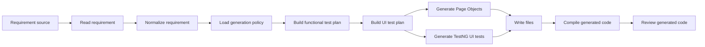

# Current Project State

Date: 2026-06-20

This document describes the current state of `agent_base_testing_framework`.
It is written for engineers who already know Java, Selenium, TestNG, Page Object
Model, or API automation, but are new to agent-based code generation.

The project is not a classic test framework only. It is an automation generation
lab: it reads requirements, builds test plans, derives UI automation scenarios,
generates Selenium/TestNG code from templates, persists generated files, compiles
them, and performs a rule-based generated-code review.

## 1. High-level purpose

The long-term goal is:

```text
BA requirement / Jira story / CSV / TestRail case
    -> normalized requirement model
    -> functional test plan
    -> UI and API automation plan
    -> generated Selenium/TestNG and API tests
    -> compile validation
    -> generated-code review
```

At the current stage, the strongest implemented branch is Selenium/TestNG UI
generation through reusable templates. API automation generation is planned but
not implemented as a full branch yet.

## 2. Current modules

The repository currently has two important Java areas:

```text
.
├── src
│   ├── main/java
│   │   ├── ua/demo/agentlab
│   │   └── ua/demo/automation
│   └── test/java
│       └── ua/demo/agentlab/ui/selenium/support
└── mcp-helpers
    └── src/main/java/ua/demo/agentlab/mcp
```

### Main project

The main Maven project is `agent-orchestrator-lab`.

It owns:

- workflow orchestration;
- requirement reading;
- requirement normalization;
- rule-based functional test planning;
- UI test planning;
- Selenium/TestNG template selection;
- Page Object generation;
- TestNG test generation;
- generated file persistence;
- Maven compile validation;
- generated-code review.

### MCP helper project

The `mcp-helpers` project is a separate Spring AI MCP server.

It currently owns deterministic intake helpers:

- `requirements_normalize_text`;
- `jira_normalize_story`;
- `csv_parse_test_cases`.

It does not yet own UI action templates such as `ui.click()` or API action
templates such as `api.post()`. That is the next architectural direction.

## 3. Current workflow

The current executable workflow is wired in:

```text
src/main/java/ua/demo/agentlab/app/DemoRunner.java
```

The default input file is:

```text
requirements/parabank-requirements.md
```

The current agent chain is:

```text
RequirementReaderAgent
    -> RequirementNormalizationAgent
    -> PolicyLoadingAgent
    -> TestPlanAgent
    -> UiTestPlanAgent
    -> PageObjectWriterAgent
    -> LayeredUiTestWriterAgent
    -> LocalFilePersistenceAgent
    -> GeneratedCodeCompileAgent
    -> GeneratedCodeReviewAgent
```

Conceptually:



## 4. WorkflowState

`WorkflowState` is the shared memory object passed between agents.

It currently stores:

- the original objective;
- the requirement input;
- the loaded requirement document;
- the normalized requirement bundle;
- the generation policy;
- the functional test plan;
- the UI test plan;
- generated Page Object files;
- generated UI test files;
- written file paths;
- validation result;
- review report;
- findings;
- audit trail;
- failure state.

For Selenium/TestNG engineers, you can think of `WorkflowState` as the generation
pipeline context. It plays a similar role to a test execution context, but for
code generation rather than runtime browser execution.

## 5. Requirement layer

Package:

```text
ua.demo.agentlab.requirements
```

Important responsibilities:

- `RequirementInput` describes where the requirement comes from.
- `SourceType` currently supports file and URL style inputs.
- `RequirementDocument` stores loaded content.
- `FileRequirementSource` reads local files.
- `UrlRequirementSource` reads requirements from URL sources.
- `RequirementReaderAgent` selects the correct source implementation.

This layer should not generate tests. It only loads requirement content.

## 6. Requirement normalization layer

Package:

```text
ua.demo.agentlab.requirements.normalization
```

Important responsibilities:

- convert raw requirement text into normalized requirement items;
- detect tags such as UI, API, auth, validation, and performance;
- keep source references so generated scenarios can trace back to requirement
  lines;
- collect assumptions and risks.

Main classes:

- `RequirementNormalizer`;
- `RuleBasedRequirementNormalizer`;
- `RequirementNormalizationAgent`;
- `NormalizedRequirement`;
- `NormalizedRequirementBundle`;
- `SourceReference`.

This layer is intentionally rule-based today. OpenAI is not currently active in
this part of the pipeline.

## 7. Functional test planning

Package:

```text
ua.demo.agentlab.planning
```

Main classes:

- `TestPlanAgent`;
- `TestPlanGenerator`;
- `RuleBasedTestPlanGenerator`;
- `TestPlan`;
- `TestScenario`;
- `FunctionalArea`;
- `TestType`;
- `TestPriority`.

The rule-based generator currently creates scenario sets from normalized
requirements:

- positive scenario;
- negative scenario;
- edge scenario;
- API scenario when the requirement looks API-relevant.

This is not yet a production-grade test design engine. It is a deterministic
base layer that can later be enriched by AI or external systems.

## 8. Policy layer

Package:

```text
ua.demo.agentlab.policy
```

Main classes:

- `PolicyLoadingAgent`;
- `PolicyResolver`;
- `GenerationPolicy`;
- `FrameworkPolicy`;
- `SelectorPolicy`;
- `NamingPolicy`;
- `DefaultGenerationPolicyProvider`.

The current default policy targets:

```text
UI framework: Selenium Java
Test style: TestNG
Architecture: Page Object Model
```

This policy is important because templates must not guess framework style. The
policy tells the generation layer what kind of output is allowed.

## 9. UI planning

Package:

```text
ua.demo.agentlab.ui
```

Main classes:

- `UiTestPlanAgent`;
- `UiTestPlanGenerator`;
- `CanonicalTestCaseUiPlanGenerator`;
- `UiTestPlan`;
- `UiTestScenario`;
- `canonicalFlowType`;
- `LocatorHint`.

The UI planner filters functional scenarios by UI-related keywords. It currently
recognizes login, password reset, registration, account overview, account
details, transfer funds, bill pay, logout, invalid credentials, account lock,
validation, and security-related scenarios.

The UI planner also maps scenarios to ParaBank pages through:

```text
ua.demo.agentlab.ui.catalog.ParaBankPageCatalog
```

The catalog currently contains page definitions and locator hints for:

- `HomePage`;
- `RegistrationPage`;
- `AccountsOverviewPage`;
- `AccountDetailsPage`;
- `TransferFundsPage`;
- `BillPayPage`;
- `LookupLoginInfoPage`.

This layer does not execute Selenium. It only prepares data for generation.

## 10. Template and project context layer

Package:

```text
ua.demo.agentlab.templates
```

Main classes:

- `DefaultProjectContextScanner`;
- `DefaultTemplateRegistry`;
- `TemplateDescriptor`;
- `ProjectContext`;
- `TemplateRegistry`;
- `ProjectContextScanner`.

The scanner checks whether required support classes exist in the local project.
The template registry currently supports Selenium Java with TestNG only.

Generated package targets are:

```text
ua.demo.agentlab.ui.generated.pages
ua.demo.agentlab.ui.generated.tests
```

Support package:

```text
ua.demo.agentlab.core.ui
```

The template registry refuses to continue if required support types such as
`BasePage` or `BaseTest` are missing.

## 11. Selenium/TestNG generation layer

Packages:

```text
ua.demo.agentlab.ui.selenium.writer
ua.demo.agentlab.templates.ui
ua.demo.agentlab.templates.assertions
```

Main classes:

- `TemplateDrivenSeleniumWriter`;
- `SeleniumTemplatePageObjectWriter`;
- `SeleniumTemplateUiTestWriter`;
- `SeleniumPageObjectTemplate`;
- `SeleniumTestNgTemplate`;
- `UiActionTemplateLibrary`;
- `AssertionTemplateLibrary`;
- `SeleniumScenarioTemplateLibrary`.

The current direction is template-driven generation.

That means the project should avoid generating low-level reusable Selenium code
from scratch every time. Instead, generation should produce tests and Page
Objects that call existing helpers or template-defined action blocks.

Current writer behavior:

- groups UI scenarios by page;
- generates Page Object files;
- generates TestNG test files;
- uses template descriptors to know packages and support types;
- returns `GeneratedSourceFile` objects to the persistence layer.

## 12. Selenium support layer

Package:

```text
ua.demo.agentlab.core.ui
```

Main support classes include:

- `BasePage`;
- `BaseTest`;
- `DriverFactory`;
- `ElementActions`;
- `WaitActions`;
- `WaitUtils`;
- `DropdownActions`;
- `AlertActions`;
- `FrameActions`;
- `WindowActions`;
- `SeleniumLocatorMapper`;
- `UiRuntimeConfig`;
- `PropertiesUiRuntimeConfig`;
- `TestDataProvider`;
- `PropertiesTestDataProvider`;
- `UserCredentials`;
- `ScenarioData`.

Support classes are under:

```text
src/main/java/ua/demo/agentlab/core
```

Runtime configuration is stored in:

```text
src/main/resources/framework.properties
```

Current values include base URL, browser settings, timeouts, credentials,
and scenario-oriented test data.

## 13. Runtime UI helper layer

It exposes methods such as:

```text
ui.open()
ui.click()
ui.type()
ui.text()
ui.waitVisible()
ui.waitClickable()
ui.selectByText()
```

This class matches the intended future direction where generated code should call
stable reusable helpers instead of regenerating low-level Selenium actions.

At the moment, this helper exists as a standalone runtime helper and is not yet
fully connected to the MCP template catalog.

## 14. Persistence layer

Package:

```text
ua.demo.agentlab.persistence
```

Main classes:

- `GeneratedFileWriter`;
- `LocalGeneratedFileWriter`;
- `LocalFilePersistenceAgent`.

This layer writes generated files to disk using each `GeneratedSourceFile`
relative path.

The persistence layer does not validate the generated code. It only writes it.

## 15. Compile validation

Package:

```text
ua.demo.agentlab.validation
```

Main classes:

- `GeneratedCodeCompileAgent`;
- `GeneratedCodeValidator`;
- `MavenGeneratedCodeValidator`;
- `GeneratedCodeValidationResult`;
- `GeneratedFileValidation`;
- `ValidationStatus`.

The current validator runs Maven test compilation:

```text
mvn.cmd --batch-mode -Duser.home=. -Dmaven.repo.local=.m2repo compiler:testCompile
```

Important current limitation:

`MavenGeneratedCodeValidator` contains an absolute working directory in
`DemoRunner`. This is acceptable for the current local lab state, but should be
replaced with a relative workspace root before the project is made portable.

## 16. Generated-code review

Package:

```text
ua.demo.agentlab.review
```

Main classes:

- `GeneratedCodeReviewAgent`;
- `GeneratedCodeReviewer`;
- `RuleBasedGeneratedCodeReviewer`;
- `GeneratedCodeReviewReport`;
- `GeneratedCodeReviewFinding`;
- `ReviewSeverity`.

The reviewer checks generated files for simple quality issues:

- hardcoded localhost base URL;
- placeholder comments;
- repeated example credentials;
- weak assertion sets.

This is a static rule-based review. It is not a replacement for human review,
but it is useful as an automated guardrail.

## 17. MCP helper module

Module:

```text
mcp-helpers
```

Main entry point:

```text
ua.demo.agentlab.mcp.AutomationHelpersMcpApplication
```

Current tools:

```text
requirements_normalize_text
jira_normalize_story
csv_parse_test_cases
```

Current models:

- `CanonicalRequirementBundle`;
- `CanonicalTestCaseBundle`;
- `CanonicalTestCase`;
- `RequirementItem`;
- `JiraStoryInput`;
- `SourceDescriptor`;
- `SourceKind`.

Current services:

- `RequirementTextNormalizer`;
- `JiraStoryNormalizer`;
- `CsvTestCaseParser`.

Current design boundary:

MCP currently normalizes external requirement and test-case formats. It does not
yet provide UI action templates, API action templates, locator catalogs, or
runtime helper manifests.

The intended next MCP direction is:

```text
MCP template catalog
    -> ui.click / ui.type / ui.waitVisible
    -> auth.login
    -> api.get / api.post
    -> API validation templates
    -> generation policy validation
```

The main project should then call MCP before code generation to resolve allowed
actions instead of inventing reusable helper code.

## 18. OpenAI status

Package:

```text
ua.demo.agentlab.ai.openai
```

Current classes:

- `OpenAiClientFactory`;
- `OpenAiTestPlanGenerator`.

Current behavior:

- `DemoRunner` supports `--ai`;
- `OpenAiTestPlanGenerator` checks that `OPENAI_API_KEY` exists;
- AI mode then throws an exception saying the AI implementation is temporarily
  disabled.

This is intentional in the current state. The project is stabilizing the
template-driven Selenium/TestNG layer first.

## 19. Build and run

The root project uses:

```text
Java 17
Spring Boot 3.5.13
Selenium 4.30.0
TestNG 7.11.0
Cucumber 7.34.3
REST Assured 5.5.7
```

Local Maven repository is configured in:

```text
.mvn/maven.config
```

Current value:

```text
-Dmaven.repo.local=m2repo
```

Compile root project:

```powershell
mvn --batch-mode compile
```

Compile tests and generated tests:

```powershell
mvn --batch-mode test-compile
```

Run the default demo pipeline:

```powershell
mvn --batch-mode exec:java
```

Run demo pipeline with explicit requirement file:

```powershell
mvn --batch-mode exec:java "-Dexec.args=requirements/parabank-requirements.md"
```

Run with AI flag:

```powershell
mvn --batch-mode exec:java "-Dexec.args=--ai requirements/parabank-requirements.md"
```

Current AI mode is expected to fail after API key validation because the
implementation is intentionally disabled.

Build MCP helpers:

```powershell
cd mcp-helpers
mvn --batch-mode test
mvn --batch-mode package
```

Run MCP helpers as STDIO server:

```powershell
java -jar target/agentlab-mcp-helpers-0.1.0-SNAPSHOT.jar
```

## 20. How to add a new UI feature today

For a new ParaBank-like UI flow, the current path is:

1. Add or update requirement text.
2. Ensure normalization produces a meaningful requirement.
3. Ensure `RuleBasedTestPlanGenerator` creates useful scenarios.
4. Add capability mapping in `RuleBasedRequirementToTestCaseGenerator` if needed.
5. Add or confirm routes/capabilities through the project profile, discovery evidence, or the stable page cache.
6. Update Selenium template libraries only if a new action pattern is required.
7. Run `mvn --batch-mode exec:java`.
8. Check generated files under generated page and test packages.
9. Run test compilation.
10. Review generated-code findings.

## 21. How to add API generation later

The API branch should mirror the UI branch:

```text
Functional TestPlan
    -> ApiTestPlan
    -> MCP API capability resolution
    -> REST Assured template writer
    -> generated API tests
    -> compile validation
    -> generated-code review
```

Suggested future packages:

```text
ua.demo.agentlab.api
ua.demo.agentlab.api.generator
ua.demo.agentlab.api.writer
ua.demo.agentlab.api.model
```

The API writer should not invent request helpers. It should call reusable runtime
actions such as:

```text
api.get()
api.post()
api.put()
api.delete()
verifyApi.statusCode()
verifyApi.jsonExists()
verifyApi.jsonEquals()
```

## 22. Known limitations

Current limitations:

- MCP is not yet integrated into the main generation pipeline.
- MCP does not yet provide UI/API action templates.
- API automation generation is not implemented.
- OpenAI mode is disabled after API key validation.
- `MavenGeneratedCodeValidator` uses a hardcoded local project path.
- UI planning is keyword-based.
- Page resolution is ParaBank-specific.
- Locator hints are static and not yet resolved through MCP.
- Generated code review is rule-based and intentionally simple.
- The project is not currently detected as a git repository in this working
  context.

## 23. Recommended next steps

The most useful next steps are:

1. Move reusable UI action contracts into MCP.
2. Add MCP template tools for `ui.click`, `ui.type`, `ui.waitVisible`, and
   `auth.login`.
3. Add a `CapabilityResolutionAgent` before code writers.
4. Change Selenium writers to consume resolved MCP action templates.
5. Add API action contracts to MCP.
6. Add REST Assured/TestNG API writer.
7. Replace the hardcoded validation working directory with a dynamic root.
8. Add tests for template resolution and generated file paths.
9. Re-enable OpenAI only after the template and MCP contract layer is stable.

## 24. Mental model for contributors

If you come from Selenium/TestNG, read the project like this:

```text
RequirementReaderAgent
    = loads the test design input

RequirementNormalizationAgent
    = cleans and structures the requirement

TestPlanAgent
    = creates manual-style test scenarios

UiTestPlanAgent
    = decides which scenarios are UI-automatable

PageObjectWriterAgent
    = generates Page Object classes

LayeredUiTestWriterAgent
    = generates TestNG test classes

LocalFilePersistenceAgent
    = saves generated Java files

GeneratedCodeCompileAgent
    = runs Maven compile validation

GeneratedCodeReviewAgent
    = performs static quality checks
```

The important architectural rule is:

```text
Agents decide what should be generated.
Templates decide how it is generated.
Runtime helpers execute repeated Selenium/API actions.
MCP should become the source of reusable action contracts.
```
