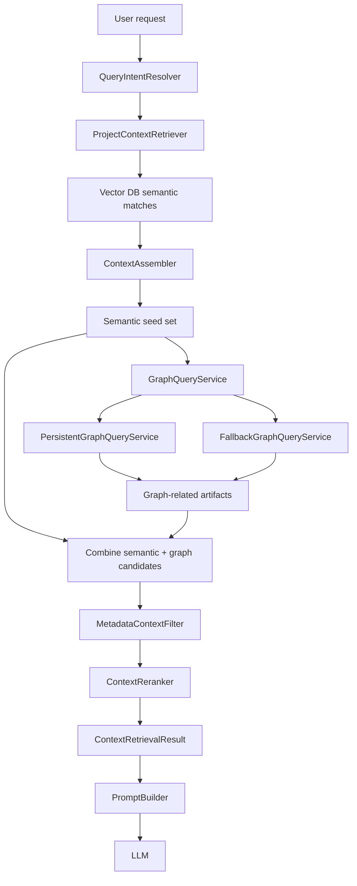

# Hybrid Retrieval Graph Layer

## Current Goal

This layer now targets the workflow:

1. Task classification
2. Semantic retrieval from Vector DB
3. Dependency expansion from Graph DB or persistent graph snapshot
4. Metadata filtering
5. Re-ranking
6. Prompt building
7. LLM generation

It is no longer only a simple semantic-plus-neighbors step.

## Implemented Components

### Semantic retrieval

- `Retriever`
- `ProjectContextRetriever`
- `QueryIntentResolver`
- `ContextAssembler`

Purpose:

- embed the request
- fetch semantic candidates from Qdrant
- infer artifact priorities and domain terms
- create the first seed set

### Graph query layer

- `GraphQueryService`
- `PersistentGraphQueryService`
- `FallbackGraphQueryService`
- `GraphQueryResult`

Purpose:

- query structural neighbors from the persistent repository graph
- fall back to legacy workspace graph extraction if repository-intelligence snapshot is missing

Persistent graph source:

- `target/repository-intelligence/knowledge-snapshot.json`
- `target/repository-intelligence/graph-store/entities.json`
- `target/repository-intelligence/graph-store/relations.json`

### Metadata filter

- `MetadataContextFilter`
- `MetadataFilterResult`

Purpose:

- drop low-signal artifacts
- keep requested artifact families
- keep useful support artifacts such as base classes, policy docs, config, and test data
- enforce lightweight relevance after graph expansion

### Re-ranker

- `ContextReranker`

Purpose:

- combine semantic score with artifact-type fit
- boost domain-term matches
- boost qualifier matches
- slightly penalize synthetic graph-only chunks
- output the final ranked context pack

### Orchestration

- `HybridContextRetriever`
- `RagRetrievalService`

Purpose:

- execute the whole retrieval pipeline end to end
- expose telemetry into prompt building and console output

## Retrieval Flow

## What Changed

Before:

- semantic retrieval
- heuristic graph expansion

Now:

- semantic retrieval
- persistent graph query when repository intelligence exists
- fallback graph query when it does not
- metadata filter
- reranking
- retrieval telemetry in prompt and CLI

## Runtime Behavior

When `target/repository-intelligence/knowledge-snapshot.json` exists:

- retrieval uses `PersistentGraphQueryService`
- graph expansion comes from repository graph entities and relations

When repository intelligence artifacts do not exist:

- retrieval falls back to `FallbackGraphQueryService`
- graph expansion uses `ProjectCodeGraph` from live workspace extraction

## Exposed Telemetry

`ContextRetrievalResult` now exposes:

- `rawMatchCount`
- `graphExpandedCount`
- `filteredCandidateCount`
- `graphSource`

This is surfaced in:

- `RagConsoleRunner`
- `ProjectStylePromptBuilder`

## Why This Matters

This moves the system closer to the target architecture:

- Vector DB answers semantic relevance
- Graph DB / graph snapshot answers structural dependency relevance
- Metadata filter reduces noise
- Re-ranker improves final prompt context quality

That makes generated prompts more stable and less dependent on raw nearest-neighbor luck.
