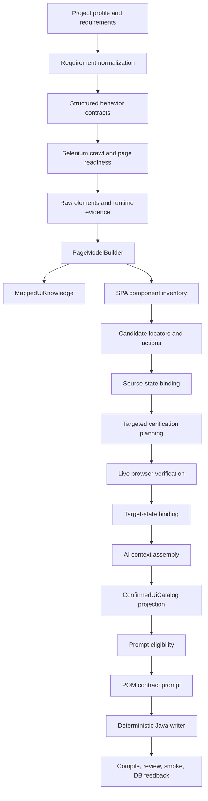
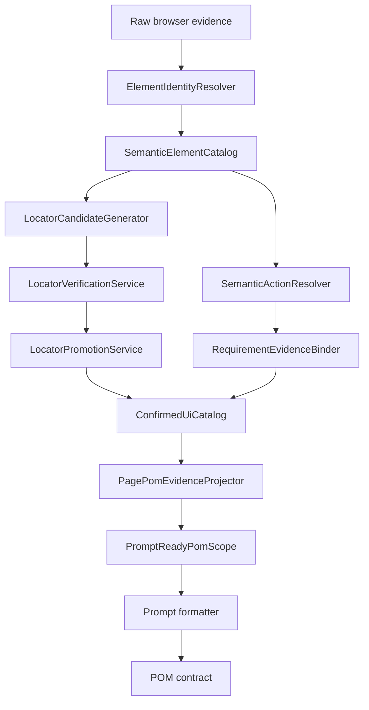
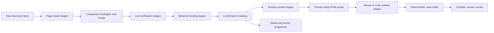

# Mapper Stabilization and Simplification Plan

## Objective

Make the mapper and POM evidence path deterministic, product-neutral, and diagnosable. The target
flow must preserve one typed identity for every requirement-owned element/action from browser
discovery through the POM contract, without reconstructing ownership or semantics from prose,
locator strings, generated suffixes, or `sourceTrace` text.

## Current Runtime Flow



## Confirmed Data-Loss Points

1. **Element identity is not stable across snapshots.** The same user-menu opener was emitted as
   `user-menu-trigger` and `user-menu-trigger-2`. The interaction graph referenced one ID while
   live verification executed the other.
2. **Semantic names are reconstructed after verification.** Live evidence carries technical IDs;
   `CurrentRunSpaLocatorEvidenceAdapter` must infer `usernameInput`, `loginButton`,
   `userMenuTrigger`, and `logoutLink` again.
3. **Action ownership is reconstructed independently.** Structured behavior binding, semantic
   action selection, the POM sanitizer, and the funnel each decide which requirement owns an
   action. Their results can diverge.
4. **Promotion is not one atomic decision.** Inventory records remain `CANDIDATE`, live results are
   verified, prompt evidence is marked `CONFIRMED_LOCATOR`, and DB promotion is evaluated later.
   No single object records the complete promotion decision.
5. **Prompt locator retention depends on reconstructed actions.** Confirmed Dashboard locators were
   present in the scoped context but were removed because `PomScopeSanitizer` received zero owned
   semantic actions.
6. **Metrics and prompt readiness use different projections.** The evidence funnel reported
   requirement-scoped prompt locators while page eligibility saw zero sanitized locators.
7. **Live verification mixes orchestration and browser mechanics.** Route setup, authentication,
   readiness, locator verification, action ordering, state capture, transition capture, and target
   page collection live in one runner.
8. **Failure is detected too late.** A missing Dashboard POM reached final live smoke and produced a
   generic `Generated source and target Page Objects are required` blocker instead of failing at the
   page-evidence boundary.

## Complexity Hotspots

| Class | Lines | Approx. methods | Primary concern |
|---|---:|---:|---|
| `PageModelBuilder` | 1233 | 58 | extraction, naming, forms, locators, actions, compatibility heuristics |
| `TargetAwareContextSlicer` | 878 | 44 | requirement/page/route/retrieval/flow slicing and fallback behavior |
| `AiPageObjectSpecGenerator` | 787 | 23 | scope, reuse, LLM, parsing, quality, artifact coordination |
| `PomScopeSanitizer` | 768 | 38 | ownership, semantic projection, locator selection, assertions, gaps |
| `LiveTargetedVerificationRunner` | 669 | 37 | browser lifecycle, verification, execution, state graph, auth |
| `UiEvidenceFunnelAssembler` | 646 | 38 | independent reconstruction of all previous stage outcomes |
| `ComponentBoundaryDetector` | 611 | 33 | all component types and grouping strategies |
| `StructuredSpaBehaviorBindingService` | 608 | 40 | binding, data resolution, assertions, executable decisions |

Large size alone is not the defect. The risk comes from these classes owning several independent
business decisions and repeating semantic/ownership resolution.

## Target Architecture



The following contracts become the only authority:

- `SemanticElementKey`: stable page/state/component/element identity;
- `RequirementEvidenceBinding`: source action ownership, prerequisites, target assertions;
- `LocatorPromotionDecision`: candidate, live result, safety result, primary/standby status;
- `ConfirmedUiCatalog`: compact confirmed read model;
- `PromptReadyPomScope`: final page-owned projection consumed by prompt formatting.

## Refactoring Phases

## P0 Foundation Status (2026-07-18)

The first contract-first stabilization slice is implemented and runs in the workflow before prompt
locator coverage is assembled:

- golden Login/Dashboard canonical-interaction snapshot and an earliest-point
  `EVIDENCE_PROJECTION_MISMATCH` gate;
- stable `SemanticElementKey`, `SemanticActionKey`, and `LocatorEvidenceId` identities;
- immutable candidate, requirement-scoped, live-verified, and promotion decision contracts;
- a raw browser-evidence boundary with no semantic or promotion fields;
- centralized `ActionCompatibilityService`;
- versioned `interaction-score.v1` scoring with per-factor breakdown;
- `RequirementEvidenceSelector` with no first-page fallback;
- safety-first Top-K selection with primary/standby selector-family diversity;
- `quality/canonical-interaction-evidence.json` as the canonical shadow artifact.

The original shadow migration is complete. SPA inventory is mapped through
`SpaInventorySemanticInteractionMapper`, and the confirmed catalog is now the production POM
source. Direct Selenium-to-`RawUiEvidence` production remains a physical decomposition task; it is
not a second prompt or promotion path.

Validation baseline: 362 unit/acceptance tests pass, including the golden Login/Dashboard topology.

## P1/P2 Canonical Runtime Status (2026-07-18)

The canonical evidence path now executes the following linear decision flow:

```text
SPA inventory semantic input
  -> InteractionCandidate
  -> interaction-score.v1
  -> RequirementEvidenceSelector
  -> safety-first Top-K
  -> UiLiveVerificationFacade
       -> LocatorVerifier
       -> ActionVerifier
       -> StateTransitionVerifier
       -> PostconditionVerifier
  -> live re-scoring
  -> interaction-promotion.v1
  -> ConfirmedUiCatalog
  -> PromptReadyPomScope
  -> Neo4j Top-3 graph projection
  -> EvidenceProjectionTrace / funnel observability
```

Implemented P1/P2 outcomes:

- `UiLiveVerificationFacade` separates locator, action, transition, and postcondition decisions;
- transition-sensitive actions cannot pass from `actionVerified=true` alone;
- `PromotionPolicy` is the only canonical lifecycle/rank authority;
- only confirmed primary catalog locators enter `PromptReadyPomScope`;
- standby locators remain DB/self-healing evidence and never enter `Allowed locators`;
- Neo4j receives a Top-3 projection keyed by semantic element/action/locator identities;
- the graph is downstream of promotion and is no longer required to make the current-run decision;
- funnel metrics use `EvidenceProjectionTrace`; funnel no longer blocks or controls POM generation;
- `CanonicalInteractionEvidenceAgent`, `LocatorCandidateCoverageAgent`, and
  `ConfirmedUiCatalogAgent` are replaced in the runtime DAG by one `UiInteractionEvidenceAgent`.

Validation baseline after P1/P2: 370 unit/acceptance tests pass.

## P3 Hard Cut Status (2026-07-18)

P3 removes the parallel runtime authorities that previously survived the contract migration:

- deleted current-run locator adapters, `PomScopeSanitizer`, old POM parser/writer adapters, and
  duplicate capability formatter;
- deleted the independent locator promotion and action compatibility policies;
- replaced three projection agents with `UiInteractionEvidenceAgent`;
- stopped inventory and live verification from writing `SpaCandidateLocator` /
  `SpaCandidateAction` graphs;
- made `UiLocatorEvidence` behind `ConfirmedUiCatalog` the only stable locator source for prompt,
  page-capability cache lookup, retention, and generated-code smoke feedback;
- reduced mapped knowledge persistence to curated graph facts; it no longer creates
  `UiStableLocator` records;
- made prompt eligibility and prompt formatting consume `ConfirmedUiCatalog -> PromptReadyPomScope`
  directly, with no raw mapped-page route fallback;
- retained `AiPageObjectSpec` only as an internal deterministic Java rendering model. It is no
  longer an LLM output contract or a prompt evidence authority.

Hard-cut validation: **353 unit/acceptance tests pass**. Legacy adapter tests were removed together
with their production paths; canonical graph regression tests now fail if old Neo4j locator labels
return to retrieval or smoke feedback.

### Combined Plan Conformance

| Refactor objective | Status | Current evidence | Remaining work |
|---|---|---|---|
| 1. Canonical interaction lifecycle | Implemented | immutable candidate/scoped/verified/promotion contracts | remove old SPA DTOs after hard-cut verification |
| 2. Raw discovery vs semantic mapping | Partial | typed raw boundary and semantic inventory mapper exist | make Selenium discovery populate `RawUiEvidence` directly |
| 3. One standard/SPA mapper | Partial | one canonical lifecycle is shared | converge standard page and SPA inventory into `UiState` producer modes |
| 4. Action compatibility | Implemented | centralized `ActionCompatibilityService` | migrate remaining legacy classifiers |
| 5. One scoring engine | Implemented | `interaction-score.v1` and factor breakdown | feed DB runtime history into the history factor |
| 6. Requirement relevance before browser | Implemented | `RequirementEvidenceSelector` before Top-K/live verification | replace temporary provenance parsing with typed ownership binding |
| 7. Top-K before live verification | Implemented | safety-first max Top-3 and family-diverse standby | tune thresholds with real-run metrics |
| 8. Unified live verification facade | Partial | four dedicated verifiers behind one facade | split browser lifecycle/execution out of the 669-line runner |
| 9. SPA state transition extension | Implemented | route and same-route transition verification | add richer table/filter/modal postcondition strategies |
| 10. Re-scoring after live run | Implemented | final score includes live/postcondition evidence | include persisted pass/flaky history |
| 11. Evidence promotion policy | Implemented | versioned policy owns status and rank | wire historical DEGRADED decisions from DB lookup |
| 12. DB Top-3 | Implemented | canonical Top-3 persistence, retrieval, retention and smoke feedback | add historical score input to current-run re-scoring |
| 13. Graph as projection | Implemented | graph writer runs after promotion; old locator labels are not read or written by the critical path | migrate/delete non-locator legacy graph projections separately |
| 14. Agent consolidation | Partial | downstream evidence decisions use one agent | consolidate discovery/binding/live SPA orchestration after runner split |
| 15. Funnel observability only | Implemented for runtime control | POM gate reads catalog, funnel reads projection trace | simplify the legacy 655-line requirement report assembler |

### Current Architectural Score

- Evidence identity and lifecycle: **9/10**
- Requirement filtering and locator safety: **9/10**
- Live verification contracts: **8/10**
- Prompt evidence determinism: **9/10**
- Knowledge persistence: **9/10**
- Physical class decomposition: **5/10**
- Legacy-path removal: **9/10**

The mapper decision model now has one production authority from promotion through prompt and DB
feedback. The remaining risk is physical complexity before the canonical boundary: oversized
discovery/binding/browser services and the still-indirect SPA inventory-to-raw mapping path.

### R0: Add Invariants and Earliest-Point Gates

1. Add invariant checks after every stage:
   - every selected action references an existing semantic element;
   - every selected locator references one component and page;
   - requirement ownership is typed and non-empty;
   - a confirmed locator has one live verification and one safety decision.
2. Fail POM eligibility with `EVIDENCE_PROJECTION_MISMATCH` when current-run confirmed locators exist
   but sanitizer output is empty.
3. Prevent final smoke from being the first stage that reports a missing generated page.

Expected impact: data loss becomes local and actionable instead of a late generic smoke failure.

### R1: Stable Semantic Identity

1. Add `SemanticElementKey(pageId, stateId, componentId, semanticRole, domAnchorHash)`.
2. Merge repeated snapshots by this key before adding numeric suffixes.
3. Keep DOM occurrence IDs as evidence only, not as action/locator contract identity.
4. Make component dependencies reference semantic action keys, not generated action IDs.

Expected impact: duplicate `trigger`/`trigger-2` records can no longer break interaction chains.

### R2: One Locator Promotion Pipeline

1. Make `LocatorPromotionService` the only producer of confirmed primary/standby decisions.
2. Consume the same decisions in:
   - confirmed catalog;
   - prompt evidence;
   - Neo4j persistence;
   - Qdrant summaries;
   - quality metrics;
   - self-healing standby selection.
3. Remove separate confirmation logic from adapters, prompt selectors, and persistence writers.
4. Persist explicit rejection codes rather than prose-only reasons.

Expected impact: funnel counts, DB state, and POM `Allowed locators` become identical projections.

### R3: Typed Requirement Ownership

1. Introduce `RequirementEvidenceBinding` with:
   - requirement ID and capability;
   - source page/state/component;
   - prerequisite action keys;
   - owned action keys;
   - target page/state;
   - owned assertion contracts.
2. Stop using `sourceTrace` parsing for ownership decisions.
3. Split cross-page scenarios into source-action ownership and target-assertion ownership once,
   before prompt assembly.
4. Rebuild requirement ownership every run; reuse only page/component/action/locator evidence.

Expected impact: Dashboard actions are retained even when the final assertion belongs to LoginPage.

### R4: Split Oversized Mapper Services

1. Split `PageModelBuilder` into:
   - `RawElementNormalizer`;
   - `ElementIdentityResolver`;
   - `PageElementAssembler`;
   - `FormModelAssembler`;
   - `PageTransitionAssembler`.
2. Split `ComponentBoundaryDetector` by component strategy:
   - landmark/ARIA detector;
   - form detector;
   - navigation/header detector;
   - table/results detector;
   - modal/overlay detector;
   - component merge service.
3. Split `LiveTargetedVerificationRunner` into:
   - browser session/setup;
   - page readiness and authentication preconditions;
   - locator verifier;
   - safe action executor;
   - state/transition capture;
   - result assembler.
4. Split `TargetAwareContextSlicer` into page, requirement, flow, retrieval, and assertion slicers.

Expected impact: each stage can be unit tested with one input/output contract and no hidden fallback.

### R5: Replace Prompt Reconstruction with Catalog Projection

1. Add `PagePomEvidenceProjector(ConfirmedUiCatalog, RequirementEvidenceBinding)`.
2. Make it produce `PromptReadyPomScope` directly.
3. Reduce `PomScopeSanitizer` to a validation gate and then remove semantic inference from it.
4. Keep `AiPageObjectPromptBuilder` as formatting only: task, confirmed page contract, selected
   locators/actions/assertions, schema.
5. Do not expose raw inventory, rejected evidence, raw RAG text, or unrelated test cases.

Expected impact: the prompt cannot lose a locator because no downstream class reconstructs its use.

### R6: Unify Quality and Diagnostics

1. Build funnel metrics from `LocatorPromotionDecision` and `ConfirmedUiCatalog`, not by recounting
   raw artifacts.
2. Add one per-page projection trace:
   `required -> candidate -> verified -> promoted -> catalog -> prompt -> contract`.
3. Keep large DOM/network artifacts debug-only; default review uses:
   - evidence funnel;
   - locator coverage;
   - confirmed catalog;
   - page eligibility;
   - compile/review/smoke.
4. Add a terminal failure contribution to `qualityScore`.

Expected impact: one compact report identifies the exact stopped stage and evidence ID.

### R7: Remove Compatibility and Fallback Paths

1. Remove locator semantic inference from `CurrentRunSpaLocatorEvidenceAdapter` after R2/R5.
2. Remove string-based action generation from `PomScopeSanitizer` after R3/R5.
3. Remove route/page first-match fallbacks from context slicing.
4. Delete duplicate metric assemblers and obsolete raw-to-prompt helpers after golden snapshots pass.

Expected impact: fewer classes participate in the critical path and unsupported evidence cannot be
silently promoted.

## Recommended Execution Order

1. R0 invariant gates.
2. R1 semantic identity and duplicate merge.
3. R2 locator promotion as one source of truth.
4. R3 typed requirement ownership.
5. R5 catalog-to-prompt projection.
6. R4 physical class decomposition after contracts stabilize.
7. R6 diagnostics consolidation.
8. R7 hard removal of adapters and fallbacks.

This order avoids a cosmetic class split while the underlying contracts are still unstable.

## Acceptance Criteria

- Login and authenticated-area POMs are generated from the same confirmed catalog used by metrics.
- `AUTHENTICATION -> AUTHENTICATED_AREA -> USER_MENU -> LOGOUT` passes live smoke repeatedly.
- Every required semantic element has candidate coverage or one explicit gap.
- Every prompt locator has one `LocatorPromotionDecision` with browser and safety evidence.
- No action/locator relationship depends on generated numeric suffixes.
- No ownership decision depends on parsing prose or `sourceTrace` strings.
- Funnel, catalog, prompt, POM contract, DB, and smoke report the same evidence IDs.
- Default artifacts are compact; raw DOM/network traces remain debug-only.

## Typed Stage Refactor Status (2026-07-18)

The critical path now follows the same contract at each boundary:



### Phase completion

| Phase | Status | Implementation |
|---|---|---|
| 0 Baseline | Implemented, live recapture required | OrangeHRM normalization and interaction snapshots, cross-product acceptance fixtures, and `NormalizedArtifactRegressionGate`. Run metadata is ignored; action sequence order remains significant. |
| 1 Live verification | Implemented | `BrowserVerificationSession`, auth preconditions, readiness, locator/action execution, snapshots, transitions, result assembly. Runner is an orchestration facade. |
| 2 Page model | Implemented | Raw normalization, semantic identity/element assembly, locator and action assembly, complete discovered-form assembly, transition and evidence assembly. |
| 3 Context slicing | Implemented | Target, requirement, assertion, flow, retrieval, enrichment, and final context assembly use one confirmed target scope. DB/catalog locator slicing is owned by retrieval slicing. |
| 4 Components | Implemented | ARIA, form, navigation, header/user-menu, table/results, modal/overlay, search, generic strategies plus one overlap/topology merge service. |
| 5 Behavior binding | Implemented | Source and target state resolution, scenario data, ordered action sequence, postconditions, executability, and result assembly are separate stages. |
| 7 Funnel | Implemented | Requirement, locator metrics, page readiness, and terminal failure are read-only projections. `UiEvidenceFunnelAssembler` only assembles their outputs. |
| 6 POM generation | Implemented | Reuse coordination, LLM execution, parse/rehydration, validation, persistence, registry registration, and metrics are separate services/stages. |
| 8 Enforcement | Implemented | Package dependency invariant tests and removed obsolete prompt/POM/current-run SPA compatibility paths. External protocol/capability adapters remain intentional boundaries. |

### Invariants after the refactor

1. Raw discovery multiplicity is preserved until semantic identity resolution.
2. Only the locator assembly/scoring pipeline creates locator candidates.
3. Context slicers do not independently invent route or page ownership.
4. Missing test data, missing target state, missing action evidence, and missing postcondition evidence have different failure reasons.
5. Funnel projections cannot promote evidence or alter workflow readiness.
6. POM reuse and POM LLM generation publish the same contract and validation artifacts.
7. Browser and database acceptance must be rerun for OrangeHRM and The Internet before merging this refactor; unit snapshots cannot substitute for live smoke.
