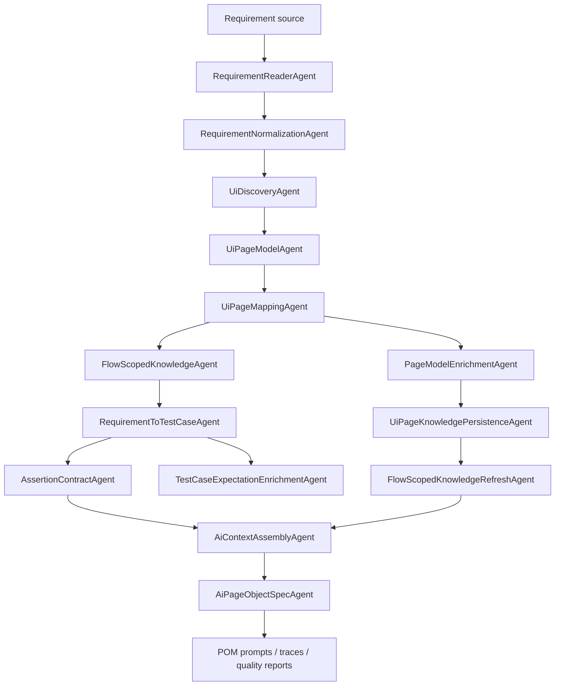
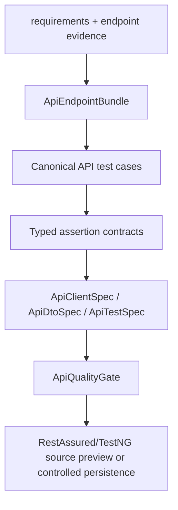

# AgentLab Project Guide

## 1. Project Purpose

AgentLab is a Java platform for requirement-driven automation generation. It combines deterministic parsing, UI/API discovery, typed contracts, optional AI enrichment, executable quality gates, and controlled artifact writing.

The current focus is not free-form code generation. The platform aims to build enough structured evidence that prompts and generated code become reviewable, traceable, and constrained.

## 2. Current Status

Implemented today:

- dependency-based agent orchestration through typed artifacts;
- requirement reading and normalization;
- generation policy loading;
- Selenium UI discovery and PageModel mapping;
- locator quality scoring and origin metadata;
- raw/curated/prompt-ready UI knowledge separation;
- Neo4j/Qdrant namespace-aware knowledge persistence/retrieval;
- expected-result and assertion contract modeling;
- AI enrichment for PageModel/expected-result metadata;
- deterministic POM prompt generation with prompt quality linter;
- run quality summary and artifact diff;
- API endpoint evidence ingestion from OpenAPI, network scan, and configured endpoint seeds;
- API client/DTO/test specs with RestAssured/TestNG writer;
- API quality gate for endpoint evidence, assertions, source roots, path params, and mutation safety;
- unit tests under `src/test/ua.demo.agentlab/unity`.

Current AI mode intentionally stops after deterministic POM prompt generation. Direct LLM-backed Java writing remains disabled until schema, compile, review, and persistence gates are fully stabilized.

## 3. Main Workflows

### AI UI Prompt Workflow



### API MVP Workflow



## 4. Important Packages

- `ua.demo.agentlab.app.workflow` - composition root split into workflow/module factories.
- `ua.demo.agentlab.orchestration` - graph orchestration and typed artifact contracts.
- `ua.demo.agentlab.requirements` - requirement sources and normalization.
- `ua.demo.agentlab.policy` - generation policy.
- `ua.demo.agentlab.ui.discovery` - Selenium discovery, PageModel building, mapping, locator quality.
- `ua.demo.agentlab.ui.catalog` - confirmed page candidates, capabilities, and page registry.
- `ua.demo.agentlab.ai.context` - context slicing, retrieval, and `PromptUiEvidence`.
- `ua.demo.agentlab.ai.pageenrichment` - PageModel enrichment over mapper output.
- `ua.demo.agentlab.ai.expectationenrichment` - expected-result resolution.
- `ua.demo.agentlab.ai.ui` - deterministic POM/test prompt/spec generation.
- `ua.demo.agentlab.api` - API discovery, canonical cases, specs, quality gate, and writer.
- `ua.demo.agentlab.core.ui` - Selenium support classes for generated UI code.
- `ua.demo.agentlab.core.api` - RestAssured support for generated API clients.
- `ua.demo.agentlab.core.config` - environment/JVM placeholder-aware runtime config.

## 5. Compatibility Notes

New platform-owned code should use the `ua.demo.agentlab...` namespace.

The root packages `core` and `config` contain deprecated facades only:

- `core.ApiManager` delegates to `ua.demo.agentlab.core.api.ApiManager`;
- `config.ConfigReader` delegates to `ua.demo.agentlab.core.config.ConfigReader`.

They exist so older generated examples continue to compile.

## 6. Repository Hygiene

Runtime artifacts belong under `target/` and are ignored by Git.

Local secrets should be supplied by environment variables or JVM properties. `framework.properties` uses placeholders such as `${API_AUTH_TOKEN}` and `${TEST_VALID_USERNAME}` rather than real credentials.

Before publishing a snapshot, run:

```powershell
mvn --batch-mode "-Duser.home=." "-Dmaven.repo.local=.m2repo" test
```
