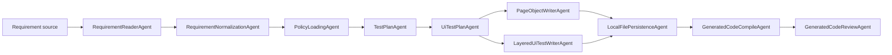

# AgentLab Project Guide

## 1. Project purpose

This project is a Java-based orchestrator for automated test generation.

Its target flow is:

1. receive requirements from external sources;
2. normalize requirements into a stable internal model;
3. apply policy and template rules;
4. build a functional test plan;
5. derive UI and later API automation plans;
6. generate automation code from reusable templates;
7. validate generated code before it is accepted.

At the current stage, the strongest part of the system is the UI generation pipeline around Selenium-style template-driven output.

---

## 2. Current status

The project already has:

- workflow orchestration through `WorkflowAgent`, `AgentOrchestrator`, and `WorkflowState`;
- requirement reading from file and URL;
- requirement normalization layer;
- generation policy loading;
- rule-based test plan generation;
- rule-based UI test plan generation;
- Selenium-oriented template registry and project context scanner;
- template-driven page object and test generation;
- file persistence for generated artifacts;
- compile and review stages in the workflow;
- local Maven repository configuration via `.mvn/maven.config`.

The project does not yet have a completed API automation branch.

The OpenAI integration is currently intentionally reduced to a placeholder so the UI layer can evolve without being blocked by SDK or environment issues.

---

## 3. Main workflow

The current `DemoRunner` pipeline is:

1. `RequirementReaderAgent`
2. `RequirementNormalizationAgent`
3. `PolicyLoadingAgent`
4. `TestPlanAgent`
5. `UiTestPlanAgent`
6. `PageObjectWriterAgent`
7. `LayeredUiTestWriterAgent`
8. `LocalFilePersistenceAgent`
9. `GeneratedCodeCompileAgent`
10. `GeneratedCodeReviewAgent`

High-level flow:



---

## 4. Important packages

### `ua.demo.agentlab.app`

Application entrypoint and workflow wiring.

Key class:

- `DemoRunner`

### `ua.demo.agentlab.orchestration`

Workflow core.

Key classes:

- `WorkflowAgent`
- `WorkflowState`
- `AgentOrchestrator`

### `ua.demo.agentlab.requirements`

Requirement input and reading layer.

Key parts:

- `RequirementInput`
- `RequirementDocument`
- `FileRequirementSource`
- `UrlRequirementSource`
- `RequirementReaderAgent`

### `ua.demo.agentlab.requirements.normalization`

Canonical normalization layer.

Key parts:

- `NormalizedRequirement`
- `NormalizedRequirementBundle`
- `RuleBasedRequirementNormalizer`
- `RequirementNormalizationAgent`

### `ua.demo.agentlab.policy`

Generation policy layer.

Key parts:

- `GenerationPolicy`
- `FrameworkPolicy`
- `SelectorPolicy`
- `NamingPolicy`
- `PolicyLoadingAgent`

### `ua.demo.agentlab.templates`

Template resolution and project scanning layer.

Key parts:

- `TemplateRegistry`
- `DefaultTemplateRegistry`
- `TemplateDescriptor`
- `ProjectContext`
- `ProjectContextScanner`
- `DefaultProjectContextScanner`

### `ua.demo.agentlab.ui`

UI planning and generation model.

Key parts:

- `UiTestPlan`
- `UiTestScenario`
- `canonicalFlowType`
- `LocatorHint`

### `ua.demo.agentlab.ui.generator`

Transforms functional scenarios into UI scenarios.

Key class:

- `CanonicalTestCaseUiPlanGenerator`

### `ua.demo.agentlab.ui.selenium.writer`

Main Selenium-oriented generation layer.

Key parts:

- `TemplateDrivenSeleniumWriter`
- `SeleniumScenarioTemplateLibrary`
- `UiActionTemplateLibrary`
- `AssertionTemplateLibrary`
- `SeleniumTemplatePageObjectWriter`
- `SeleniumTemplateUiTestWriter`

### `ua.demo.agentlab.templates.ui`

Concrete template implementations.

Key parts:

- `SeleniumPageObjectTemplate`
- `SeleniumTestNgTemplate`
- `SeleniumTemplateBundle`

### `ua.demo.agentlab.persistence`

Generated artifact persistence.

Key parts:

- `GeneratedFileWriter`
- `LocalGeneratedFileWriter`
- `LocalFilePersistenceAgent`

### `ua.demo.agentlab.validation`

Compilation and validation layer.

Key parts:

- `MavenGeneratedCodeValidator`
- `GeneratedCodeCompileAgent`

### `ua.demo.agentlab.review`

Generated code review layer.

Key parts:

- `RuleBasedGeneratedCodeReviewer`
- `GeneratedCodeReviewAgent`

---

## 5. Selenium template layer

The current UI generation direction is template-driven rather than full free-form generation.

This is important because it gives:

- better consistency across projects;
- lower token usage later when OpenAI is re-enabled;
- stronger control over POM, naming, and assertions;
- easier migration between projects if templates remain stable.

The current Selenium template layer is built around:

- `TemplateRegistry` for selecting the correct template set;
- `ProjectContextScanner` for scanning the local project structure;
- `UiActionTemplateLibrary` for reusable scenario action blocks;
- `AssertionTemplateLibrary` for reusable scenario assertion blocks;
- `SeleniumPageObjectTemplate` for page object generation;
- `SeleniumTestNgTemplate` for test generation.

---

## 6. Test data layer

The core support layer already contains a dedicated test data abstraction.

Key classes:

- `TestDataProvider`
- `PropertiesTestDataProvider`
- `UserCredentials`
- `ScenarioData`
- `UiRuntimeConfig`
- `PropertiesUiRuntimeConfig`
- `BaseTest`

Current design:

- credentials and scenario datasets are loaded from configuration;
- test classes access helper methods from `BaseTest`;
- generated page objects consume generic `ScenarioData` instead of product-specific DTOs.

This is the correct base for moving later to:

- environment variables;
- secret stores;
- project-specific data files;
- synthetic data generators.

---

## 7. Build and run

The project now uses a local Maven repository configured in:

- `.mvn/maven.config`

Current value:

```text
-Dmaven.repo.local=m2repo
```

This was added because the default local repository path and the sandboxed compiler flow were causing `AccessDeniedException` on Windows during jar access.

Main commands:

Compile:

```powershell
mvn --batch-mode compile
```

Compile tests:

```powershell
mvn --batch-mode test-compile
```

Run demo workflow:

```powershell
mvn --batch-mode exec:java
```

Run demo workflow with explicit requirements file:

```powershell
mvn --batch-mode exec:java "-Dexec.args=requirements/parabank-requirements.md"
```

---

## 8. OpenAI status

OpenAI is not fully active right now.

Current situation:

- `OpenAiTestPlanGenerator` exists only as a guarded placeholder;
- the direct SDK dependency was removed from the active build;
- this was done to avoid blocking UI-layer development because of repository and SDK issues.

The intended future role of OpenAI is:

- requirement interpretation support;
- test plan enrichment where safe;
- controlled template-aware generation support;
- failure analysis and healing proposal support.

OpenAI should remain behind interfaces and must not own the orchestration layer directly.

---

## 9. Current limitations

Known limitations at the current stage:

- API automation branch is not implemented yet;
- UI planning is still largely rule-based;
- locator derivation is still heuristic;
- generated Selenium output still needs final stabilization;
- some old generated test files may still need regeneration after template evolution;
- OpenAI is temporarily disabled in active build mode;
- the top-level `README.md` currently has encoding issues and should be replaced later with a clean UTF-8 version.

---

## 10. Recommended reading order

For quick onboarding:

1. `docs/CURRENT_PROJECT_STATE.md`
2. `docs/PROJECT_GUIDE.md`
3. `ROADMAP.md`
4. `ARCHITECTURE.md`
5. `docs/TEMPLATE_LAYER_CHANGES.md`
6. `src/main/java/ua/demo/agentlab/app/DemoRunner.java`

For implementation work on UI generation:

1. `CanonicalTestCaseUiPlanGenerator`
2. `TemplateRegistry` and `ProjectContextScanner`
3. `UiActionTemplateLibrary`
4. `AssertionTemplateLibrary`
5. `SeleniumPageObjectTemplate`
6. `SeleniumTestNgTemplate`
7. `BaseTest` and `TestDataProvider`

---

## 11. Short conclusion

This project is evolving toward a configurable orchestration platform for generated test automation.

The core strategic idea is:

- normalize first;
- apply policy next;
- generate from templates instead of from scratch;
- validate generated output;
- connect AI only where it improves the system without making the architecture fragile.
