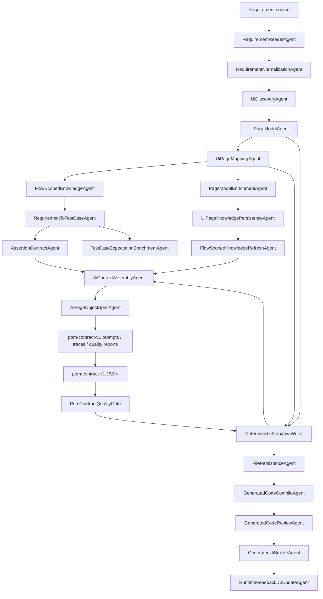
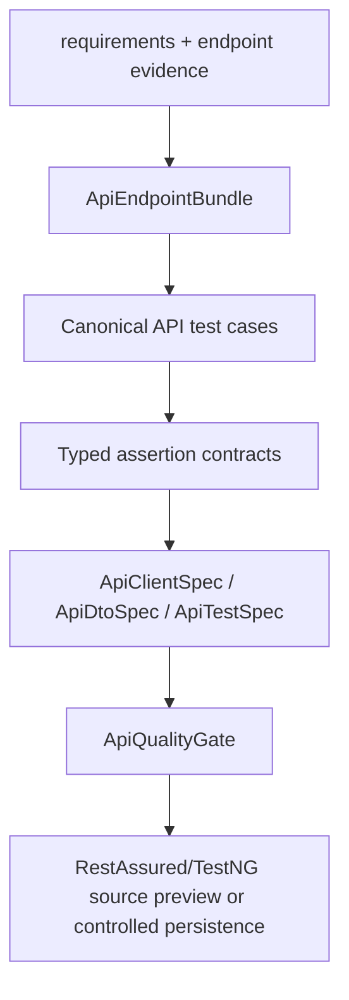

# AgentLab Project Guide

## 1. Project Purpose

AgentLab is a Java platform for requirement-driven automation generation. It combines deterministic parsing, UI/API discovery, typed contracts, optional AI enrichment, executable quality gates, and controlled artifact writing.

The current focus is not free-form code generation. The platform aims to build enough structured evidence that prompts and generated code become reviewable, traceable, and constrained.

## 2. Current Status

Implemented today:

- dependency-based agent orchestration through typed artifacts;
- requirement reading and normalization;
- generation policy loading;
- Selenium UI discovery and PageModel mapping;
- deterministic UI semantic action model between PageModel and prompt evidence;
- locator quality scoring and origin metadata;
- raw/curated/prompt-ready UI knowledge separation;
- Neo4j/Qdrant namespace-aware knowledge persistence/retrieval;
- expected-result and assertion contract modeling;
- AI enrichment for PageModel/expected-result metadata;
- deterministic POM contract prompt generation with prompt quality linter;
- `pom-contract-v1` model and deterministic Java writer path for Page Objects;
- generated-source persistence, compile/review validation, generated UI smoke, and runtime-feedback update stages;
- run quality summary and artifact diff;
- API endpoint evidence ingestion from OpenAPI, network scan, and configured endpoint seeds;
- API client/DTO/test specs with RestAssured/TestNG writer;
- API quality gate for endpoint evidence, assertions, source roots, path params, and mutation safety;
- API demo mode via `--api`, including controlled full CRUD flow generation when the endpoint set supports it;
- unit tests under `src/test/java/unit/tests`.

Current AI mode can continue from deterministic POM contract prompt generation to validated `pom-contract-v1`, deterministic Page Object Java output, source persistence, compile/review, and generated-source smoke validation. Direct LLM-backed Java writing is not used for Page Objects; Java method bodies are owned by the deterministic writer path.

The checked-in profile is demo-oriented: AI, RAG, Neo4j, and Qdrant switches are enabled, while secrets and service availability still come from environment variables or JVM properties. Disable these switches explicitly for deterministic or no-DB comparison runs.

## 3. Main Workflows

### AI UI Prompt Workflow



### API MVP Workflow



Run API-only demo mode with:

```powershell
mvn --batch-mode "-Duser.home=." "-Dmaven.repo.local=.m2repo" exec:java "-Dexec.args=--api requirements/valid-author.md"
```

For resources with `GET collection`, `POST collection`, `GET by id`, `PUT by id`, `PATCH by id`, and `DELETE by id`, the generated API test is a single atomic CRUD flow that owns its setup and cleanup.

Detailed API layer documentation: [API Layer Documentation](API_LAYER.md).

## 4. Important Packages

- `ua.demo.agentlab.app.workflow` - composition root split into workflow/module factories.
- `ua.demo.agentlab.orchestration` - graph orchestration and typed artifact contracts.
- `ua.demo.agentlab.requirements` - requirement sources and normalization.
- `ua.demo.agentlab.policy` - generation policy.
- `ua.demo.agentlab.ui.discovery` - Selenium discovery, PageModel building, mapping, locator quality.
- `ua.demo.agentlab.ui.discovery.semantic` - semantic element classification, action candidates, business-intent candidates, and semantic action model.
- `ua.demo.agentlab.ui.catalog` - confirmed page candidates, capabilities, and page registry.
- `ua.demo.agentlab.ai.context` - context slicing, retrieval, and `PromptUiEvidence`.
- `ua.demo.agentlab.ai.pageenrichment` - PageModel enrichment over mapper output.
- `ua.demo.agentlab.ai.expectationenrichment` - expected-result resolution.
- `ua.demo.agentlab.ai.ui` - deterministic POM/test prompt/spec generation.
- `ua.demo.agentlab.ai.ui.contract` - `pom-contract-v1`, POM contract quality gate, deterministic Java writer, and compatibility adapter.
- `ua.demo.agentlab.api` - API discovery, canonical cases, specs, quality gate, and writer.
- `ua.demo.agentlab.core.ui` - Selenium support classes for generated UI code.
- `ua.demo.agentlab.core.api` - RestAssured support for generated API clients.
- `ua.demo.agentlab.core.config` - environment/JVM placeholder-aware runtime config.

## 5. Compatibility Notes

New platform-owned code should use the `ua.demo.agentlab...` namespace.

The root packages `core` and `config` contain deprecated facades only:

- `core.ApiManager` delegates to `ua.demo.agentlab.core.api.ApiManager`;
- `config.ConfigReader` delegates to `ua.demo.agentlab.core.config.ConfigReader`.

They exist so older generated examples continue to compile.

## 6. Repository Hygiene

Runtime artifacts belong under `target/` and are ignored by Git.

Useful UI run artifacts:

- `target/discovery/semantic-action-model.json` - deterministic semantic elements, action candidates, and business-intent candidates before POM prompt generation.
- `target/ai-run/run-summary.md` - compact review entry point for the current run.
- `target/ai-run/page-objects/<Page>-prompt.txt` - final compact POM contract prompt.
- `target/ai-run/page-objects/<Page>-pom-contract.json` - parsed POM contract consumed by the deterministic Java writer.
- `target/ai-run/debug/page-object-spec/<Page>-scope-trace.json` - page, route, and requirement scoping diagnostics when `ai.debug.artifacts=true`.
- `target/ai-run/validation/generated-ui-smoke-result.json` - generated-source smoke result after POM source persistence, compile, and review.

Golden UI slice status:

- `requirements/valid-login-requirement.md` is the current golden requirement fixture.
- LoginPage has confirmed field/button locators and stable generated POM methods.
- DashboardPage has confirmed authenticated route, user-menu trigger, and logout-link evidence when authenticated discovery succeeds.
- Dashboard heading remains a coverage gap unless discovery confirms a stable heading locator.
- Full live-browser smoke execution is still the next hardening target after generated-source smoke.

Local secrets should be supplied by environment variables or JVM properties. `framework.properties` uses placeholders such as `${API_AUTH_TOKEN}` and `${TEST_VALID_USERNAME}` rather than real credentials.

Before publishing a snapshot, run:

```powershell
mvn --batch-mode "-Duser.home=." "-Dmaven.repo.local=.m2repo" test
```
