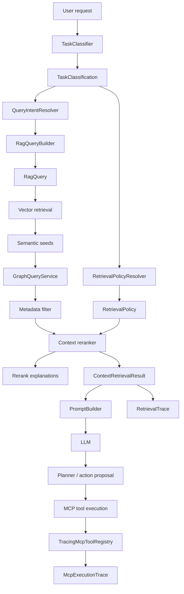

# RAG Policy, Rerank Explanation, and MCP Trace Layer

## What Was Added

This iteration closed three missing production concerns:

1. retrieval policy
2. rerank explainability
3. MCP execution trace

These are not cosmetic improvements.
They make the platform more controllable, debuggable, and safer to evolve toward real AI-driven test generation.

## 1. Retrieval Policy

### Added classes

- `RetrievalPolicy`
- `RetrievalPolicyResolver`

Location:

- `src/main/java/ua/demo/agentlab/ai/rag/retrieval`

### Why it was added

Before this layer, retrieval limits were mostly generic:

- a fixed artifact target
- a fixed semantic multiplier
- a fixed graph expansion pattern

That is not enough when the request types differ.

Examples:

- failure analysis needs broader context
- page object generation needs focused UI artifacts
- code review needs more support and policy artifacts
- API generation needs contract-heavy retrieval

### What it does

`RetrievalPolicyResolver` maps `TaskClassification` to a concrete `RetrievalPolicy`.

Policy now controls:

- `desiredArtifacts`
- `semanticRetrievalMultiplier`
- `graphExpansionMultiplier`
- `keepSupportArtifacts`
- `preferDocumentation`
- `allowSyntheticGraphArtifacts`

### Current behavior

Examples of policy shaping:

- `FAILURE_ANALYSIS`
  uses larger semantic and graph breadth

- `PAGE_OBJECT_GENERATION`
  stays narrower and reduces synthetic graph noise

- `API_TEST_GENERATION`
  expands wider and preserves policy/documentation support

### Where it is wired

- `ProjectContextRetriever`
- `HybridContextRetriever`
- `ProjectStylePromptBuilder`
- `RagConsoleRunner`

## 2. Rerank Explainability

### Added classes

- `ContextRerankExplanation`
- `RerankResult`

Location:

- `src/main/java/ua/demo/agentlab/ai/rag/retrieval`

### Why it was added

Previously, the reranker produced only a sorted final list.

That meant:

- hard to debug why a file survived
- hard to understand why another file dropped out
- hard to tune retrieval later

### What it does

`ContextReranker` now returns both:

- final reranked chunks
- human-readable explanations per selected artifact

Explanation reasons include:

- `artifact-type-match`
- `domain-term:<term>`
- `qualifier:<term>`
- `synthetic-graph-artifact`
- `semantic-score`

### Where it is exposed

- `ContextRetrievalResult.rerankExplanations`
- `ProjectStylePromptBuilder`
- `RagConsoleRunner`

### Why this matters

This is the first usable observability layer for prompt-context quality.

When a generation run is weak, you can now inspect:

- what was retrieved
- why it ranked high
- whether graph artifacts drowned useful code

## 3. MCP Execution Trace

### Added classes

- `McpExecutionTrace`
- `McpExecutionTraceEntry`
- `TracingMcpToolRegistry`

Location:

- `src/main/java/ua/demo/agentlab/mcp/trace`

### Why it was added

The platform already had MCP tools, but no structured execution history.

That meant:

- no reliable timeline of what tools ran
- no execution telemetry for debugging agent behavior
- no clear handoff artifact for future approval/audit flows

### What it does

`TracingMcpToolRegistry` wraps the normal `McpToolRegistry`.

For each tool execution it records:

- tool name
- input type
- result type
- status
- message
- start time
- finish time
- duration

### Where it is wired

- `LocalMcpExecutionAgent`

`LocalMcpExecutionAgent` now owns:

- traced `toolRegistry`
- `executionTrace()`

### Why this matters

This is the platform hook needed before:

- approval boundaries
- execution replay
- failure postmortems
- planner-to-MCP audit chains

## Updated Flow



## Key Updated Classes

### Retrieval layer

- `QueryIntent`
- `ProjectContextRetriever`
- `HybridContextRetriever`
- `ContextRetrievalResult`
- `ContextReranker`
- `RagRetrievalService`

### Prompt/generation layer

- `ProjectStylePromptBuilder`
- `GenerateTestAgent`
- `RagGenerationResult`
- `RagConsoleRunner`

### MCP layer

- `LocalMcpExecutionAgent`

## Build Validation

Validated locally:

```powershell
mvn --batch-mode "-Duser.home=." "-Dmaven.repo.local=.m2repo" test-compile
```

Result:

- `BUILD SUCCESS`

## What This Unlocks Next

This is now enough to move into:

1. approval-aware execution plans
2. tool-call replay and audit
3. retrieval quality dashboards
4. task-specific retrieval tuning
5. AI-assisted failure triage with trace-backed evidence
