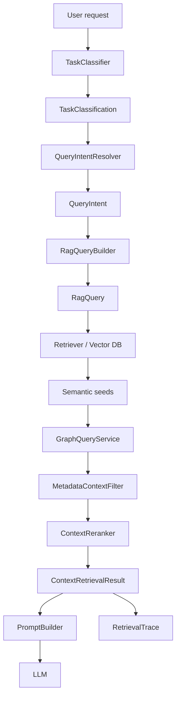

# RAG Task Orchestration Layer

## Goal

This layer adds the missing top section above retrieval:

1. Task classification
2. Query shaping
3. Retrieval tracing

The system already had:

- semantic retrieval
- graph expansion
- metadata filtering
- reranking
- prompt building

Now it also decides what kind of task the request represents and records how retrieval was formed.

## Added Components

### Task classification

- `RagTaskType`
- `TaskClassification`
- `TaskClassifier`

Purpose:

- infer what the user is actually asking for
- bias retrieval toward the right artifact families
- expose confidence and classification signals

Current supported task categories:

- `UI_TEST_GENERATION`
- `API_TEST_GENERATION`
- `NEGATIVE_TEST_GENERATION`
- `SMOKE_TEST_GENERATION`
- `REGRESSION_TEST_GENERATION`
- `PAGE_OBJECT_GENERATION`
- `FAILURE_ANALYSIS`
- `BUG_FIX`
- `CODE_REVIEW`
- `GENERAL_AUTOMATION`

### Query shaping

- `RagQuery`
- `RagQueryBuilder`

Purpose:

- build a richer semantic query than raw user text
- prepare graph terms
- prepare metadata hints

`RagQuery` currently contains:

- `semanticQuery`
- `graphTerms`
- `metadataHints`

### Retrieval trace

- `RetrievalTrace`

Purpose:

- explain how retrieval was executed
- show classification confidence
- show semantic query used for vector retrieval
- show how many artifacts came from each stage

Tracked fields:

- `taskType`
- `taskConfidence`
- `semanticQuery`
- `requestedArtifacts`
- `rawSemanticMatches`
- `semanticSeedCount`
- `graphExpandedArtifacts`
- `filteredCandidates`
- `finalArtifacts`
- `graphSource`

## Updated Flow

## Where It Is Wired

### `QueryIntentResolver`

Now uses `TaskClassifier` internally and enriches `QueryIntent` with:

- `TaskClassification taskClassification`

### `ProjectContextRetriever`

Now:

1. resolves intent
2. builds `RagQuery`
3. executes semantic retrieval with `semanticQuery`
4. builds first `RetrievalTrace`

### `HybridContextRetriever`

Now:

1. takes semantic result
2. expands via graph
3. filters metadata
4. reranks
5. finalizes `RetrievalTrace`

### `ContextRetrievalResult`

Now carries:

- `QueryIntent`
- `RagQuery`
- `RetrievalTrace`
- final retrieved chunks
- counts and graph source

### `GenerateTestAgent`

Now returns generation output together with retrieval trace via:

- `RagGenerationResult.retrievalTrace`

### `ProjectStylePromptBuilder`

Now includes:

- task type
- task confidence
- classification signals
- semantic query
- graph source

This makes the prompt more controllable and debuggable.

## Why This Matters

Before this layer, retrieval treated most requests as loosely similar text.

After this layer:

- the system distinguishes generation vs analysis vs review vs failure work
- the vector query becomes more intentional
- graph/filter/rerank stages are traceable
- prompt construction gets explicit orchestration metadata

That is a major step toward:

- `Task Classification`
- `RAG Query Builder`
- `Vector DB`
- `Graph DB`
- `Metadata Filter`
- `Re-ranker`
- `Prompt Builder`
- `LLM`
- `MCP Tool Execution`

## Current Limitations

This is still rule-based classification, not LLM-assisted classification.

Next likely upgrades:

1. add a dedicated `RetrievalPolicy` layer to tune limits and artifact mixes per task type
2. use repository-intelligence signals to boost task-specific routing
3. add rerank explanations per artifact
4. add MCP execution trace after LLM generation
