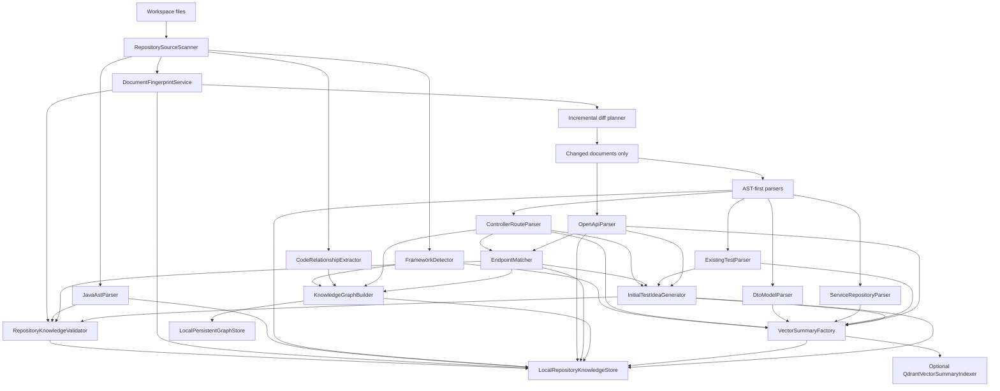

# Repository Intelligence Indexer

## Status

Repository intelligence is now wired as a production-oriented indexing pipeline,
not just a heuristic chunk exporter.

Validated locally on June 22, 2026:

- `mvn --batch-mode "-Duser.home=." "-Dmaven.repo.local=.m2repo" test-compile`
- `mvn --batch-mode "-Dexec.mainClass=ua.demo.agentlab.app.RepositoryIntelligenceRunner" exec:java "-Dexec.args=. target/repository-intelligence"`

Second run verification confirmed incremental reuse:

- first run: `changedDocuments=374`, `reusedDocuments=0`
- second run: `changedDocuments=0`, `reusedDocuments=374`

## Implemented Workflow

1. Scan repository
2. Detect framework type
3. Build Java AST parse layer
4. Parse controllers/routes from AST first, heuristics second
5. Parse DTOs/models from AST first, heuristics second
6. Parse services/repositories from AST first, heuristics second
7. Parse existing tests from AST first, heuristics second
8. Parse Swagger/OpenAPI
9. Match OpenAPI endpoints with controllers using scored strategies
10. Build code graph and repository graph entities/relations
11. Generate vector summaries
12. Generate initial test ideas for API, UI, contract, regression, and failure-risk signals
13. Persist repository knowledge snapshot
14. Persist graph store as standalone graph artifacts
15. Persist incremental fingerprints and AST results
16. Optionally push vector summaries into Qdrant
17. Emit diagnostics, parser metrics, confidence assessments, and warnings

## Architecture



## Core Components

### Source and incremental layer

- `RepositorySourceScanner`
- `DocumentFingerprintService`
- `RepositoryIntelligenceConfig`
- `KnowledgeStore.load(...)`

What it does:

- reads supported repository files
- excludes generated UI artifacts by default
- computes SHA-256 fingerprints
- reuses prior snapshot data for unchanged files

Persisted artifacts:

- `target/repository-intelligence/document-fingerprints.json`
- `target/repository-intelligence/java-ast-results.json`
- `target/repository-intelligence/knowledge-snapshot.json`

### Java AST parser

- `JavaAstParser`
- `JavaAstParseResult`
- `JavaAstType`
- `JavaAstMethod`

What it does:

- parses Java source via JDK compiler tree API
- extracts package, imports, class type, annotations, inheritance, methods
- captures method invocation targets
- marks test methods from annotations
- assigns per-file parse confidence

Fallback behavior:

- if AST parsing is unavailable or fails, downstream parsers still fall back to heuristic parsing

### AST-first semantic parsers

- `ControllerRouteParser`
- `DtoModelParser`
- `ServiceRepositoryParser`
- `ExistingTestParser`

Behavior:

- prefer AST data when available
- fall back to regex/heuristics for resilience
- produce normalized repository artifacts ready for graphing and retrieval

### Richer contract matching

- `EndpointMatcher`

Match strategies:

- `EXACT_PATH`
- `PATH_VARIABLE_NORMALIZED`
- `OPERATION_ID`
- `SUMMARY_HINT`
- `PATH_SUFFIX`
- `UNMATCHED`

Each `EndpointMatch` now carries:

- match flag
- confidence score
- match strategy

### Persistent graph store

- `GraphStore`
- `LocalPersistentGraphStore`
- `KnowledgeGraphBuilder`

Persisted graph files:

- `target/repository-intelligence/graph-store/entities.json`
- `target/repository-intelligence/graph-store/relations.json`
- `target/repository-intelligence/graph-store/graph-metadata.json`

This is the stable graph persistence layer for later graph-query and dependency-expansion work.

### Confidence model and parser metrics

- `ParserMetric`
- `ConfidenceAssessment`
- `ParsingDiagnostics`
- `RepositoryKnowledgeValidator`

Current diagnostics include:

- language distribution
- incremental stats
- parser metrics
- confidence assessments
- warnings

Example confidence dimensions:

- `java-ast-parse`
- `openapi-route-alignment`
- `incremental-reuse`
- `test-idea-signal`

### Vector-summary indexing into Qdrant

- `VectorSummaryFactory`
- `VectorSummaryIndexer`
- `QdrantVectorSummaryIndexer`
- `DisabledVectorSummaryIndexer`

Behavior:

- vector summaries are always generated locally
- if `rag.enabled` is explicitly set to `true` and `OPENAI_API_KEY` or `RAG_OPENAI_API_KEY` is present,
  summaries can be embedded and upserted to Qdrant automatically during repository indexing
- if disabled or not configured, repository indexing still completes safely

### Initial idea generation

- `InitialTestIdeaGenerator`

Idea families:

- `API_POSITIVE`
- `API_NEGATIVE`
- `API_CONTRACT`
- `API_FAILURE_MODE`
- `UI_FLOW`
- `BUG_RISK`
- `REGRESSION_GAP`

This is still a seed generator, not a final planner. It is now richer than the earlier API-only pass.

## Current Output for This Repository

From the validated local run:

- scanned files: `374`
- Java files: `310`
- DTO/models: `108`
- services/repositories/components: `34`
- existing tests: `6`
- graph entities: `2042`
- graph relations: `30895`
- vector summaries: `155`
- warnings: `2`

Warnings currently reflect repository reality, not pipeline failure:

- `SPRING_WITHOUT_CONTROLLERS`
- `OPENAPI_WITHOUT_ENDPOINTS`

This project contains Spring/OpenAPI markers in dependencies/configuration, but no real backend controllers or OpenAPI endpoint contracts to parse.

## Entry Point

- `ua.demo.agentlab.app.RepositoryIntelligenceRunner`

Run:

```powershell
mvn --batch-mode "-Dexec.mainClass=ua.demo.agentlab.app.RepositoryIntelligenceRunner" exec:java "-Dexec.args=."
```

Run with explicit output directory:

```powershell
mvn --batch-mode "-Dexec.mainClass=ua.demo.agentlab.app.RepositoryIntelligenceRunner" exec:java "-Dexec.args=. target/repository-intelligence"
```

## To Configure Automatic Qdrant Indexing

The checked-in demo profile enables RAG. Keep the following values configured when Qdrant indexing is desired, or override `rag.enabled=false` for no-RAG runs:

```properties
rag.enabled=<true>
rag.qdrant.url=http://localhost:6333
rag.qdrant.collection=agentlab-project-style
rag.openai.embedding-model=text-embedding-3-small
```

And provide one of:

- `OPENAI_API_KEY`
- `RAG_OPENAI_API_KEY`

Optional:

- `RAG_QDRANT_API_KEY`

## Remaining Gaps

What is now strong:

- AST parsing
- persistent graph persistence
- incremental snapshot reuse
- confidence and diagnostics
- scored contract matching
- optional automatic vector indexing

What is still the next maturity step:

- deeper Spring controller semantic extraction for complex annotations
- richer OpenAPI request/response schema linking
- graph-query service on top of persisted graph store
- better UI-specific initial idea generation from actual discovery/page-flow evidence
- full reranking between graph expansion and vector retrieval
