# SPA Semantic Understanding Engine

## Purpose

The SPA layer turns browser discovery into controlled, reusable UI knowledge. It does not treat every DOM element as a Page Object locator. Instead it separates inventory evidence, requirement-scoped verification, promoted stable knowledge, and generated POM evidence.

```mermaid
flowchart LR
    A["Requirement block"] --> B["Capability + typed assertions"]
    B --> C["Targeted SPA discovery"]
    C --> D["Component inventory"]
    D --> E["Locator/action candidates"]
    E --> F["Live verification"]
    F --> G["Postcondition + smoke feedback"]
    G --> H["Neo4j confirmed knowledge"]
    H --> I["Component-scoped PromptUiEvidence"]
    I --> J["Deterministic component POM"]
```



## Requirement Contract

Capability-first requirements use one `## Requirement: REQ-...` block per atomic business behavior:

```md
### Capability
`FILTER`

### Preconditions
* User is authenticated.
* Vacancies page is open.

### Action
* Select Status `${VACANCY_STATUS}`.
* Click Search.

### Expected Result
* Results refresh and only matching rows are visible.

### Assertion Requirements
* `type: RESULTS_CHANGED`
  * `target: vacancyResultsCollection`
  * `expectedValue: Results refresh after filtering`
* `type: ROW_VISIBLE`
  * `target: vacancyResultRow`
  * `expectedValue: ${VACANCY_NAME}`

### Target Context
* `pageCapability: RECORD_LIST`
* `componentCapability: FILTER_PANEL, RESULTS_COLLECTION`

### Data Requirements
* `dataset: vacancy-filter`
```

`RuleBasedRequirementNormalizer` keeps the block as one exact `REQ` and extracts `StructuredAssertionRequirement` values. Nested bullets no longer become unrelated canonical cases.

`StructuredBehaviorContractAgent` publishes the resulting intent to `target/ai-run/requirements/structured-behavior-contracts.json`. The subsequent `UiSpaStructuredBehaviorBindingAgent` binds it only to current-run confirmed component/action/locator evidence and writes `target/discovery/spa-structured-behavior-bindings.json`. A contract becomes executable only after that binding succeeds.

## Evidence Lifecycle

| Status | Meaning | Eligible for POM prompt |
|---|---|---|
| `CANDIDATE` | Found by inventory; no live proof. | No |
| `NEEDS_REVIEW` | Missing stable locator, data, postcondition, or ownership evidence. | No |
| `CONFIRMED` | Requirement-scoped verification and smoke feedback passed. | Yes |
| `DEGRADED` | Previously stable evidence failed quality/lifecycle thresholds. | No |

Promotion requires same-origin evidence, acceptable score, stable discovery observation, scoped/global uniqueness, live verification, and smoke feedback. Neo4j is a quality layer, not an unvalidated cache.

## Components and Flows

The inventory detects `NAVIGATION`, `HEADER`, `USER_MENU`, `FORM`, `FILTER_PANEL`, `RESULTS_COLLECTION`, `TABLE`, `MODAL`, `SEARCH`, and `CONTENT` boundaries. Every component owns candidate locators and actions.

Typed component flows:

| Flow | Required proof |
|---|---|
| `MODULE_NAVIGATION` | Confirmed internal module link and SPA route transition. |
| `FILTER_RESULTS` | Selected criteria plus changed results/count or matching visible row. |
| `TABLE_SORT` | Sort action plus observed order or sort-state change. |
| `TABLE_PAGINATION` | Pagination action plus changed page/row collection. |
| `MODAL_CONFIRMATION` | Modal visible before confirmation and closed/target state afterward. |
| `MODAL_CANCELLATION` | Modal closed and original state preserved. |

`MODULE_NAVIGATION` has live browser support now: a confirmed internal sidebar/module link is clicked, the SPA route is awaited, and the target is associated with an existing inventory page when one exists. Unknown target routes remain `needs-review`; the platform never invents a Page Object.

## Debugging

Primary review artifact:

`target/ai-run/need-review/spa-evidence-needs-review.json`

Each entry includes requirement IDs, page/component/evidence IDs, selector and score context, reason, and a remediation.

| Review reason | Correct response |
|---|---|
| Locator not unique | Add a stable component root or product test hook; validate within the component. |
| Locator unstable | Repeat discovery; prefer `data-testid`, stable `id`, `name`, or ARIA evidence. |
| Action prerequisites missing | Confirm the prerequisite graph, for example `openUserMenu -> logout`. |
| Postcondition unavailable | Add an observable assertion requirement; do not promote the action. |
| Route unknown | Run authenticated targeted discovery from a confirmed source component. |

Supporting artifacts:

* `target/discovery/ui-interaction-inventory.json`
* `target/discovery/component-model.json`
* `target/discovery/component-interaction-graph.json`
* `target/discovery/typed-component-flows.json`
* `target/discovery/spa-targeted-verification.json`
* `target/discovery/spa-live-targeted-verification.json`
* `target/discovery/spa-structured-behavior-bindings.json`
* `target/discovery/spa-structured-behavior-execution.json`
* `target/ai-run/validation/pom-source-map.json`
* `target/ai-run/validation/spa-smoke-evidence-feedback.json`
* `target/ai-run/requirements/structured-behavior-contracts.json`
* `target/ai-run/need-review/spa-structured-behavior-needs-review.json`

## Current Readiness

### Ready

* Component-aware SPA inventory feeding one canonical interaction projection.
* Canonical locator/action lifecycle with promotion, degradation, retention, and smoke feedback.
* Component-scoped POM evidence and deterministic component POM writing.
* `USER_MENU -> LOGOUT` dependency graph and live verification.
* Internal `MODULE_NAVIGATION` with route confirmation.
* Explicit POM source-map; smoke feedback does not parse generated Java selectors.
* Cross-run Neo4j capability lookup, limited to confirmed evidence with a passing smoke.
* Structured capability-first requirements and typed assertion extraction.

### Candidate/Review Only

* Filter, navigation, table, and modal flows can now bind ScenarioData/ENV values, execute select/type/click sequences through a fresh browser session, and verify before/after state where an observable postcondition is supplied.
* Safe navigation is enabled by default. Data-changing filter actions require `spa.live-verification.execute-data-actions=true`; session-ending/destructive actions remain opt-in.
* Successful browser execution updates only matching canonical `UiLocatorEvidence` and `UiSemanticAction` records in Neo4j. `SKIPPED` and `NEEDS_REVIEW` never promote evidence or bypass the catalog.
* A missing result locator, test dataset, state-change assertion, or modal result produces a focused review item rather than a guessed interaction.

For a data-driven live verification, enable it explicitly and provide every value required by the structured requirement. `ScenarioData` is read first from the named dataset; environment variables or JVM properties with the exact placeholder name override it:

```powershell
$env:SPA_LIVE_VERIFICATION_EXECUTE_DATA_ACTIONS="true"
$env:JOB_TITLE="..."
$env:VACANCY_NAME="..."
$env:HIRING_MANAGER="..."
$env:VACANCY_STATUS="..."
```

If all placeholders resolve from ENV/system properties, an unavailable optional dataset does not block the contract. Destructive and session-ending actions remain opt-in through `SPA_LIVE_VERIFICATION_EXECUTE_SESSION_ENDING_ACTIONS=true`.
